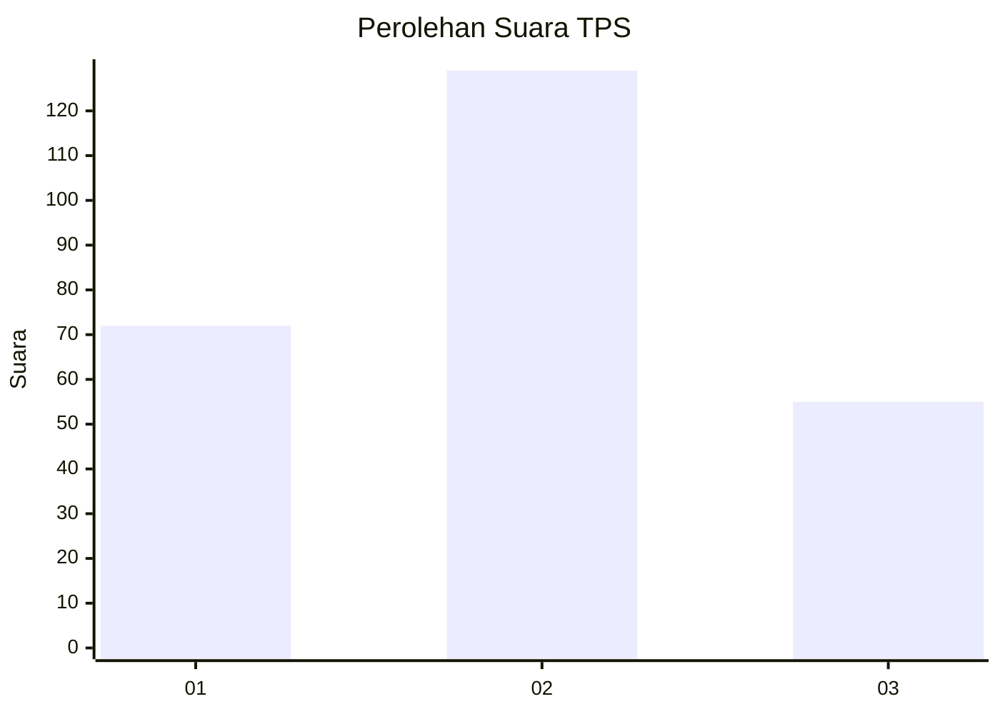
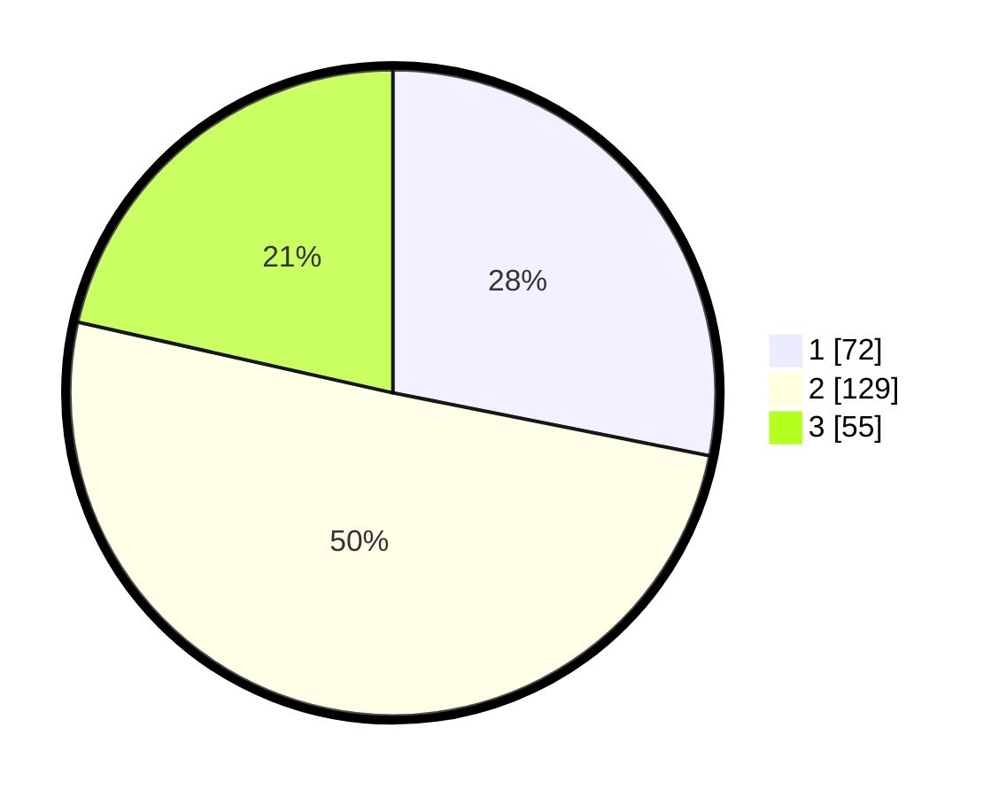

# Hasil

## Grafik

## Tabel

| No. | Nama Paslon    | Suara | Suara (raw) | Persentase |
|:--- |:-------------- | -----:| -----------:| ----------:|
| 1   | ANIES MUHAIMIN | 72    | [72][p-1]   | 28,13      |
| 2   | PRABOWO GIBRAN | 129   | [129][p-2]  | 50,39      |
| 3   | GANJAR MAHFUD  | 55    | [55][p-3]   | 21,48      |

[p-1]: https://github.com/gigit-pemilu/pemilu-2024-34-di-yogyakarta/blob/main/pilpres/hitung-suara/sub/34-di-yogyakarta/sub/01-kulon-progo/sub/04-galur/sub/2002-kranggan/sub/005-tps/sub/paslon-1.txt
[p-2]: https://github.com/gigit-pemilu/pemilu-2024-34-di-yogyakarta/blob/main/pilpres/hitung-suara/sub/34-di-yogyakarta/sub/01-kulon-progo/sub/04-galur/sub/2002-kranggan/sub/005-tps/sub/paslon-2.txt
[p-3]: https://github.com/gigit-pemilu/pemilu-2024-34-di-yogyakarta/blob/main/pilpres/hitung-suara/sub/34-di-yogyakarta/sub/01-kulon-progo/sub/04-galur/sub/2002-kranggan/sub/005-tps/sub/paslon-3.txt

## Foto C Plano

https://sirekap-obj-formc.kpu.go.id/45a0/pemilu/ppwp/34/01/04/20/02/3401042002005-20240215-220246--cd555d51-92d2-4585-bbf9-b8fae72dda80.jpg

https://sirekap-obj-formc.kpu.go.id/45a0/pemilu/ppwp/34/01/04/20/02/3401042002005-20240215-214755--7d7aa395-6964-45b9-ab5b-7f91eb017e3a.jpg

https://sirekap-obj-formc.kpu.go.id/45a0/pemilu/ppwp/34/01/04/20/02/3401042002005-20240216-143117--72b79624-18d4-4898-92c7-03e123229739.jpg

## Metadata

| Key        | Value               |
| ---------- | ------------------- |
| Time Stamp | 2024-02-16 16:25:10 |

