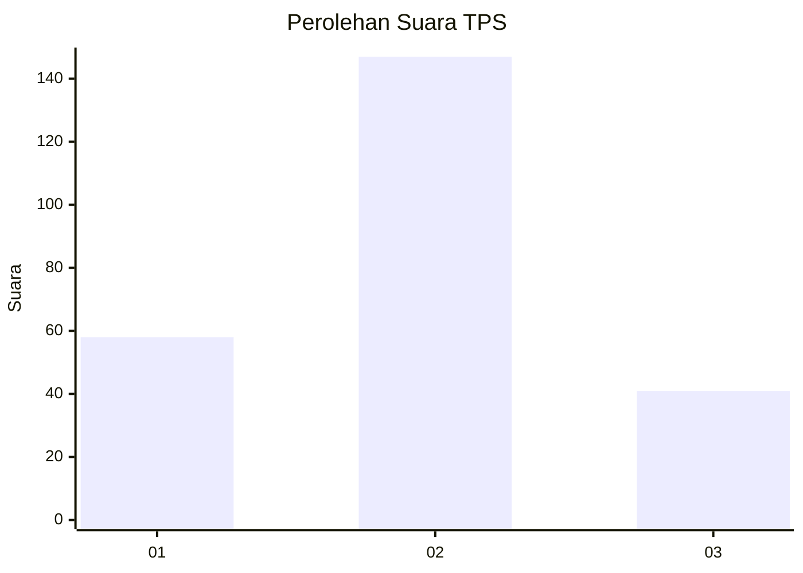

# Hasil

## Grafik

## Tabel

| No. | Nama Paslon    | Suara | Suara (raw) | Persentase |
|:--- |:-------------- | -----:| -----------:| ----------:|
| 1   | ANIES MUHAIMIN | 58    | [58][p-1]   | 23,58      |
| 2   | PRABOWO GIBRAN | 147   | [147][p-2]  | 59,76      |
| 3   | GANJAR MAHFUD  | 41    | [41][p-3]   | 16,67      |

[p-1]: https://github.com/gigit-pemilu/pemilu-2024-34-di-yogyakarta/blob/main/pilpres/hitung-suara/sub/34-di-yogyakarta/sub/01-kulon-progo/sub/04-galur/sub/2004-karangsewu/sub/003-tps/sub/paslon-1.txt
[p-2]: https://github.com/gigit-pemilu/pemilu-2024-34-di-yogyakarta/blob/main/pilpres/hitung-suara/sub/34-di-yogyakarta/sub/01-kulon-progo/sub/04-galur/sub/2004-karangsewu/sub/003-tps/sub/paslon-2.txt
[p-3]: https://github.com/gigit-pemilu/pemilu-2024-34-di-yogyakarta/blob/main/pilpres/hitung-suara/sub/34-di-yogyakarta/sub/01-kulon-progo/sub/04-galur/sub/2004-karangsewu/sub/003-tps/sub/paslon-3.txt

## Foto C Plano

https://sirekap-obj-formc.kpu.go.id/7dc3/pemilu/ppwp/34/01/04/20/04/3401042004003-20240215-025329--d8b06d90-cc4c-4e49-b62d-961d16d33e9e.jpg

https://sirekap-obj-formc.kpu.go.id/7dc3/pemilu/ppwp/34/01/04/20/04/3401042004003-20240214-205616--0ec96845-ad08-4939-a9d2-57151c580d51.jpg

https://sirekap-obj-formc.kpu.go.id/7dc3/pemilu/ppwp/34/01/04/20/04/3401042004003-20240214-222120--4f4c4d08-12cc-4db1-a411-ee770ed0c3e1.jpg

## Metadata

| Key        | Value               |
| ---------- | ------------------- |
| Time Stamp | 2024-02-15 19:00:26 |

