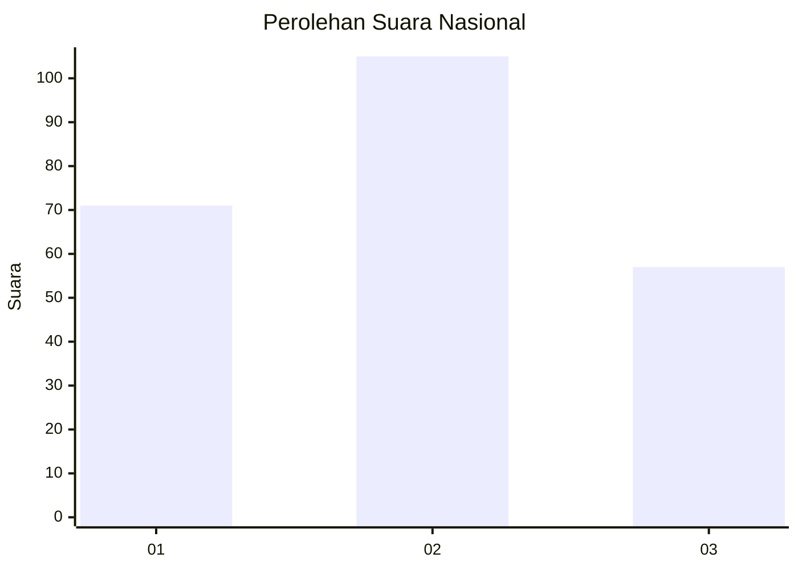
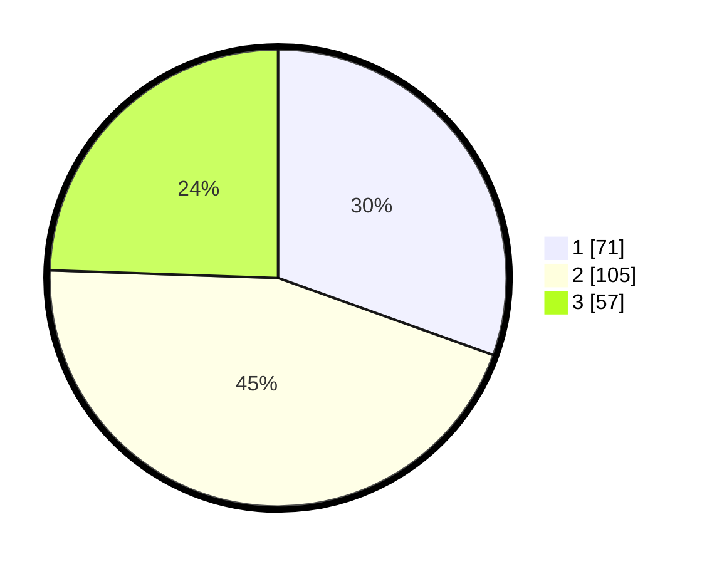

# Hasil

## Grafik

## Tabel

| No. | Nama Paslon    | Suara | Suara (raw) | Persentase |
|:--- |:-------------- | -----:| -----------:| ----------:|
| 1   | ANIES MUHAIMIN | 71    | [71][p-1]   | 30,47      |
| 2   | PRABOWO GIBRAN | 105   | [105][p-2]  | 45,06      |
| 3   | GANJAR MAHFUD  | 57    | [57][p-3]   | 24,46      |

[p-1]: https://github.com/gigit-pemilu/pemilu-2024/blob/main/pilpres/hitung-suara/sub/34-di-yogyakarta/sub/01-kulon-progo/sub/04-galur/sub/2004-karangsewu/sub/011-tps/sub/paslon-1.txt
[p-2]: https://github.com/gigit-pemilu/pemilu-2024/blob/main/pilpres/hitung-suara/sub/34-di-yogyakarta/sub/01-kulon-progo/sub/04-galur/sub/2004-karangsewu/sub/011-tps/sub/paslon-2.txt
[p-3]: https://github.com/gigit-pemilu/pemilu-2024/blob/main/pilpres/hitung-suara/sub/34-di-yogyakarta/sub/01-kulon-progo/sub/04-galur/sub/2004-karangsewu/sub/011-tps/sub/paslon-3.txt

## Foto C Plano

https://sirekap-obj-formc.kpu.go.id/9c4a/pemilu/ppwp/34/01/04/20/04/3401042004011-20240215-021505--81f38754-3354-4682-af8d-33b8240edb5a.jpg

https://sirekap-obj-formc.kpu.go.id/9c4a/pemilu/ppwp/34/01/04/20/04/3401042004011-20240215-015441--991b6ba9-3dbb-4651-95c7-70cf8d7174b3.jpg

https://sirekap-obj-formc.kpu.go.id/9c4a/pemilu/ppwp/34/01/04/20/04/3401042004011-20240215-044319--bd6e899b-c795-4129-9001-27457a112988.jpg

## Metadata

| Key        | Value               |
| ---------- | ------------------- |
| Time Stamp | 2024-02-15 16:30:25 |

