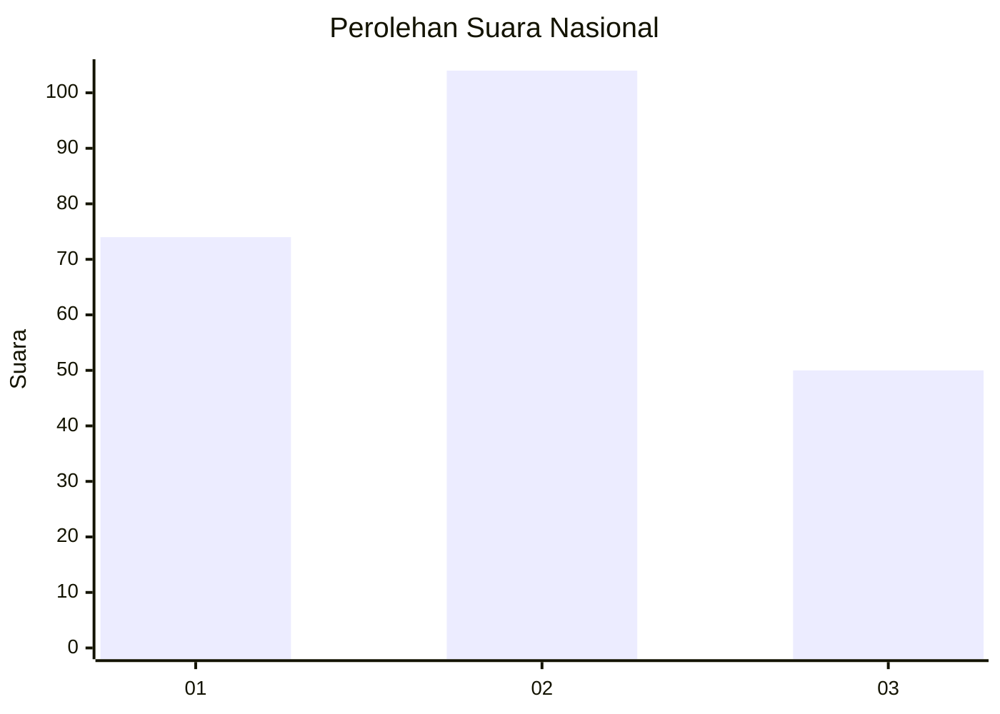
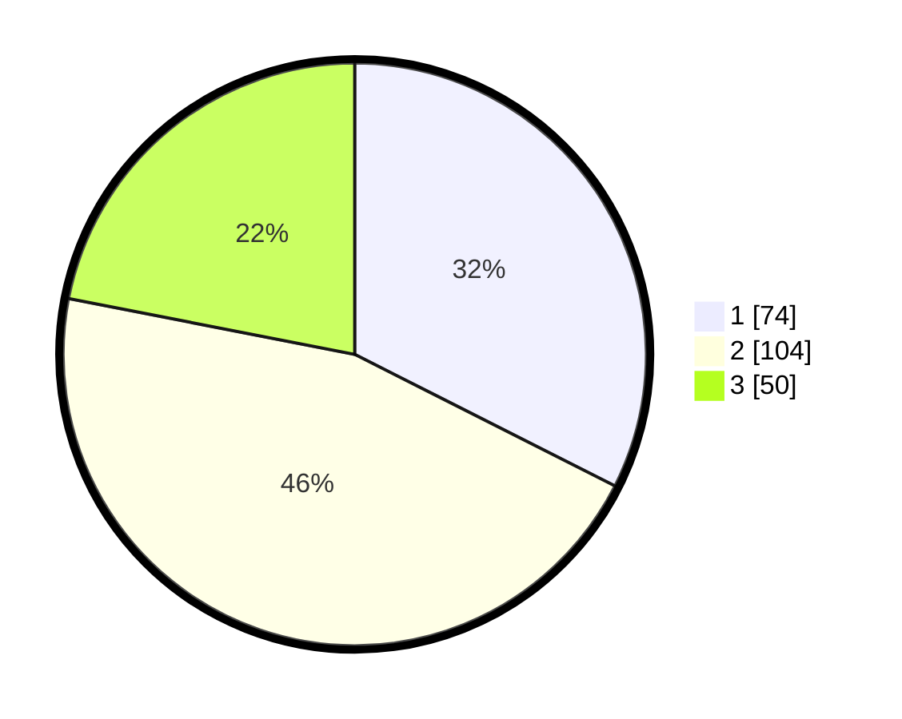

# Hasil

## Grafik

## Tabel

| No. | Nama Paslon    | Suara | Suara (raw) | Persentase |
|:--- |:-------------- | -----:| -----------:| ----------:|
| 1   | ANIES MUHAIMIN | 74    | [74][p-1]   | 32,46      |
| 2   | PRABOWO GIBRAN | 104   | [104][p-2]  | 45,61      |
| 3   | GANJAR MAHFUD  | 50    | [50][p-3]   | 21,93      |

[p-1]: https://github.com/gigit-pemilu/pemilu-2024/blob/main/pilpres/hitung-suara/sub/34-di-yogyakarta/sub/01-kulon-progo/sub/04-galur/sub/2004-karangsewu/sub/020-tps/sub/paslon-1.txt
[p-2]: https://github.com/gigit-pemilu/pemilu-2024/blob/main/pilpres/hitung-suara/sub/34-di-yogyakarta/sub/01-kulon-progo/sub/04-galur/sub/2004-karangsewu/sub/020-tps/sub/paslon-2.txt
[p-3]: https://github.com/gigit-pemilu/pemilu-2024/blob/main/pilpres/hitung-suara/sub/34-di-yogyakarta/sub/01-kulon-progo/sub/04-galur/sub/2004-karangsewu/sub/020-tps/sub/paslon-3.txt

## Foto C Plano

https://sirekap-obj-formc.kpu.go.id/4675/pemilu/ppwp/34/01/04/20/04/3401042004020-20240215-032508--62414904-e382-4e8a-93e3-69ad67484eb7.jpg

https://sirekap-obj-formc.kpu.go.id/4675/pemilu/ppwp/34/01/04/20/04/3401042004020-20240215-032631--fd095992-2524-4421-afdb-a9b046a4545d.jpg

https://sirekap-obj-formc.kpu.go.id/4675/pemilu/ppwp/34/01/04/20/04/3401042004020-20240215-032735--c5ba9243-3b69-4bb0-85e1-40b3882d5528.jpg

## Metadata

| Key        | Value               |
| ---------- | ------------------- |
| Time Stamp | 2024-02-15 15:00:29 |

