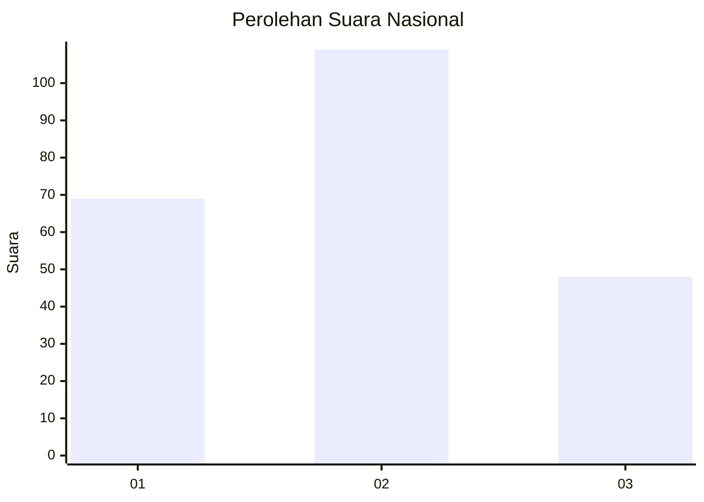
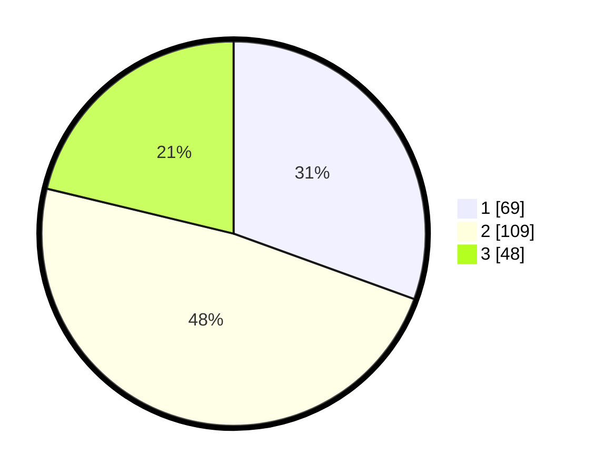

# Hasil

## Grafik

## Tabel

| No. | Nama Paslon    | Suara | Suara (raw) | Persentase |
|:--- |:-------------- | -----:| -----------:| ----------:|
| 1   | ANIES MUHAIMIN | 69    | [69][p-1]   | 30,53      |
| 2   | PRABOWO GIBRAN | 109   | [109][p-2]  | 48,23      |
| 3   | GANJAR MAHFUD  | 48    | [48][p-3]   | 21,24      |

[p-1]: https://github.com/gigit-pemilu/pemilu-2024/blob/main/pilpres/hitung-suara/sub/34-di-yogyakarta/sub/01-kulon-progo/sub/04-galur/sub/2004-karangsewu/sub/021-tps/sub/paslon-1.txt
[p-2]: https://github.com/gigit-pemilu/pemilu-2024/blob/main/pilpres/hitung-suara/sub/34-di-yogyakarta/sub/01-kulon-progo/sub/04-galur/sub/2004-karangsewu/sub/021-tps/sub/paslon-2.txt
[p-3]: https://github.com/gigit-pemilu/pemilu-2024/blob/main/pilpres/hitung-suara/sub/34-di-yogyakarta/sub/01-kulon-progo/sub/04-galur/sub/2004-karangsewu/sub/021-tps/sub/paslon-3.txt

## Foto C Plano

https://sirekap-obj-formc.kpu.go.id/d71e/pemilu/ppwp/34/01/04/20/04/3401042004021-20240215-011852--837602e6-d4e2-4b7f-b12e-a72750865ce9.jpg

https://sirekap-obj-formc.kpu.go.id/d71e/pemilu/ppwp/34/01/04/20/04/3401042004021-20240215-012732--24092041-9159-43fb-975c-bc00bbc17a42.jpg

https://sirekap-obj-formc.kpu.go.id/d71e/pemilu/ppwp/34/01/04/20/04/3401042004021-20240215-012017--8668c239-2ddd-41a2-a95d-d0d8dfe4215b.jpg

## Metadata

| Key        | Value               |
| ---------- | ------------------- |
| Time Stamp | 2024-02-15 15:00:29 |

