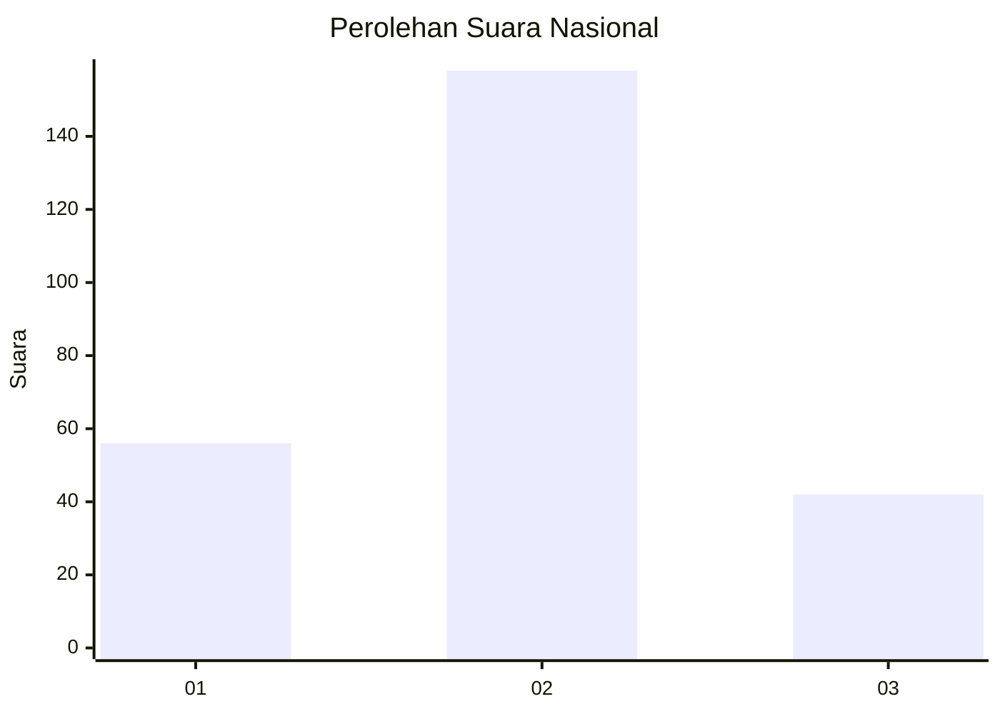

# Hasil

## Grafik

## Tabel

| No. | Nama Paslon    | Suara | Suara (raw) | Persentase |
|:--- |:-------------- | -----:| -----------:| ----------:|
| 1   | ANIES MUHAIMIN | 56    | [56][p-1]   | 21,88      |
| 2   | PRABOWO GIBRAN | 158   | [158][p-2]  | 61,72      |
| 3   | GANJAR MAHFUD  | 42    | [42][p-3]   | 16,41      |

[p-1]: https://github.com/gigit-pemilu/pemilu-2024/blob/main/pilpres/hitung-suara/sub/34-di-yogyakarta/sub/01-kulon-progo/sub/04-galur/sub/2005-tirtorahayu/sub/005-tps/sub/paslon-1.txt
[p-2]: https://github.com/gigit-pemilu/pemilu-2024/blob/main/pilpres/hitung-suara/sub/34-di-yogyakarta/sub/01-kulon-progo/sub/04-galur/sub/2005-tirtorahayu/sub/005-tps/sub/paslon-2.txt
[p-3]: https://github.com/gigit-pemilu/pemilu-2024/blob/main/pilpres/hitung-suara/sub/34-di-yogyakarta/sub/01-kulon-progo/sub/04-galur/sub/2005-tirtorahayu/sub/005-tps/sub/paslon-3.txt

## Foto C Plano

https://sirekap-obj-formc.kpu.go.id/3129/pemilu/ppwp/34/01/04/20/05/3401042005005-20240215-221422--9eb31077-b869-4394-88cb-a3f0a317b101.jpg

https://sirekap-obj-formc.kpu.go.id/3129/pemilu/ppwp/34/01/04/20/05/3401042005005-20240215-221425--f4ded369-bb63-4d21-9f06-c7cf609e2df0.jpg

https://sirekap-obj-formc.kpu.go.id/3129/pemilu/ppwp/34/01/04/20/05/3401042005005-20240215-221423--1af1fd6d-1dfd-4897-ade2-f76affd15ddd.jpg

## Metadata

| Key        | Value               |
| ---------- | ------------------- |
| Time Stamp | 2024-02-19 06:16:00 |

## DATA PEMILIH TETAP

Jumlah pemilih dalam DPT: **287**.
 * L: **132**.
 * P: **155**.

## DATA PENGGUNA HAK PILIH

Jumlah pengguna hak pilih dalam DPT: **258**.
 * L: **117**.
 * P: **141**.

Jumlah pengguna hak pilih dalam DPTb: **9**.
 * L: **8**.
 * P: **1**.

Jumlah pengguna hak pilih dalam DPK: **2**.
 * L: **2**.
 * P: **0**.

Jumlah pengguna hak pilih: **269**.
 * L: **127**.
 * P: **142**.

## JUMLAH SUARA SAH DAN TIDAK SAH

JUMLAH SELURUH SUARA SAH: **256**.

JUMLAH SUARA TIDAK SAH: **13**.

JUMLAH SELURUH SUARA SAH DAN SUARA TIDAK SAH: **269**.

