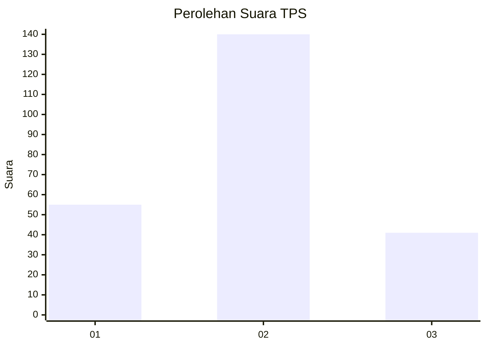
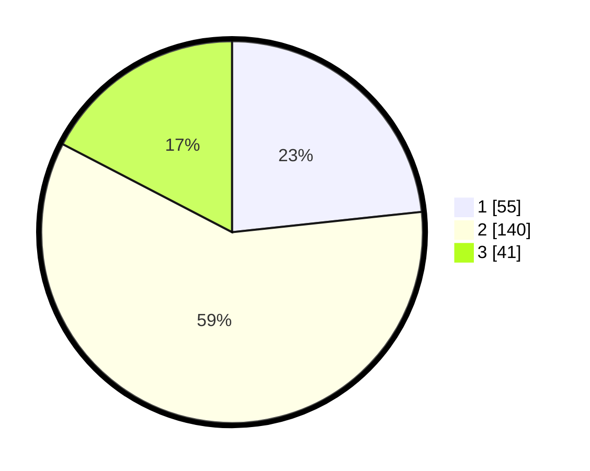

# Hasil

## Grafik

## Tabel

| No. | Nama Paslon    | Suara | Suara (raw) | Persentase |
|:--- |:-------------- | -----:| -----------:| ----------:|
| 1   | ANIES MUHAIMIN | 55    | [55][p-1]   | 23,31      |
| 2   | PRABOWO GIBRAN | 140   | [140][p-2]  | 59,32      |
| 3   | GANJAR MAHFUD  | 41    | [41][p-3]   | 17,37      |

[p-1]: https://github.com/gigit-pemilu/pemilu-2024-34-di-yogyakarta/blob/main/pilpres/hitung-suara/sub/34-di-yogyakarta/sub/01-kulon-progo/sub/04-galur/sub/2005-tirtorahayu/sub/006-tps/sub/paslon-1.txt
[p-2]: https://github.com/gigit-pemilu/pemilu-2024-34-di-yogyakarta/blob/main/pilpres/hitung-suara/sub/34-di-yogyakarta/sub/01-kulon-progo/sub/04-galur/sub/2005-tirtorahayu/sub/006-tps/sub/paslon-2.txt
[p-3]: https://github.com/gigit-pemilu/pemilu-2024-34-di-yogyakarta/blob/main/pilpres/hitung-suara/sub/34-di-yogyakarta/sub/01-kulon-progo/sub/04-galur/sub/2005-tirtorahayu/sub/006-tps/sub/paslon-3.txt

## Foto C Plano

https://sirekap-obj-formc.kpu.go.id/caa2/pemilu/ppwp/34/01/04/20/05/3401042005006-20240215-033916--a9ddf0ff-bcd6-45cd-9f87-1fe372152fff.jpg

https://sirekap-obj-formc.kpu.go.id/caa2/pemilu/ppwp/34/01/04/20/05/3401042005006-20240215-034047--6bfabbbe-609f-4dd9-a90b-0f46aa4cffe1.jpg

https://sirekap-obj-formc.kpu.go.id/caa2/pemilu/ppwp/34/01/04/20/05/3401042005006-20240215-034201--f4f417d6-2537-4f7f-a936-7a46e578679e.jpg

## Metadata

| Key        | Value               |
| ---------- | ------------------- |
| Time Stamp | 2024-02-15 15:00:29 |

