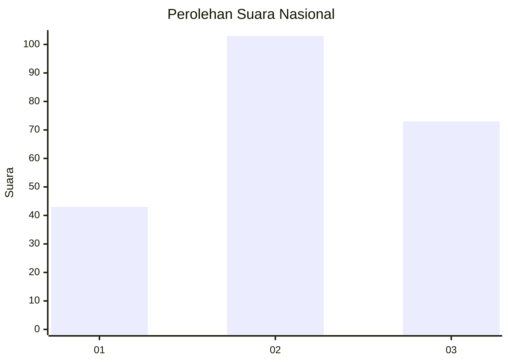
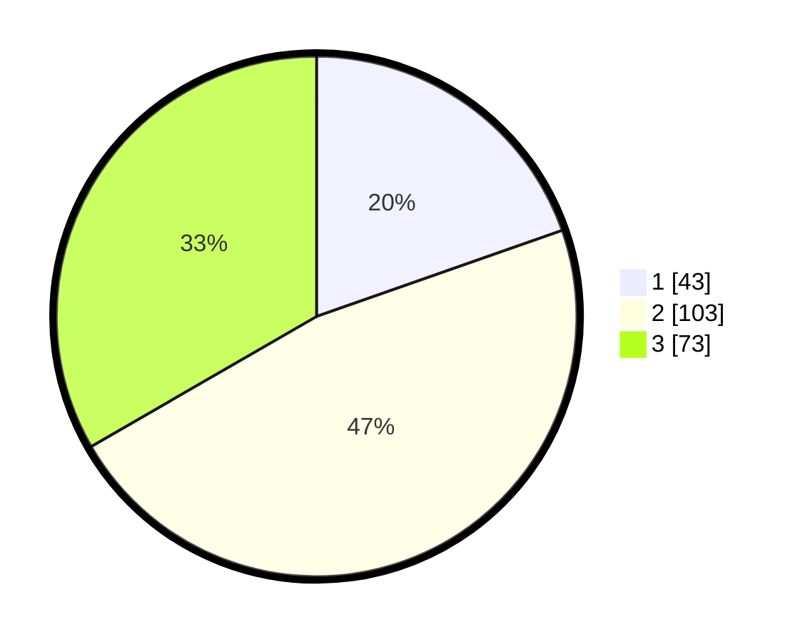

# Hasil

## Grafik

## Tabel

| No. | Nama Paslon    | Suara | Suara (raw) | Persentase |
|:--- |:-------------- | -----:| -----------:| ----------:|
| 1   | ANIES MUHAIMIN | 43    | [43][p-1]   | 19,63      |
| 2   | PRABOWO GIBRAN | 103   | [103][p-2]  | 47,03      |
| 3   | GANJAR MAHFUD  | 73    | [73][p-3]   | 33,33      |

[p-1]: https://github.com/gigit-pemilu/pemilu-2024/blob/main/pilpres/hitung-suara/sub/34-di-yogyakarta/sub/01-kulon-progo/sub/04-galur/sub/2005-tirtorahayu/sub/007-tps/sub/paslon-1.txt
[p-2]: https://github.com/gigit-pemilu/pemilu-2024/blob/main/pilpres/hitung-suara/sub/34-di-yogyakarta/sub/01-kulon-progo/sub/04-galur/sub/2005-tirtorahayu/sub/007-tps/sub/paslon-2.txt
[p-3]: https://github.com/gigit-pemilu/pemilu-2024/blob/main/pilpres/hitung-suara/sub/34-di-yogyakarta/sub/01-kulon-progo/sub/04-galur/sub/2005-tirtorahayu/sub/007-tps/sub/paslon-3.txt

## Foto C Plano

https://sirekap-obj-formc.kpu.go.id/dd70/pemilu/ppwp/34/01/04/20/05/3401042005007-20240215-030542--66ad1980-375d-422f-80dd-c9b648804b96.jpg

https://sirekap-obj-formc.kpu.go.id/dd70/pemilu/ppwp/34/01/04/20/05/3401042005007-20240215-020912--8728b04d-c22d-4a13-b521-89f855d63f93.jpg

https://sirekap-obj-formc.kpu.go.id/dd70/pemilu/ppwp/34/01/04/20/05/3401042005007-20240215-030848--9d705e41-c7c0-43b0-a8da-5fedef3b9fdd.jpg

## Metadata

| Key        | Value               |
| ---------- | ------------------- |
| Time Stamp | 2024-02-15 22:00:27 |

