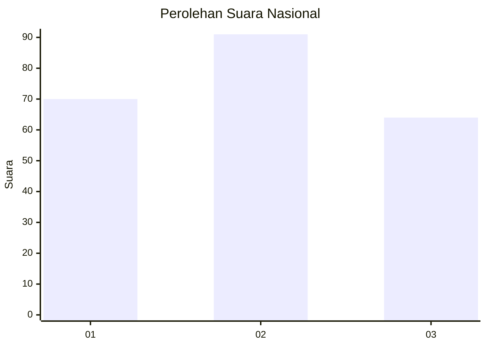
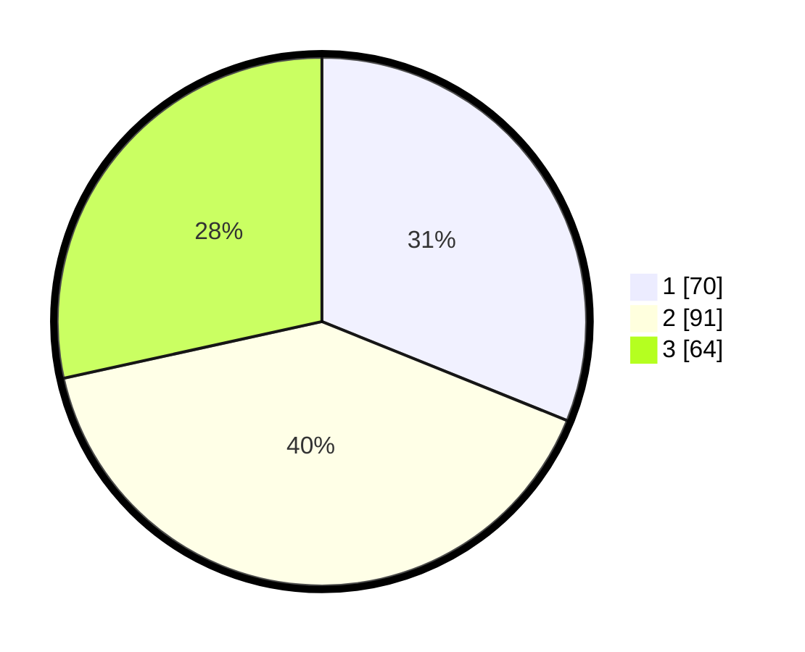

# Hasil

## Grafik

## Tabel

| No. | Nama Paslon    | Suara | Suara (raw) | Persentase |
|:--- |:-------------- | -----:| -----------:| ----------:|
| 1   | ANIES MUHAIMIN | 70    | [70][p-1]   | 31,11      |
| 2   | PRABOWO GIBRAN | 91    | [91][p-2]   | 40,44      |
| 3   | GANJAR MAHFUD  | 64    | [64][p-3]   | 28,44      |

[p-1]: https://github.com/gigit-pemilu/pemilu-2024/blob/main/pilpres/hitung-suara/sub/34-di-yogyakarta/sub/01-kulon-progo/sub/04-galur/sub/2005-tirtorahayu/sub/012-tps/sub/paslon-1.txt
[p-2]: https://github.com/gigit-pemilu/pemilu-2024/blob/main/pilpres/hitung-suara/sub/34-di-yogyakarta/sub/01-kulon-progo/sub/04-galur/sub/2005-tirtorahayu/sub/012-tps/sub/paslon-2.txt
[p-3]: https://github.com/gigit-pemilu/pemilu-2024/blob/main/pilpres/hitung-suara/sub/34-di-yogyakarta/sub/01-kulon-progo/sub/04-galur/sub/2005-tirtorahayu/sub/012-tps/sub/paslon-3.txt

## Foto C Plano

https://sirekap-obj-formc.kpu.go.id/ea07/pemilu/ppwp/34/01/04/20/05/3401042005012-20240217-193958--0e2264f8-41a4-4742-b93e-c1113da82139.jpg

https://sirekap-obj-formc.kpu.go.id/ea07/pemilu/ppwp/34/01/04/20/05/3401042005012-20240217-194021--e693c8b2-c5b8-4f06-bce0-b847837c5e73.jpg

https://sirekap-obj-formc.kpu.go.id/ea07/pemilu/ppwp/34/01/04/20/05/3401042005012-20240217-194047--aa0832e6-7372-4242-8182-cb7f645955ad.jpg

## Metadata

| Key        | Value               |
| ---------- | ------------------- |
| Time Stamp | 2024-02-19 06:16:00 |

