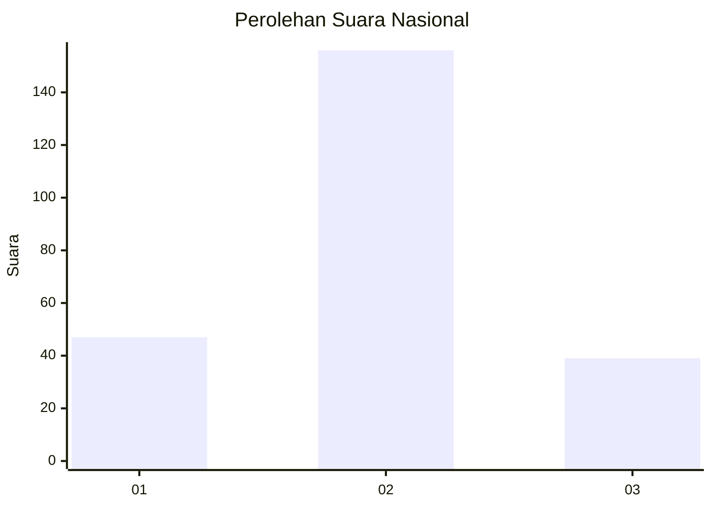
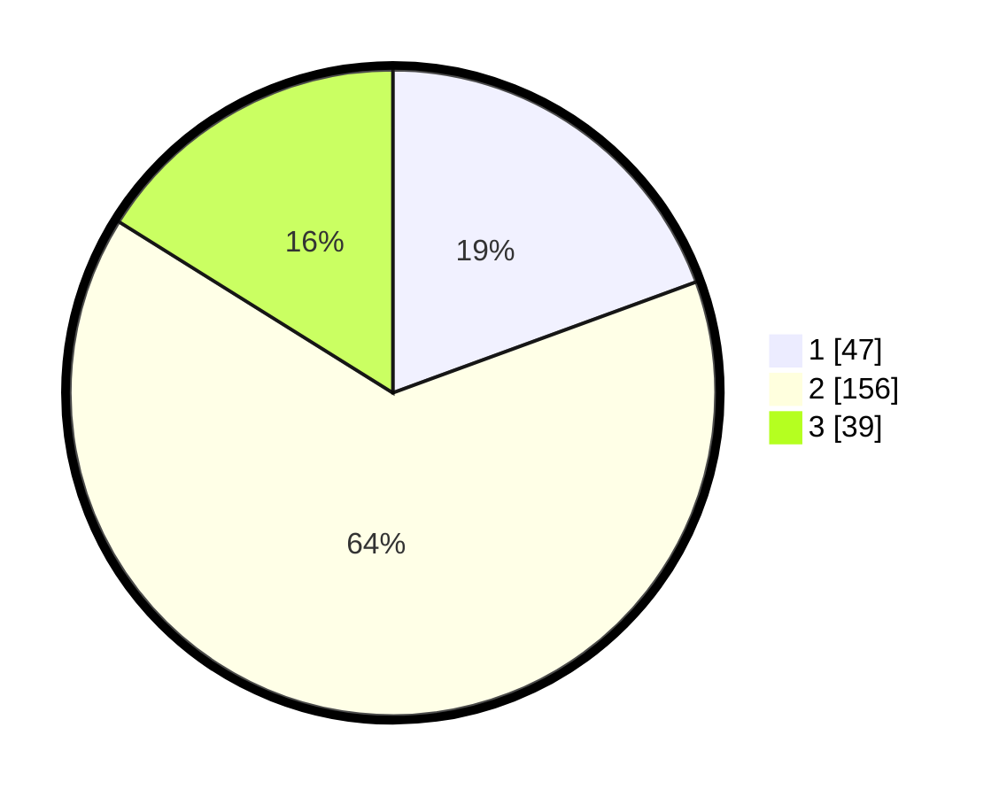

# Hasil

## Grafik

## Tabel

| No. | Nama Paslon    | Suara | Suara (raw) | Persentase |
|:--- |:-------------- | -----:| -----------:| ----------:|
| 1   | ANIES MUHAIMIN | 47    | [47][p-1]   | 19,42      |
| 2   | PRABOWO GIBRAN | 156   | [156][p-2]  | 64,46      |
| 3   | GANJAR MAHFUD  | 39    | [39][p-3]   | 16,12      |

[p-1]: https://github.com/gigit-pemilu/pemilu-2024/blob/main/pilpres/hitung-suara/sub/34-di-yogyakarta/sub/01-kulon-progo/sub/04-galur/sub/2005-tirtorahayu/sub/017-tps/sub/paslon-1.txt
[p-2]: https://github.com/gigit-pemilu/pemilu-2024/blob/main/pilpres/hitung-suara/sub/34-di-yogyakarta/sub/01-kulon-progo/sub/04-galur/sub/2005-tirtorahayu/sub/017-tps/sub/paslon-2.txt
[p-3]: https://github.com/gigit-pemilu/pemilu-2024/blob/main/pilpres/hitung-suara/sub/34-di-yogyakarta/sub/01-kulon-progo/sub/04-galur/sub/2005-tirtorahayu/sub/017-tps/sub/paslon-3.txt

## Foto C Plano

https://sirekap-obj-formc.kpu.go.id/6a65/pemilu/ppwp/34/01/04/20/05/3401042005017-20240214-215318--31e07062-1583-4801-ae6a-50a84bc4e232.jpg

https://sirekap-obj-formc.kpu.go.id/6a65/pemilu/ppwp/34/01/04/20/05/3401042005017-20240214-215705--b7ab10fc-f7e2-45ea-b505-a8d0ed72819f.jpg

https://sirekap-obj-formc.kpu.go.id/6a65/pemilu/ppwp/34/01/04/20/05/3401042005017-20240214-220038--5d867b7b-2b22-4784-a15c-da4b61a29a79.jpg

## Metadata

| Key        | Value               |
| ---------- | ------------------- |
| Time Stamp | 2024-02-15 16:30:25 |

