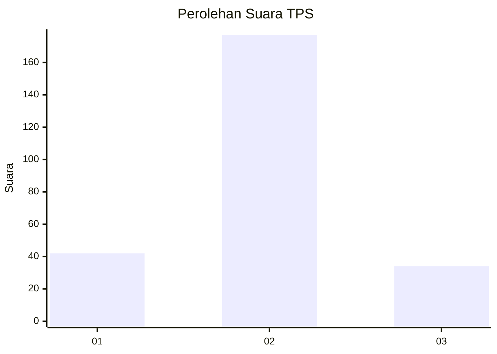
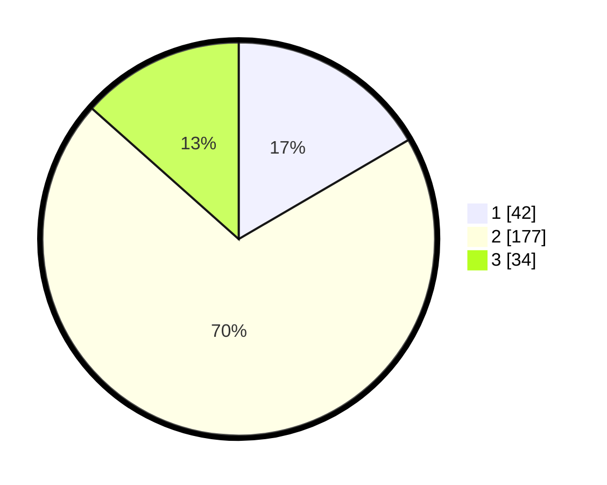

# Hasil

## Grafik

## Tabel

| No. | Nama Paslon    | Suara | Suara (raw) | Persentase |
|:--- |:-------------- | -----:| -----------:| ----------:|
| 1   | ANIES MUHAIMIN | 42    | [42][p-1]   | 16,60      |
| 2   | PRABOWO GIBRAN | 177   | [177][p-2]  | 69,96      |
| 3   | GANJAR MAHFUD  | 34    | [34][p-3]   | 13,44      |

[p-1]: https://github.com/gigit-pemilu/pemilu-2024-34-di-yogyakarta/blob/main/pilpres/hitung-suara/sub/34-di-yogyakarta/sub/01-kulon-progo/sub/04-galur/sub/2005-tirtorahayu/sub/018-tps/sub/paslon-1.txt
[p-2]: https://github.com/gigit-pemilu/pemilu-2024-34-di-yogyakarta/blob/main/pilpres/hitung-suara/sub/34-di-yogyakarta/sub/01-kulon-progo/sub/04-galur/sub/2005-tirtorahayu/sub/018-tps/sub/paslon-2.txt
[p-3]: https://github.com/gigit-pemilu/pemilu-2024-34-di-yogyakarta/blob/main/pilpres/hitung-suara/sub/34-di-yogyakarta/sub/01-kulon-progo/sub/04-galur/sub/2005-tirtorahayu/sub/018-tps/sub/paslon-3.txt

## Foto C Plano

https://sirekap-obj-formc.kpu.go.id/b5d8/pemilu/ppwp/34/01/04/20/05/3401042005018-20240215-013023--bec6fe7d-9d0d-4495-bdb0-8ad5da0c72e6.jpg

https://sirekap-obj-formc.kpu.go.id/b5d8/pemilu/ppwp/34/01/04/20/05/3401042005018-20240215-013353--b25e9ff6-c0d6-4cdc-be35-780c43075cfc.jpg

https://sirekap-obj-formc.kpu.go.id/b5d8/pemilu/ppwp/34/01/04/20/05/3401042005018-20240215-013537--8c4bff4a-293d-4dae-8f78-b0bb3dc99d14.jpg

## Metadata

| Key        | Value               |
| ---------- | ------------------- |
| Time Stamp | 2024-02-15 22:00:27 |

