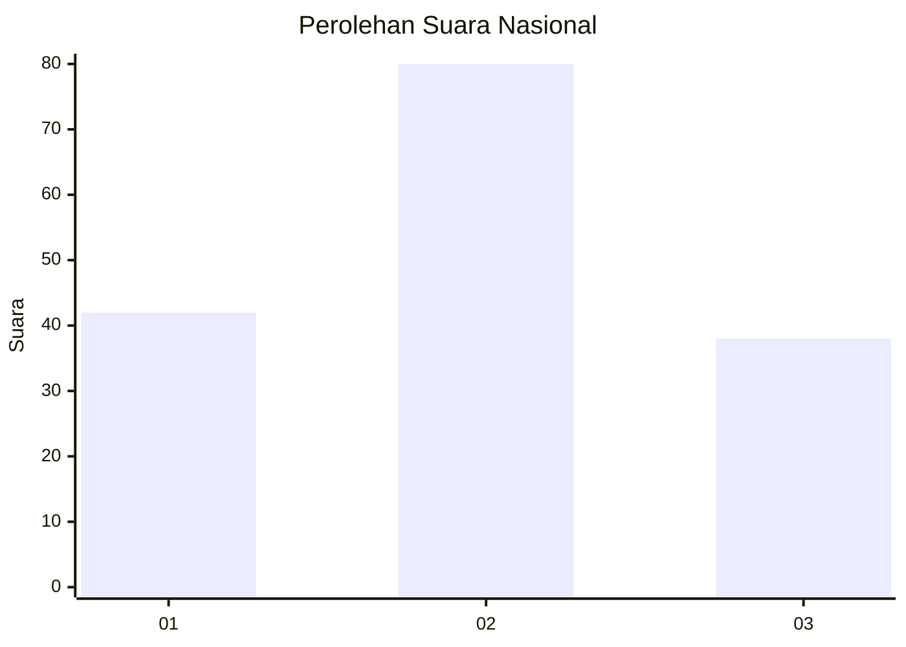
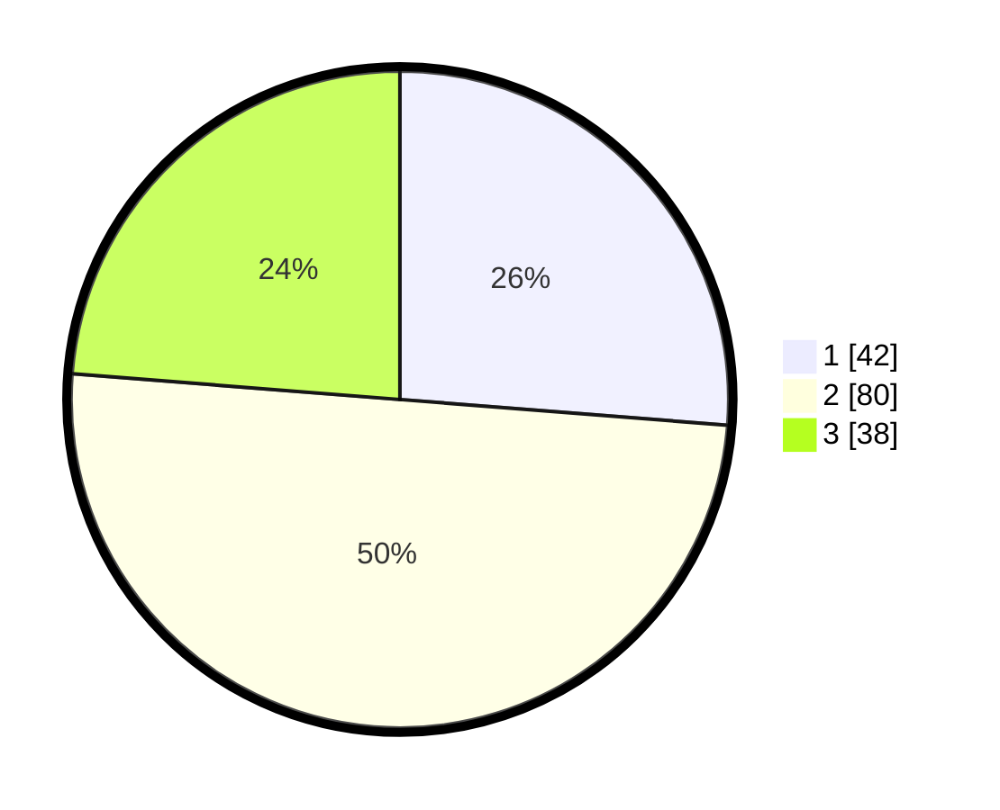

# Hasil

## Grafik

## Tabel

| No. | Nama Paslon    | Suara | Suara (raw) | Persentase |
|:--- |:-------------- | -----:| -----------:| ----------:|
| 1   | ANIES MUHAIMIN | 42    | [42][p-1]   | 26,25      |
| 2   | PRABOWO GIBRAN | 80    | [80][p-2]   | 50,00      |
| 3   | GANJAR MAHFUD  | 38    | [38][p-3]   | 23,75      |

[p-1]: https://github.com/gigit-pemilu/pemilu-2024/blob/main/pilpres/hitung-suara/sub/34-di-yogyakarta/sub/01-kulon-progo/sub/04-galur/sub/2005-tirtorahayu/sub/020-tps/sub/paslon-1.txt
[p-2]: https://github.com/gigit-pemilu/pemilu-2024/blob/main/pilpres/hitung-suara/sub/34-di-yogyakarta/sub/01-kulon-progo/sub/04-galur/sub/2005-tirtorahayu/sub/020-tps/sub/paslon-2.txt
[p-3]: https://github.com/gigit-pemilu/pemilu-2024/blob/main/pilpres/hitung-suara/sub/34-di-yogyakarta/sub/01-kulon-progo/sub/04-galur/sub/2005-tirtorahayu/sub/020-tps/sub/paslon-3.txt

## Foto C Plano

https://sirekap-obj-formc.kpu.go.id/c016/pemilu/ppwp/34/01/04/20/05/3401042005020-20240214-230742--f8308a10-8094-41d7-9d52-5f43b9997959.jpg

https://sirekap-obj-formc.kpu.go.id/c016/pemilu/ppwp/34/01/04/20/05/3401042005020-20240214-230824--e93b7044-19c2-4b66-b4b0-d46c452a282c.jpg

https://sirekap-obj-formc.kpu.go.id/c016/pemilu/ppwp/34/01/04/20/05/3401042005020-20240215-015949--db6888c4-8e96-49aa-bfe0-f3cc45d43add.jpg

## Metadata

| Key        | Value               |
| ---------- | ------------------- |
| Time Stamp | 2024-02-15 15:00:29 |

