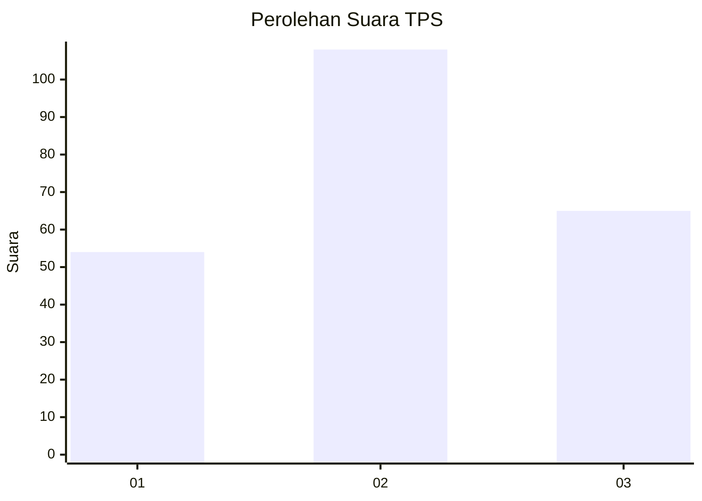
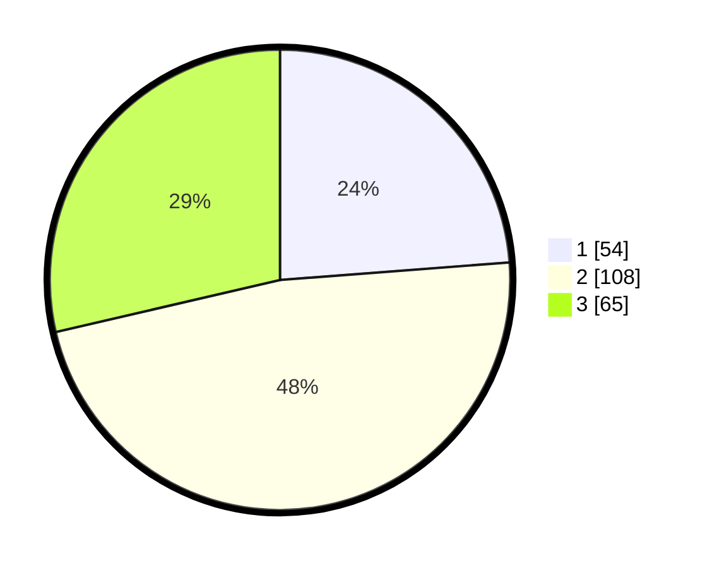

# Hasil

## Grafik

## Tabel

| No. | Nama Paslon    | Suara | Suara (raw) | Persentase |
|:--- |:-------------- | -----:| -----------:| ----------:|
| 1   | ANIES MUHAIMIN | 54    | [54][p-1]   | 23,79      |
| 2   | PRABOWO GIBRAN | 108   | [108][p-2]  | 47,58      |
| 3   | GANJAR MAHFUD  | 65    | [65][p-3]   | 28,63      |

[p-1]: https://github.com/gigit-pemilu/pemilu-2024-34-di-yogyakarta/blob/main/pilpres/hitung-suara/sub/34-di-yogyakarta/sub/01-kulon-progo/sub/04-galur/sub/2006-pandowan/sub/001-tps/sub/paslon-1.txt
[p-2]: https://github.com/gigit-pemilu/pemilu-2024-34-di-yogyakarta/blob/main/pilpres/hitung-suara/sub/34-di-yogyakarta/sub/01-kulon-progo/sub/04-galur/sub/2006-pandowan/sub/001-tps/sub/paslon-2.txt
[p-3]: https://github.com/gigit-pemilu/pemilu-2024-34-di-yogyakarta/blob/main/pilpres/hitung-suara/sub/34-di-yogyakarta/sub/01-kulon-progo/sub/04-galur/sub/2006-pandowan/sub/001-tps/sub/paslon-3.txt

## Foto C Plano

https://sirekap-obj-formc.kpu.go.id/3d17/pemilu/ppwp/34/01/04/20/06/3401042006001-20240215-003632--1a2ab455-db25-45ca-817b-a61d143c5560.jpg

https://sirekap-obj-formc.kpu.go.id/3d17/pemilu/ppwp/34/01/04/20/06/3401042006001-20240215-003751--931191c6-dbee-425a-8c15-386a7af6439d.jpg

https://sirekap-obj-formc.kpu.go.id/3d17/pemilu/ppwp/34/01/04/20/06/3401042006001-20240215-003949--ae9fa487-e50a-4e82-8dac-b7858cc7d040.jpg

## Metadata

| Key        | Value               |
| ---------- | ------------------- |
| Time Stamp | 2024-02-15 22:00:27 |

