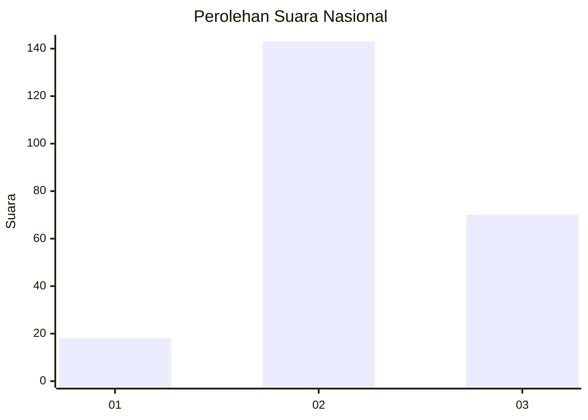
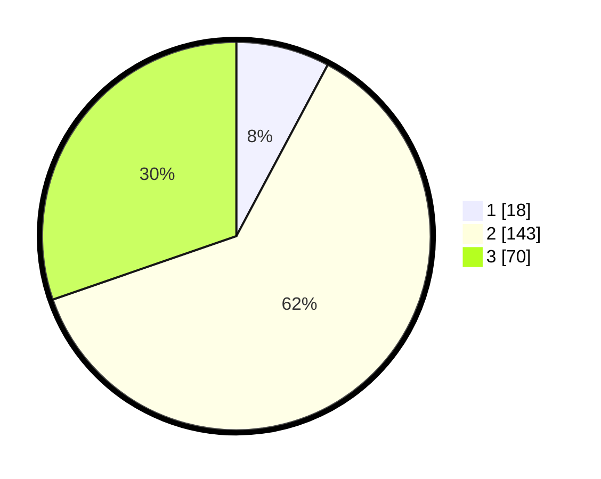

# Hasil

## Grafik

## Tabel

| No. | Nama Paslon    | Suara | Suara (raw) | Persentase |
|:--- |:-------------- | -----:| -----------:| ----------:|
| 1   | ANIES MUHAIMIN | 18    | [18][p-1]   | 7,79       |
| 2   | PRABOWO GIBRAN | 143   | [143][p-2]  | 61,90      |
| 3   | GANJAR MAHFUD  | 70    | [70][p-3]   | 30,30      |

[p-1]: https://github.com/gigit-pemilu/pemilu-2024/blob/main/pilpres/hitung-suara/sub/34-di-yogyakarta/sub/01-kulon-progo/sub/04-galur/sub/2006-pandowan/sub/006-tps/sub/paslon-1.txt
[p-2]: https://github.com/gigit-pemilu/pemilu-2024/blob/main/pilpres/hitung-suara/sub/34-di-yogyakarta/sub/01-kulon-progo/sub/04-galur/sub/2006-pandowan/sub/006-tps/sub/paslon-2.txt
[p-3]: https://github.com/gigit-pemilu/pemilu-2024/blob/main/pilpres/hitung-suara/sub/34-di-yogyakarta/sub/01-kulon-progo/sub/04-galur/sub/2006-pandowan/sub/006-tps/sub/paslon-3.txt

## Foto C Plano

https://sirekap-obj-formc.kpu.go.id/0572/pemilu/ppwp/34/01/04/20/06/3401042006006-20240215-015851--56a89d66-068e-4ff7-a0af-f87d7eb872a9.jpg

https://sirekap-obj-formc.kpu.go.id/0572/pemilu/ppwp/34/01/04/20/06/3401042006006-20240215-020056--71e56a9f-1d01-473f-8dcd-5739190114d0.jpg

https://sirekap-obj-formc.kpu.go.id/0572/pemilu/ppwp/34/01/04/20/06/3401042006006-20240215-020419--cc8f7357-5d12-480b-83c4-3664a9614711.jpg

## Metadata

| Key        | Value               |
| ---------- | ------------------- |
| Time Stamp | 2024-02-15 16:30:25 |

