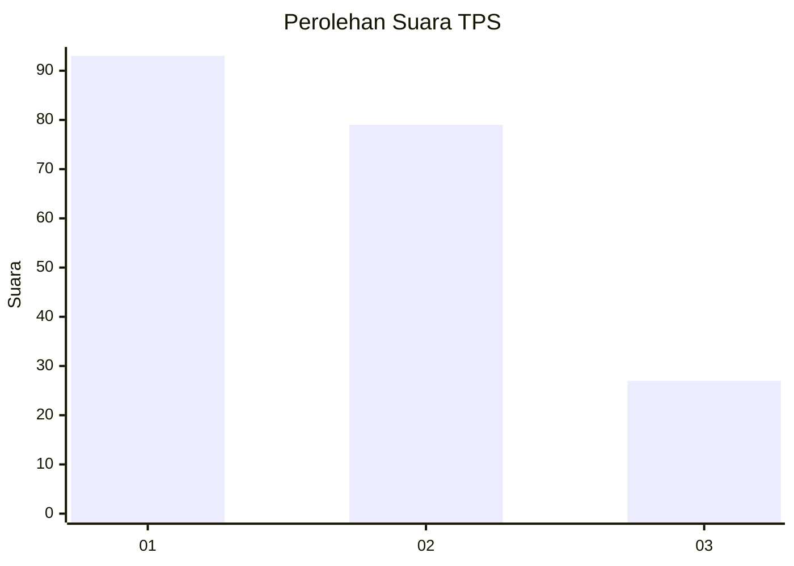
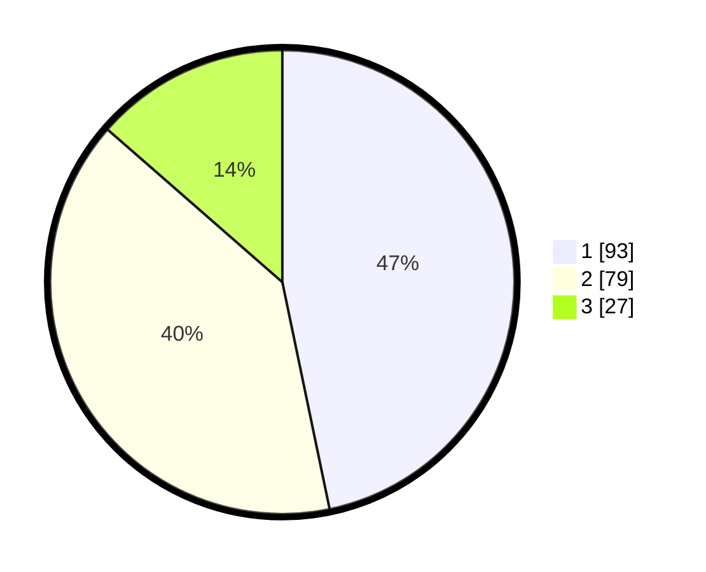

# Hasil

## Grafik

## Tabel

| No. | Nama Paslon    | Suara | Suara (raw) | Persentase |
|:--- |:-------------- | -----:| -----------:| ----------:|
| 1   | ANIES MUHAIMIN | 93    | [93][p-1]   | 46,73      |
| 2   | PRABOWO GIBRAN | 79    | [79][p-2]   | 39,70      |
| 3   | GANJAR MAHFUD  | 27    | [27][p-3]   | 13,57      |

[p-1]: https://github.com/gigit-pemilu/pemilu-2024-34-di-yogyakarta/blob/main/pilpres/hitung-suara/sub/34-di-yogyakarta/sub/01-kulon-progo/sub/05-lendah/sub/2001-wahyuharjo/sub/001-tps/sub/paslon-1.txt
[p-2]: https://github.com/gigit-pemilu/pemilu-2024-34-di-yogyakarta/blob/main/pilpres/hitung-suara/sub/34-di-yogyakarta/sub/01-kulon-progo/sub/05-lendah/sub/2001-wahyuharjo/sub/001-tps/sub/paslon-2.txt
[p-3]: https://github.com/gigit-pemilu/pemilu-2024-34-di-yogyakarta/blob/main/pilpres/hitung-suara/sub/34-di-yogyakarta/sub/01-kulon-progo/sub/05-lendah/sub/2001-wahyuharjo/sub/001-tps/sub/paslon-3.txt

## Foto C Plano

https://sirekap-obj-formc.kpu.go.id/1030/pemilu/ppwp/34/01/05/20/01/3401052001001-20240216-020324--f743ad46-eecf-44f2-9bd8-51dc6ede9c1c.jpg

https://sirekap-obj-formc.kpu.go.id/1030/pemilu/ppwp/34/01/05/20/01/3401052001001-20240216-023041--026f4a3f-4c30-4d69-91db-55ba290fb239.jpg

https://sirekap-obj-formc.kpu.go.id/1030/pemilu/ppwp/34/01/05/20/01/3401052001001-20240216-020333--c75ad3e2-5ef5-4fc8-96b1-fb105839d38b.jpg

## Metadata

| Key        | Value               |
| ---------- | ------------------- |
| Time Stamp | 2024-02-19 06:16:00 |

## DATA PEMILIH TETAP

Jumlah pemilih dalam DPT: **230**.
 * L: **112**.
 * P: **118**.

## DATA PENGGUNA HAK PILIH

Jumlah pengguna hak pilih dalam DPT: **202**.
 * L: **93**.
 * P: **109**.

Jumlah pengguna hak pilih dalam DPTb: **4**.
 * L: **2**.
 * P: **2**.

Jumlah pengguna hak pilih dalam DPK: **0**.
 * L: **0**.
 * P: **0**.

Jumlah pengguna hak pilih: **206**.
 * L: **95**.
 * P: **111**.

## JUMLAH SUARA SAH DAN TIDAK SAH

JUMLAH SELURUH SUARA SAH: **199**.

JUMLAH SUARA TIDAK SAH: **7**.

JUMLAH SELURUH SUARA SAH DAN SUARA TIDAK SAH: **206**.

