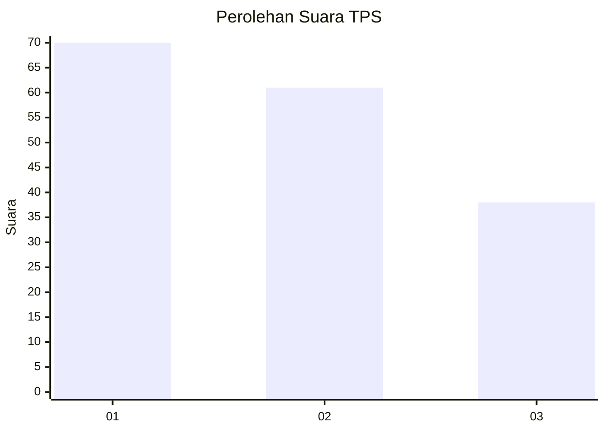
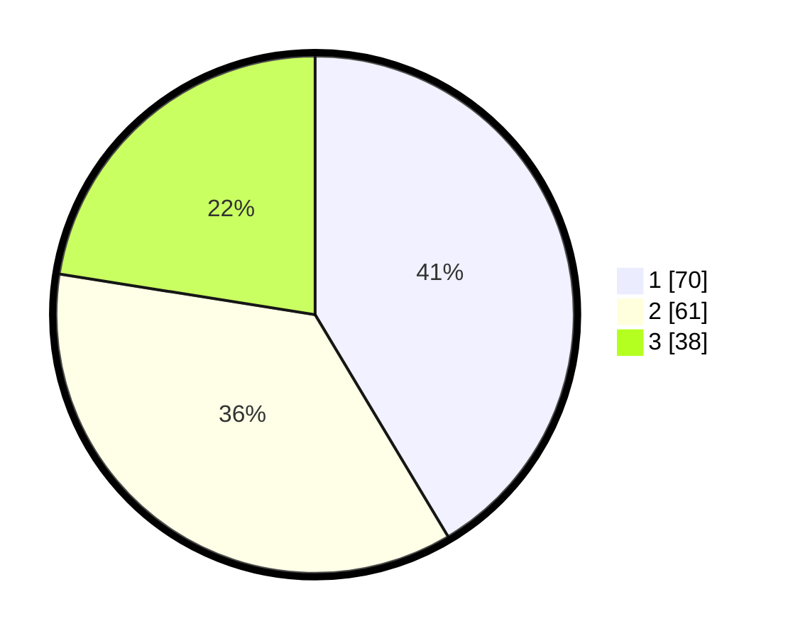

# Hasil

## Grafik

## Tabel

| No. | Nama Paslon    | Suara | Suara (raw) | Persentase |
|:--- |:-------------- | -----:| -----------:| ----------:|
| 1   | ANIES MUHAIMIN | 70    | [70][p-1]   | 41,42      |
| 2   | PRABOWO GIBRAN | 61    | [61][p-2]   | 36,09      |
| 3   | GANJAR MAHFUD  | 38    | [38][p-3]   | 22,49      |

[p-1]: https://github.com/gigit-pemilu/pemilu-2024-34-di-yogyakarta/blob/main/pilpres/hitung-suara/sub/34-di-yogyakarta/sub/01-kulon-progo/sub/05-lendah/sub/2001-wahyuharjo/sub/002-tps/sub/paslon-1.txt
[p-2]: https://github.com/gigit-pemilu/pemilu-2024-34-di-yogyakarta/blob/main/pilpres/hitung-suara/sub/34-di-yogyakarta/sub/01-kulon-progo/sub/05-lendah/sub/2001-wahyuharjo/sub/002-tps/sub/paslon-2.txt
[p-3]: https://github.com/gigit-pemilu/pemilu-2024-34-di-yogyakarta/blob/main/pilpres/hitung-suara/sub/34-di-yogyakarta/sub/01-kulon-progo/sub/05-lendah/sub/2001-wahyuharjo/sub/002-tps/sub/paslon-3.txt

## Foto C Plano

https://sirekap-obj-formc.kpu.go.id/3b94/pemilu/ppwp/34/01/05/20/01/3401052001002-20240216-010615--0df48529-6c6b-420c-a2c2-46c8b74cd8f2.jpg

https://sirekap-obj-formc.kpu.go.id/3b94/pemilu/ppwp/34/01/05/20/01/3401052001002-20240216-010619--66be9cd4-d16b-4cd9-b8f1-486875022409.jpg

https://sirekap-obj-formc.kpu.go.id/3b94/pemilu/ppwp/34/01/05/20/01/3401052001002-20240216-010617--26691a8a-b8fa-48f5-8f92-3acb72ebc6e9.jpg

## Metadata

| Key        | Value               |
| ---------- | ------------------- |
| Time Stamp | 2024-02-19 06:16:00 |

## DATA PEMILIH TETAP

Jumlah pemilih dalam DPT: **207**.
 * L: **99**.
 * P: **108**.

## DATA PENGGUNA HAK PILIH

Jumlah pengguna hak pilih dalam DPT: **168**.
 * L: **80**.
 * P: **88**.

Jumlah pengguna hak pilih dalam DPTb: **5**.
 * L: **3**.
 * P: **2**.

Jumlah pengguna hak pilih dalam DPK: **0**.
 * L: **0**.
 * P: **0**.

Jumlah pengguna hak pilih: **173**.
 * L: **83**.
 * P: **90**.

## JUMLAH SUARA SAH DAN TIDAK SAH

JUMLAH SELURUH SUARA SAH: **169**.

JUMLAH SUARA TIDAK SAH: **4**.

JUMLAH SELURUH SUARA SAH DAN SUARA TIDAK SAH: **173**.

