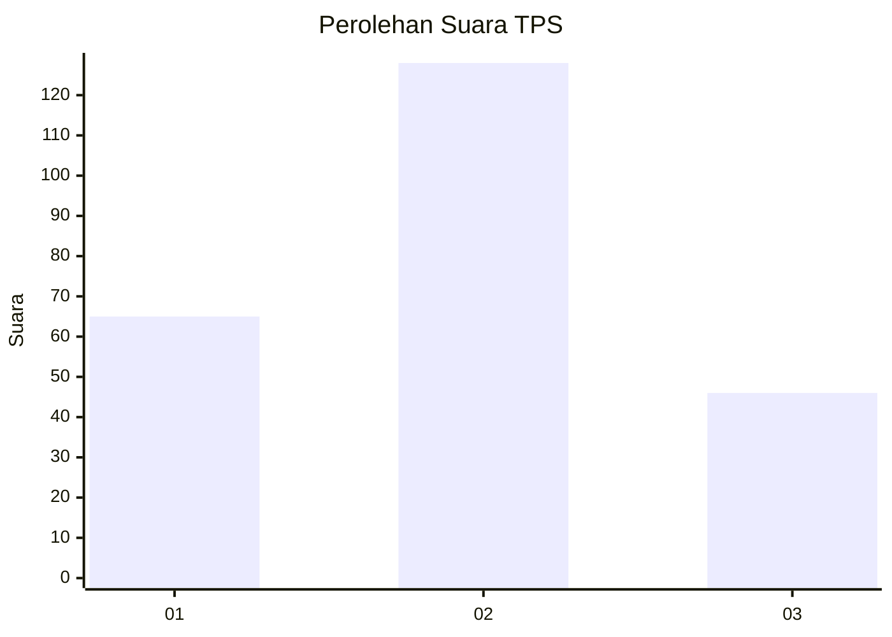
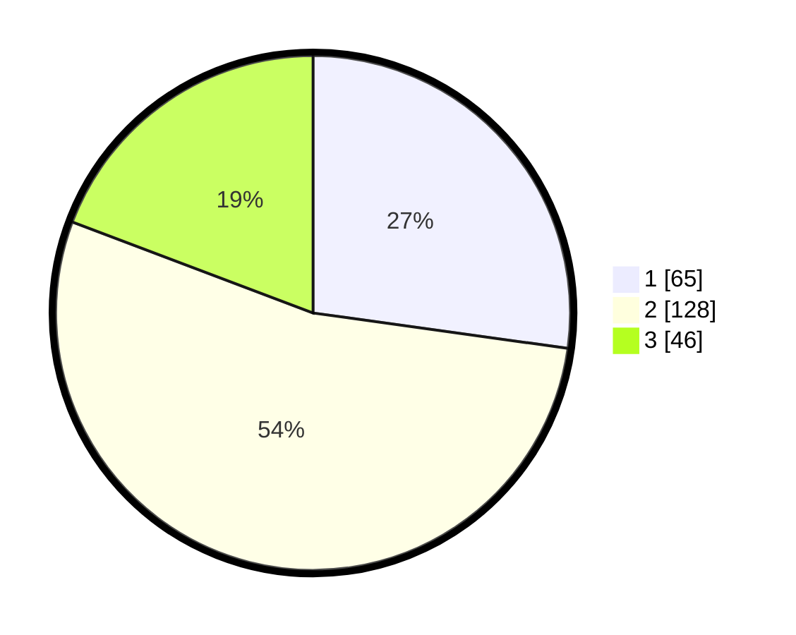

# Hasil

## Grafik

## Tabel

| No. | Nama Paslon    | Suara | Suara (raw) | Persentase |
|:--- |:-------------- | -----:| -----------:| ----------:|
| 1   | ANIES MUHAIMIN | 65    | [65][p-1]   | 27,20      |
| 2   | PRABOWO GIBRAN | 128   | [128][p-2]  | 53,56      |
| 3   | GANJAR MAHFUD  | 46    | [46][p-3]   | 19,25      |

[p-1]: https://github.com/gigit-pemilu/pemilu-2024-34-di-yogyakarta/blob/main/pilpres/hitung-suara/sub/34-di-yogyakarta/sub/01-kulon-progo/sub/05-lendah/sub/2001-wahyuharjo/sub/003-tps/sub/paslon-1.txt
[p-2]: https://github.com/gigit-pemilu/pemilu-2024-34-di-yogyakarta/blob/main/pilpres/hitung-suara/sub/34-di-yogyakarta/sub/01-kulon-progo/sub/05-lendah/sub/2001-wahyuharjo/sub/003-tps/sub/paslon-2.txt
[p-3]: https://github.com/gigit-pemilu/pemilu-2024-34-di-yogyakarta/blob/main/pilpres/hitung-suara/sub/34-di-yogyakarta/sub/01-kulon-progo/sub/05-lendah/sub/2001-wahyuharjo/sub/003-tps/sub/paslon-3.txt

## Foto C Plano

https://sirekap-obj-formc.kpu.go.id/423e/pemilu/ppwp/34/01/05/20/01/3401052001003-20240216-020349--783d8c5f-e679-4926-91d3-25b7421789c3.jpg

https://sirekap-obj-formc.kpu.go.id/423e/pemilu/ppwp/34/01/05/20/01/3401052001003-20240216-013942--797dc3ac-47d0-4b69-be65-04bc91953bbf.jpg

https://sirekap-obj-formc.kpu.go.id/423e/pemilu/ppwp/34/01/05/20/01/3401052001003-20240216-013932--412037c2-4573-4445-9765-d8c0e45eabaa.jpg

## Metadata

| Key        | Value               |
| ---------- | ------------------- |
| Time Stamp | 2024-02-19 06:16:00 |

## DATA PEMILIH TETAP

Jumlah pemilih dalam DPT: **263**.
 * L: **130**.
 * P: **133**.

## DATA PENGGUNA HAK PILIH

Jumlah pengguna hak pilih dalam DPT: **240**.
 * L: **117**.
 * P: **123**.

Jumlah pengguna hak pilih dalam DPTb: **5**.
 * L: **1**.
 * P: **4**.

Jumlah pengguna hak pilih dalam DPK: **1**.
 * L: **0**.
 * P: **1**.

Jumlah pengguna hak pilih: **246**.
 * L: **118**.
 * P: **128**.

## JUMLAH SUARA SAH DAN TIDAK SAH

JUMLAH SELURUH SUARA SAH: **239**.

JUMLAH SUARA TIDAK SAH: **7**.

JUMLAH SELURUH SUARA SAH DAN SUARA TIDAK SAH: **246**.

