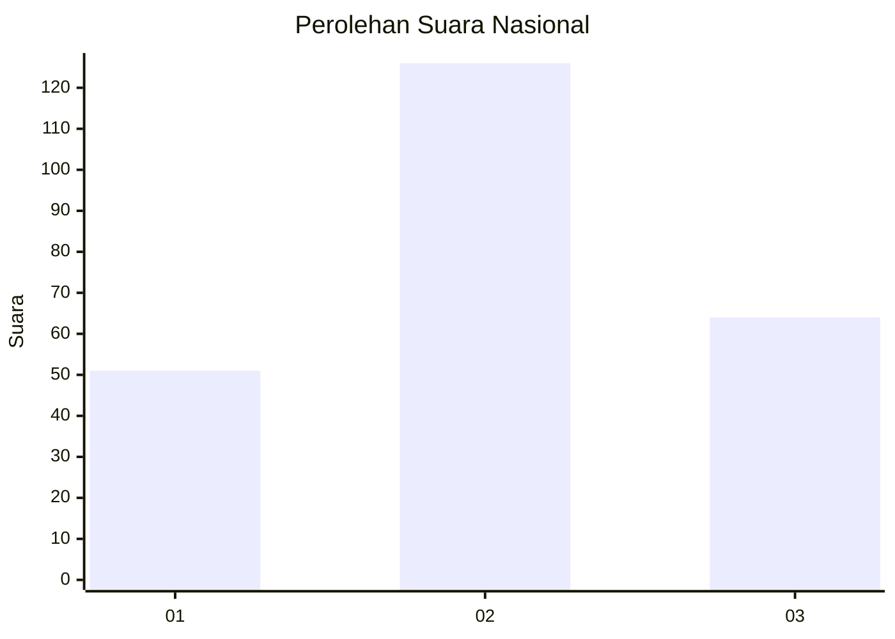
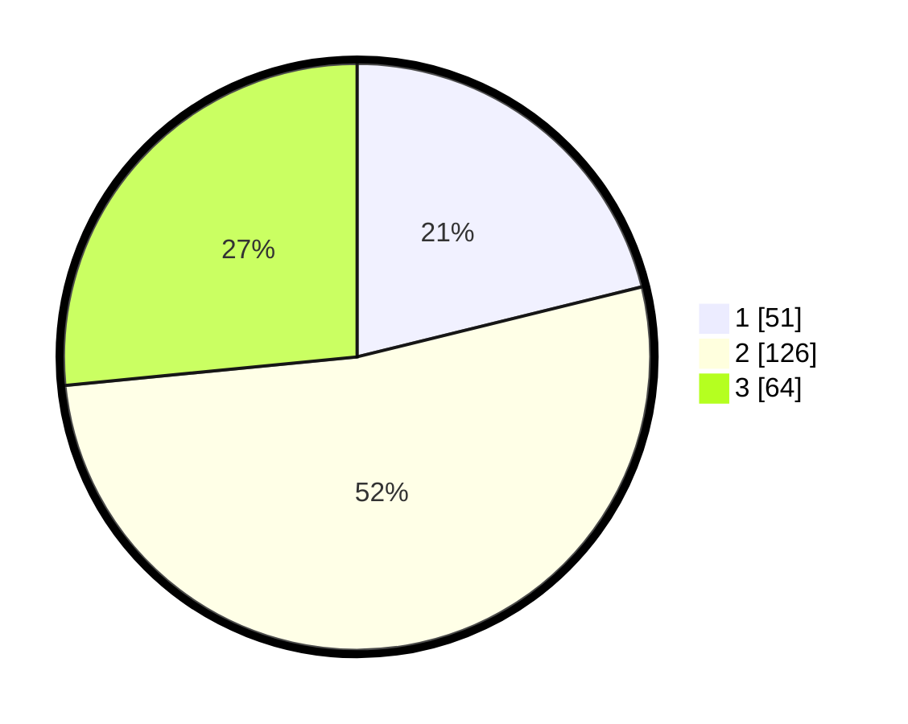

# Hasil

## Grafik

## Tabel

| No. | Nama Paslon    | Suara | Suara (raw) | Persentase |
|:--- |:-------------- | -----:| -----------:| ----------:|
| 1   | ANIES MUHAIMIN | 51    | [51][p-1]   | 21,16      |
| 2   | PRABOWO GIBRAN | 126   | [126][p-2]  | 52,28      |
| 3   | GANJAR MAHFUD  | 64    | [64][p-3]   | 26,56      |

[p-1]: https://github.com/gigit-pemilu/pemilu-2024/blob/main/pilpres/hitung-suara/sub/34-di-yogyakarta/sub/01-kulon-progo/sub/05-lendah/sub/2001-wahyuharjo/sub/004-tps/sub/paslon-1.txt
[p-2]: https://github.com/gigit-pemilu/pemilu-2024/blob/main/pilpres/hitung-suara/sub/34-di-yogyakarta/sub/01-kulon-progo/sub/05-lendah/sub/2001-wahyuharjo/sub/004-tps/sub/paslon-2.txt
[p-3]: https://github.com/gigit-pemilu/pemilu-2024/blob/main/pilpres/hitung-suara/sub/34-di-yogyakarta/sub/01-kulon-progo/sub/05-lendah/sub/2001-wahyuharjo/sub/004-tps/sub/paslon-3.txt

## Foto C Plano

https://sirekap-obj-formc.kpu.go.id/c215/pemilu/ppwp/34/01/05/20/01/3401052001004-20240216-142058--c38da5ab-bd45-4148-b902-e5f3834dab22.jpg

https://sirekap-obj-formc.kpu.go.id/c215/pemilu/ppwp/34/01/05/20/01/3401052001004-20240216-142100--9c91553e-cf3e-4481-b6ea-43c6c379696d.jpg

https://sirekap-obj-formc.kpu.go.id/c215/pemilu/ppwp/34/01/05/20/01/3401052001004-20240216-142059--10eb6b75-6580-407e-bae9-11e8d79474ee.jpg

## Metadata

| Key        | Value               |
| ---------- | ------------------- |
| Time Stamp | 2024-02-19 06:16:00 |

## DATA PEMILIH TETAP

Jumlah pemilih dalam DPT: **265**.
 * L: **129**.
 * P: **136**.

## DATA PENGGUNA HAK PILIH

Jumlah pengguna hak pilih dalam DPT: **242**.
 * L: **116**.
 * P: **126**.

Jumlah pengguna hak pilih dalam DPTb: **4**.
 * L: **1**.
 * P: **3**.

Jumlah pengguna hak pilih dalam DPK: **1**.
 * L: **1**.
 * P: **0**.

Jumlah pengguna hak pilih: **247**.
 * L: **118**.
 * P: **129**.

## JUMLAH SUARA SAH DAN TIDAK SAH

JUMLAH SELURUH SUARA SAH: **241**.

JUMLAH SUARA TIDAK SAH: **6**.

JUMLAH SELURUH SUARA SAH DAN SUARA TIDAK SAH: **247**.

