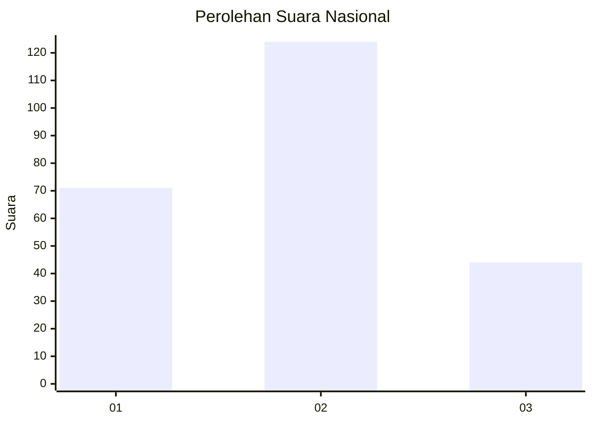
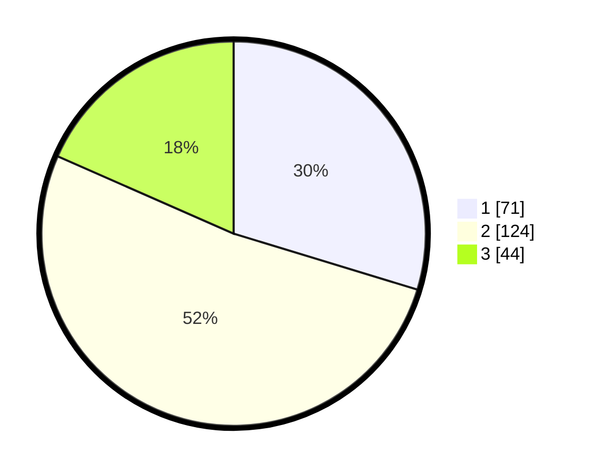

# Hasil

## Grafik

## Tabel

| No. | Nama Paslon    | Suara | Suara (raw) | Persentase |
|:--- |:-------------- | -----:| -----------:| ----------:|
| 1   | ANIES MUHAIMIN | 71    | [71][p-1]   | 29,71      |
| 2   | PRABOWO GIBRAN | 124   | [124][p-2]  | 51,88      |
| 3   | GANJAR MAHFUD  | 44    | [44][p-3]   | 18,41      |

[p-1]: https://github.com/gigit-pemilu/pemilu-2024/blob/main/pilpres/hitung-suara/sub/34-di-yogyakarta/sub/01-kulon-progo/sub/05-lendah/sub/2001-wahyuharjo/sub/006-tps/sub/paslon-1.txt
[p-2]: https://github.com/gigit-pemilu/pemilu-2024/blob/main/pilpres/hitung-suara/sub/34-di-yogyakarta/sub/01-kulon-progo/sub/05-lendah/sub/2001-wahyuharjo/sub/006-tps/sub/paslon-2.txt
[p-3]: https://github.com/gigit-pemilu/pemilu-2024/blob/main/pilpres/hitung-suara/sub/34-di-yogyakarta/sub/01-kulon-progo/sub/05-lendah/sub/2001-wahyuharjo/sub/006-tps/sub/paslon-3.txt

## Foto C Plano

https://sirekap-obj-formc.kpu.go.id/dd9d/pemilu/ppwp/34/01/05/20/01/3401052001006-20240216-133306--6a6dc5f6-fbcc-4c9c-8802-fae44187b086.jpg

https://sirekap-obj-formc.kpu.go.id/dd9d/pemilu/ppwp/34/01/05/20/01/3401052001006-20240216-133307--5c737f6d-c25b-42fa-8cbd-6a779a25f551.jpg

https://sirekap-obj-formc.kpu.go.id/dd9d/pemilu/ppwp/34/01/05/20/01/3401052001006-20240216-133306--b5a5535a-dc27-44c2-b76a-453709fe8ea0.jpg

## Metadata

| Key        | Value               |
| ---------- | ------------------- |
| Time Stamp | 2024-02-19 06:16:00 |

## DATA PEMILIH TETAP

Jumlah pemilih dalam DPT: **287**.
 * L: **133**.
 * P: **154**.

## DATA PENGGUNA HAK PILIH

Jumlah pengguna hak pilih dalam DPT: **242**.
 * L: **107**.
 * P: **135**.

Jumlah pengguna hak pilih dalam DPTb: **4**.
 * L: **3**.
 * P: **1**.

Jumlah pengguna hak pilih dalam DPK: **1**.
 * L: **0**.
 * P: **1**.

Jumlah pengguna hak pilih: **247**.
 * L: **110**.
 * P: **137**.

## JUMLAH SUARA SAH DAN TIDAK SAH

JUMLAH SELURUH SUARA SAH: **239**.

JUMLAH SUARA TIDAK SAH: **8**.

JUMLAH SELURUH SUARA SAH DAN SUARA TIDAK SAH: **247**.

