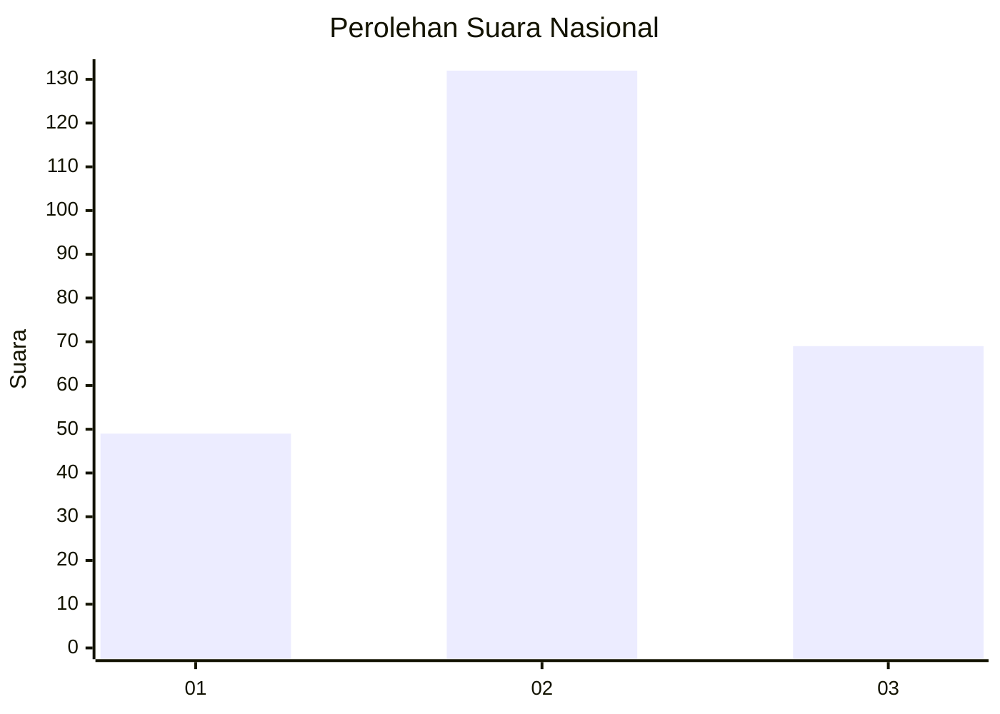
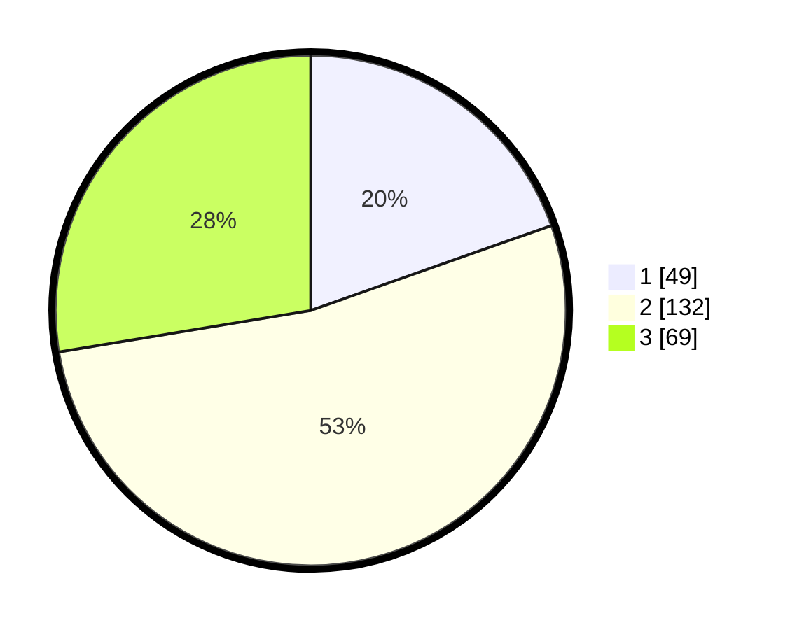

# Hasil

## Grafik

## Tabel

| No. | Nama Paslon    | Suara | Suara (raw) | Persentase |
|:--- |:-------------- | -----:| -----------:| ----------:|
| 1   | ANIES MUHAIMIN | 49    | [49][p-1]   | 19,60      |
| 2   | PRABOWO GIBRAN | 132   | [132][p-2]  | 52,80      |
| 3   | GANJAR MAHFUD  | 69    | [69][p-3]   | 27,60      |

[p-1]: https://github.com/gigit-pemilu/pemilu-2024/blob/main/pilpres/hitung-suara/sub/34-di-yogyakarta/sub/01-kulon-progo/sub/05-lendah/sub/2002-bumirejo/sub/020-tps/sub/paslon-1.txt
[p-2]: https://github.com/gigit-pemilu/pemilu-2024/blob/main/pilpres/hitung-suara/sub/34-di-yogyakarta/sub/01-kulon-progo/sub/05-lendah/sub/2002-bumirejo/sub/020-tps/sub/paslon-2.txt
[p-3]: https://github.com/gigit-pemilu/pemilu-2024/blob/main/pilpres/hitung-suara/sub/34-di-yogyakarta/sub/01-kulon-progo/sub/05-lendah/sub/2002-bumirejo/sub/020-tps/sub/paslon-3.txt

## Foto C Plano

https://sirekap-obj-formc.kpu.go.id/e807/pemilu/ppwp/34/01/05/20/02/3401052002020-20240214-193808--cdb3bafb-fce7-45a6-9457-aa259cb2c1df.jpg

https://sirekap-obj-formc.kpu.go.id/e807/pemilu/ppwp/34/01/05/20/02/3401052002020-20240214-192953--4fd8305d-6491-4068-a200-ca1180346215.jpg

https://sirekap-obj-formc.kpu.go.id/e807/pemilu/ppwp/34/01/05/20/02/3401052002020-20240214-205606--7cf4127a-1ce7-4e1c-8e9e-1898726db98c.jpg

## Metadata

| Key        | Value               |
| ---------- | ------------------- |
| Time Stamp | 2024-02-14 21:46:01 |

