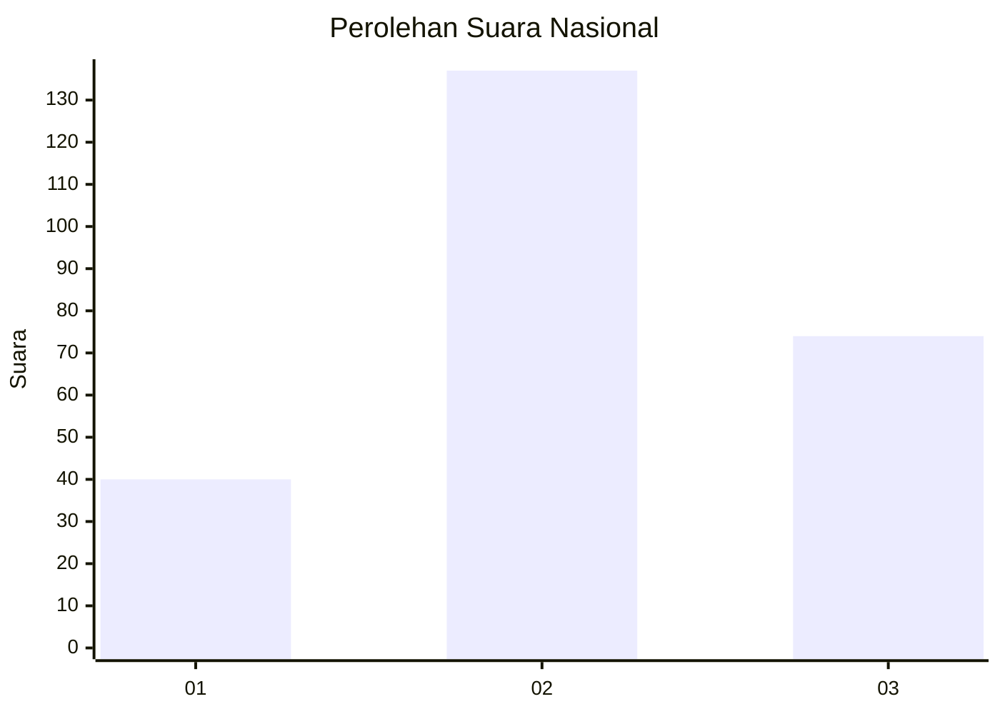
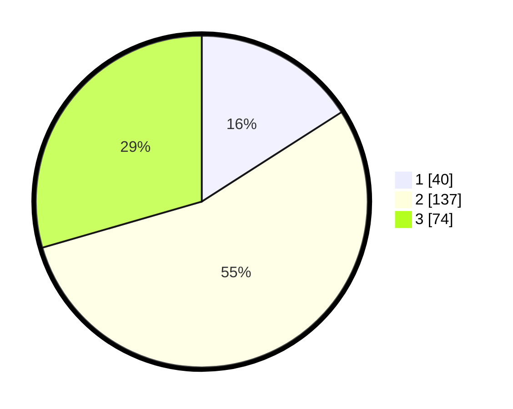

# Hasil

## Grafik

## Tabel

| No. | Nama Paslon    | Suara | Suara (raw) | Persentase |
|:--- |:-------------- | -----:| -----------:| ----------:|
| 1   | ANIES MUHAIMIN | 40    | [40][p-1]   | 15,94      |
| 2   | PRABOWO GIBRAN | 137   | [137][p-2]  | 54,58      |
| 3   | GANJAR MAHFUD  | 74    | [74][p-3]   | 29,48      |

[p-1]: https://github.com/gigit-pemilu/pemilu-2024/blob/main/pilpres/hitung-suara/sub/34-di-yogyakarta/sub/01-kulon-progo/sub/05-lendah/sub/2002-bumirejo/sub/021-tps/sub/paslon-1.txt
[p-2]: https://github.com/gigit-pemilu/pemilu-2024/blob/main/pilpres/hitung-suara/sub/34-di-yogyakarta/sub/01-kulon-progo/sub/05-lendah/sub/2002-bumirejo/sub/021-tps/sub/paslon-2.txt
[p-3]: https://github.com/gigit-pemilu/pemilu-2024/blob/main/pilpres/hitung-suara/sub/34-di-yogyakarta/sub/01-kulon-progo/sub/05-lendah/sub/2002-bumirejo/sub/021-tps/sub/paslon-3.txt

## Foto C Plano

https://sirekap-obj-formc.kpu.go.id/c066/pemilu/ppwp/34/01/05/20/02/3401052002021-20240214-185919--0e1786ad-a292-4375-ae94-60ea012b8de9.jpg

https://sirekap-obj-formc.kpu.go.id/c066/pemilu/ppwp/34/01/05/20/02/3401052002021-20240214-185955--11dcfacd-8de9-4a2f-94c8-c54eddbcc742.jpg

https://sirekap-obj-formc.kpu.go.id/c066/pemilu/ppwp/34/01/05/20/02/3401052002021-20240214-190017--22aff4e4-006c-4696-8b48-2d0beb3c071a.jpg

## Metadata

| Key        | Value               |
| ---------- | ------------------- |
| Time Stamp | 2024-02-14 21:46:01 |

## DATA PEMILIH TETAP

Jumlah pemilih dalam DPT: **291**.
 * L: **143**.
 * P: **148**.

## DATA PENGGUNA HAK PILIH

Jumlah pengguna hak pilih dalam DPT: **267**.
 * L: **129**.
 * P: **138**.

Jumlah pengguna hak pilih dalam DPTb: **4**.
 * L: **0**.
 * P: **4**.

Jumlah pengguna hak pilih dalam DPK: **2**.
 * L: **2**.
 * P: **0**.

Jumlah pengguna hak pilih: **273**.
 * L: **131**.
 * P: **142**.

## JUMLAH SUARA SAH DAN TIDAK SAH

JUMLAH SELURUH SUARA SAH: **251**.

JUMLAH SUARA TIDAK SAH: **22**.

JUMLAH SELURUH SUARA SAH DAN SUARA TIDAK SAH: **273**.

