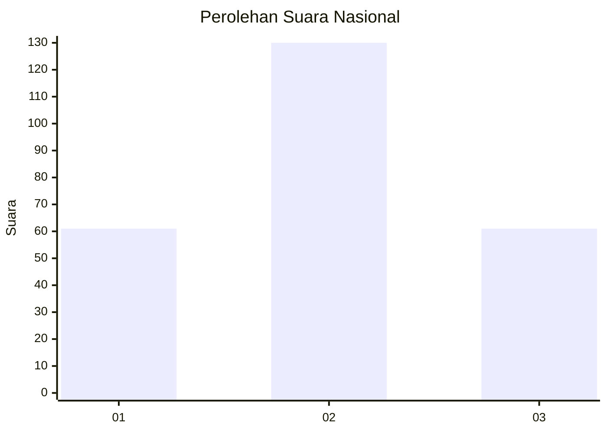
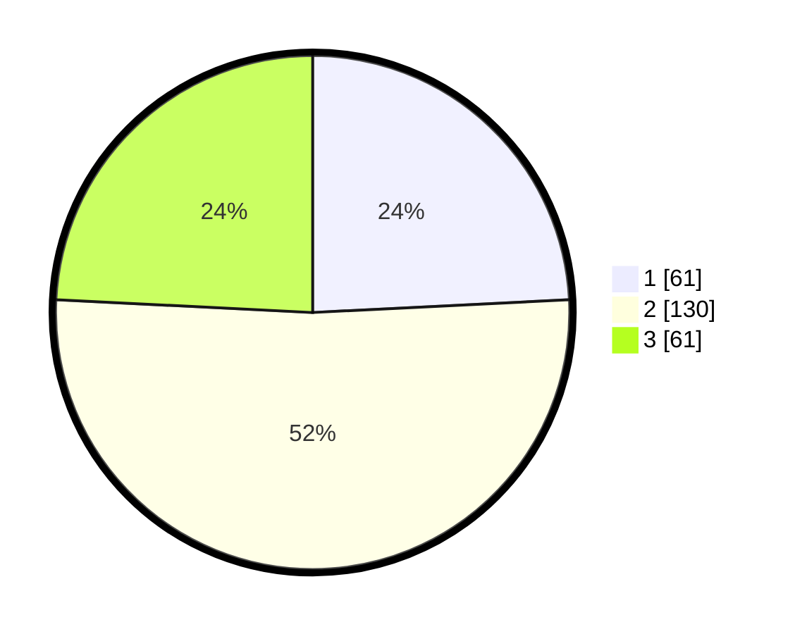

# Hasil

## Grafik

## Tabel

| No. | Nama Paslon    | Suara | Suara (raw) | Persentase |
|:--- |:-------------- | -----:| -----------:| ----------:|
| 1   | ANIES MUHAIMIN | 61    | [61][p-1]   | 24,21      |
| 2   | PRABOWO GIBRAN | 130   | [130][p-2]  | 51,59      |
| 3   | GANJAR MAHFUD  | 61    | [61][p-3]   | 24,21      |

[p-1]: https://github.com/gigit-pemilu/pemilu-2024/blob/main/pilpres/hitung-suara/sub/34-di-yogyakarta/sub/01-kulon-progo/sub/05-lendah/sub/2003-jatirejo/sub/004-tps/sub/paslon-1.txt
[p-2]: https://github.com/gigit-pemilu/pemilu-2024/blob/main/pilpres/hitung-suara/sub/34-di-yogyakarta/sub/01-kulon-progo/sub/05-lendah/sub/2003-jatirejo/sub/004-tps/sub/paslon-2.txt
[p-3]: https://github.com/gigit-pemilu/pemilu-2024/blob/main/pilpres/hitung-suara/sub/34-di-yogyakarta/sub/01-kulon-progo/sub/05-lendah/sub/2003-jatirejo/sub/004-tps/sub/paslon-3.txt

## Foto C Plano

https://sirekap-obj-formc.kpu.go.id/0a5e/pemilu/ppwp/34/01/05/20/03/3401052003004-20240214-215447--914d380a-0ca3-4cc4-80af-409fff45c234.jpg

https://sirekap-obj-formc.kpu.go.id/0a5e/pemilu/ppwp/34/01/05/20/03/3401052003004-20240214-215725--7351b84b-2de2-4733-ba7b-03034b6af898.jpg

https://sirekap-obj-formc.kpu.go.id/0a5e/pemilu/ppwp/34/01/05/20/03/3401052003004-20240214-220338--36e96873-8958-474b-a5e6-ffcff8252830.jpg

## Metadata

| Key        | Value               |
| ---------- | ------------------- |
| Time Stamp | 2024-02-15 15:30:25 |

## DATA PEMILIH TETAP

Jumlah pemilih dalam DPT: **255**.
 * L: **121**.
 * P: **134**.

## DATA PENGGUNA HAK PILIH

Jumlah pengguna hak pilih dalam DPT: **255**.
 * L: **121**.
 * P: **134**.

Jumlah pengguna hak pilih dalam DPTb: **3**.
 * L: **3**.
 * P: **0**.

Jumlah pengguna hak pilih dalam DPK: **2**.
 * L: **1**.
 * P: **1**.

Jumlah pengguna hak pilih: **260**.
 * L: **125**.
 * P: **135**.

## JUMLAH SUARA SAH DAN TIDAK SAH

JUMLAH SELURUH SUARA SAH: **252**.

JUMLAH SUARA TIDAK SAH: **8**.

JUMLAH SELURUH SUARA SAH DAN SUARA TIDAK SAH: **260**.

