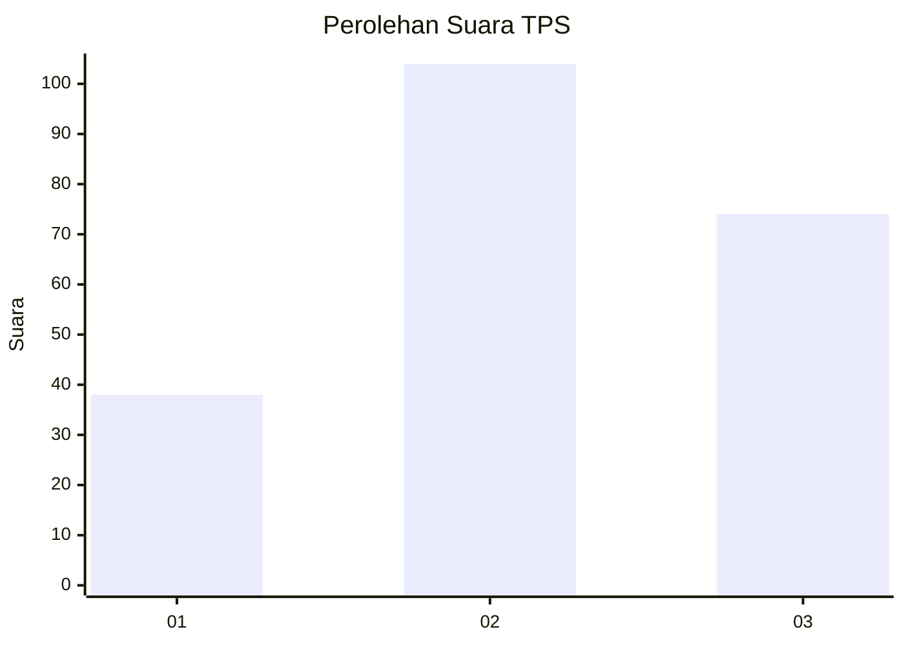
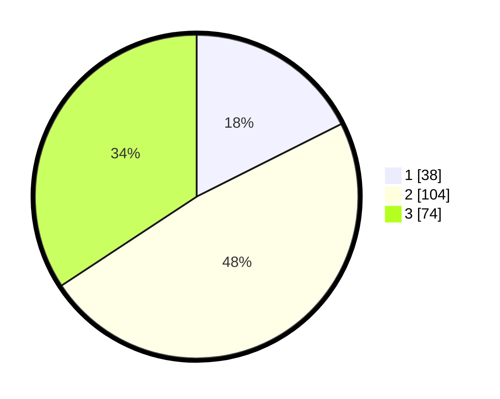

# Hasil

## Grafik

## Tabel

| No. | Nama Paslon    | Suara | Suara (raw) | Persentase |
|:--- |:-------------- | -----:| -----------:| ----------:|
| 1   | ANIES MUHAIMIN | 38    | [38][p-1]   | 17,59      |
| 2   | PRABOWO GIBRAN | 104   | [104][p-2]  | 48,15      |
| 3   | GANJAR MAHFUD  | 74    | [74][p-3]   | 34,26      |

[p-1]: https://github.com/gigit-pemilu/pemilu-2024-34-di-yogyakarta/blob/main/pilpres/hitung-suara/sub/34-di-yogyakarta/sub/01-kulon-progo/sub/05-lendah/sub/2003-jatirejo/sub/015-tps/sub/paslon-1.txt
[p-2]: https://github.com/gigit-pemilu/pemilu-2024-34-di-yogyakarta/blob/main/pilpres/hitung-suara/sub/34-di-yogyakarta/sub/01-kulon-progo/sub/05-lendah/sub/2003-jatirejo/sub/015-tps/sub/paslon-2.txt
[p-3]: https://github.com/gigit-pemilu/pemilu-2024-34-di-yogyakarta/blob/main/pilpres/hitung-suara/sub/34-di-yogyakarta/sub/01-kulon-progo/sub/05-lendah/sub/2003-jatirejo/sub/015-tps/sub/paslon-3.txt

## Foto C Plano

https://sirekap-obj-formc.kpu.go.id/c9b0/pemilu/ppwp/34/01/05/20/03/3401052003015-20240215-003441--b21269bc-3b77-4f21-8917-69785f98bfbe.jpg

https://sirekap-obj-formc.kpu.go.id/c9b0/pemilu/ppwp/34/01/05/20/03/3401052003015-20240215-003515--3969a377-d97b-4d92-8352-750de72b73b8.jpg

https://sirekap-obj-formc.kpu.go.id/c9b0/pemilu/ppwp/34/01/05/20/03/3401052003015-20240215-003559--62941f60-4ac9-43cc-82df-5825200ee6ec.jpg

## Metadata

| Key        | Value               |
| ---------- | ------------------- |
| Time Stamp | 2024-02-15 15:00:29 |

