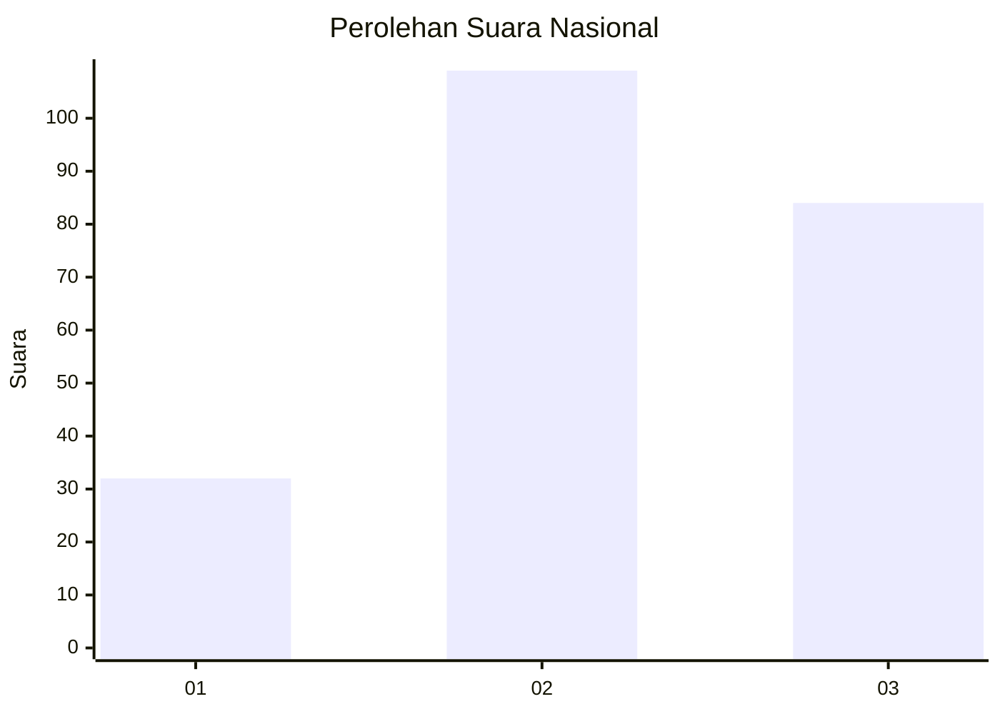
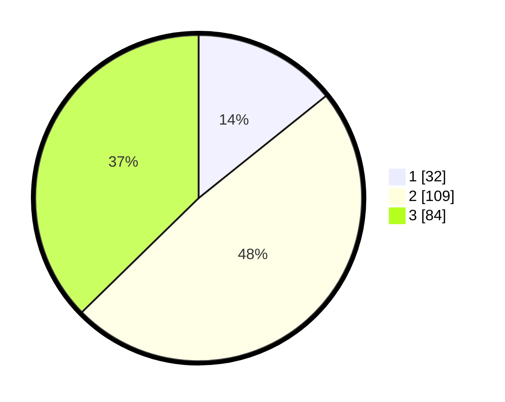

# Hasil

## Grafik

## Tabel

| No. | Nama Paslon    | Suara | Suara (raw) | Persentase |
|:--- |:-------------- | -----:| -----------:| ----------:|
| 1   | ANIES MUHAIMIN | 32    | [32][p-1]   | 14,22      |
| 2   | PRABOWO GIBRAN | 109   | [109][p-2]  | 48,44      |
| 3   | GANJAR MAHFUD  | 84    | [84][p-3]   | 37,33      |

[p-1]: https://github.com/gigit-pemilu/pemilu-2024/blob/main/pilpres/hitung-suara/sub/34-di-yogyakarta/sub/01-kulon-progo/sub/05-lendah/sub/2003-jatirejo/sub/016-tps/sub/paslon-1.txt
[p-2]: https://github.com/gigit-pemilu/pemilu-2024/blob/main/pilpres/hitung-suara/sub/34-di-yogyakarta/sub/01-kulon-progo/sub/05-lendah/sub/2003-jatirejo/sub/016-tps/sub/paslon-2.txt
[p-3]: https://github.com/gigit-pemilu/pemilu-2024/blob/main/pilpres/hitung-suara/sub/34-di-yogyakarta/sub/01-kulon-progo/sub/05-lendah/sub/2003-jatirejo/sub/016-tps/sub/paslon-3.txt

## Foto C Plano

https://sirekap-obj-formc.kpu.go.id/6c4a/pemilu/ppwp/34/01/05/20/03/3401052003016-20240214-202906--a0ba05e2-43df-42c3-9b54-2a630efde0aa.jpg

https://sirekap-obj-formc.kpu.go.id/6c4a/pemilu/ppwp/34/01/05/20/03/3401052003016-20240214-202214--a6090967-cb7f-4b38-b61b-7fbc9b3b0c1a.jpg

https://sirekap-obj-formc.kpu.go.id/6c4a/pemilu/ppwp/34/01/05/20/03/3401052003016-20240215-131756--d6acc0db-2b46-4fb5-ac9b-cb967776531b.jpg

## Metadata

| Key        | Value               |
| ---------- | ------------------- |
| Time Stamp | 2024-02-15 15:00:29 |

