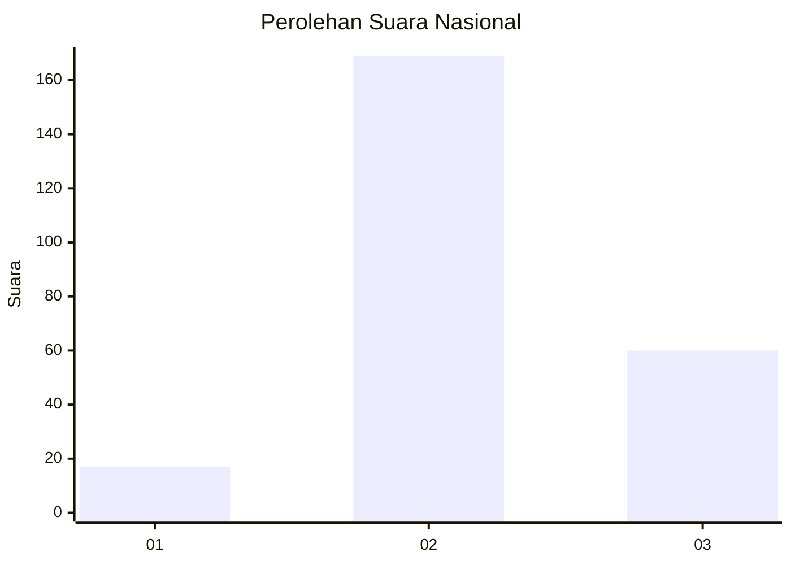
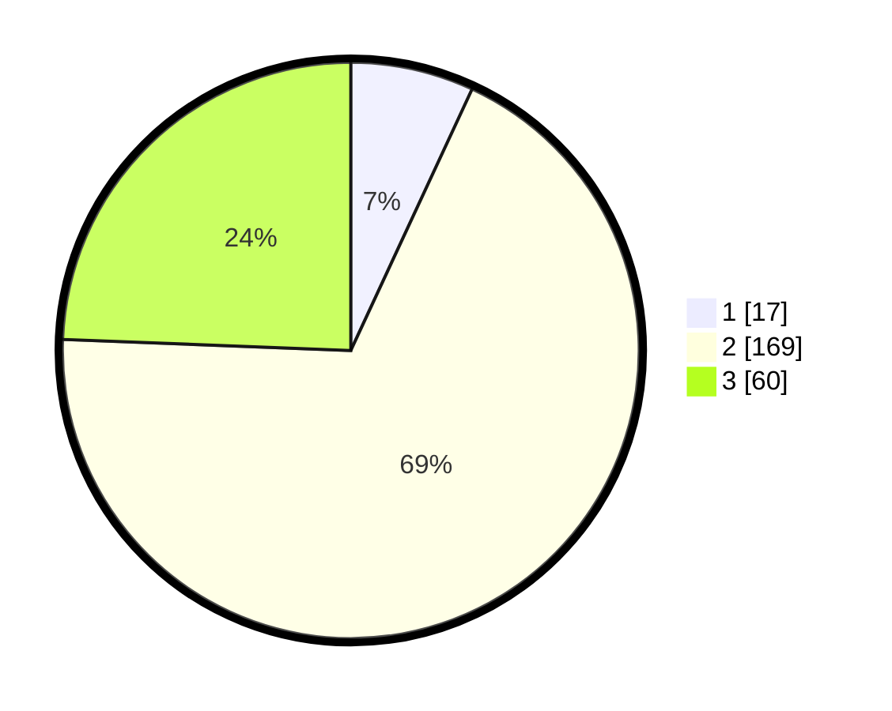

# Hasil

## Grafik

## Tabel

| No. | Nama Paslon    | Suara | Suara (raw) | Persentase |
|:--- |:-------------- | -----:| -----------:| ----------:|
| 1   | ANIES MUHAIMIN | 17    | [17][p-1]   | 6,91       |
| 2   | PRABOWO GIBRAN | 169   | [169][p-2]  | 68,70      |
| 3   | GANJAR MAHFUD  | 60    | [60][p-3]   | 24,39      |

[p-1]: https://github.com/gigit-pemilu/pemilu-2024/blob/main/pilpres/hitung-suara/sub/34-di-yogyakarta/sub/01-kulon-progo/sub/05-lendah/sub/2004-sidorejo/sub/001-tps/sub/paslon-1.txt
[p-2]: https://github.com/gigit-pemilu/pemilu-2024/blob/main/pilpres/hitung-suara/sub/34-di-yogyakarta/sub/01-kulon-progo/sub/05-lendah/sub/2004-sidorejo/sub/001-tps/sub/paslon-2.txt
[p-3]: https://github.com/gigit-pemilu/pemilu-2024/blob/main/pilpres/hitung-suara/sub/34-di-yogyakarta/sub/01-kulon-progo/sub/05-lendah/sub/2004-sidorejo/sub/001-tps/sub/paslon-3.txt

## Foto C Plano

https://sirekap-obj-formc.kpu.go.id/2d97/pemilu/ppwp/34/01/05/20/04/3401052004001-20240214-230033--37223da3-0065-4ae7-847e-f2a28bb804b6.jpg

https://sirekap-obj-formc.kpu.go.id/2d97/pemilu/ppwp/34/01/05/20/04/3401052004001-20240214-230048--93732c85-ff10-468f-ad25-e2af8f0fce1f.jpg

https://sirekap-obj-formc.kpu.go.id/2d97/pemilu/ppwp/34/01/05/20/04/3401052004001-20240214-230237--9163fc26-5bad-499f-927c-b894b30215a1.jpg

## Metadata

| Key        | Value               |
| ---------- | ------------------- |
| Time Stamp | 2024-02-24 22:31:28 |

