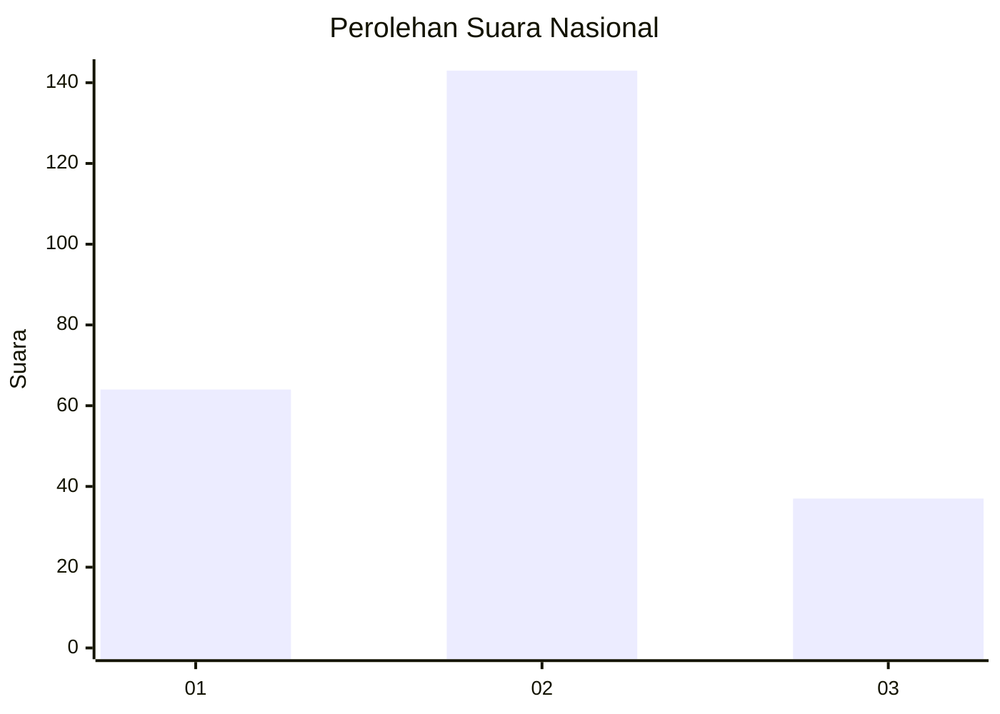

# Hasil

## Grafik

## Tabel

| No. | Nama Paslon    | Suara | Suara (raw) | Persentase |
|:--- |:-------------- | -----:| -----------:| ----------:|
| 1   | ANIES MUHAIMIN | 64    | [64][p-1]   | 26,23      |
| 2   | PRABOWO GIBRAN | 143   | [143][p-2]  | 58,61      |
| 3   | GANJAR MAHFUD  | 37    | [37][p-3]   | 15,16      |

[p-1]: https://github.com/gigit-pemilu/pemilu-2024/blob/main/pilpres/hitung-suara/sub/34-di-yogyakarta/sub/01-kulon-progo/sub/05-lendah/sub/2004-sidorejo/sub/023-tps/sub/paslon-1.txt
[p-2]: https://github.com/gigit-pemilu/pemilu-2024/blob/main/pilpres/hitung-suara/sub/34-di-yogyakarta/sub/01-kulon-progo/sub/05-lendah/sub/2004-sidorejo/sub/023-tps/sub/paslon-2.txt
[p-3]: https://github.com/gigit-pemilu/pemilu-2024/blob/main/pilpres/hitung-suara/sub/34-di-yogyakarta/sub/01-kulon-progo/sub/05-lendah/sub/2004-sidorejo/sub/023-tps/sub/paslon-3.txt

## Foto C Plano

https://sirekap-obj-formc.kpu.go.id/5a4a/pemilu/ppwp/34/01/05/20/04/3401052004023-20240215-134741--00aca247-9196-4d40-ba95-c93f1767bd59.jpg

https://sirekap-obj-formc.kpu.go.id/5a4a/pemilu/ppwp/34/01/05/20/04/3401052004023-20240215-025621--a0672745-3313-48dd-8e20-903edc3cd6a6.jpg

https://sirekap-obj-formc.kpu.go.id/5a4a/pemilu/ppwp/34/01/05/20/04/3401052004023-20240215-145643--ee823915-1798-4a3d-a195-093f63ed476d.jpg

## Metadata

| Key        | Value               |
| ---------- | ------------------- |
| Time Stamp | 2024-02-15 20:30:46 |

