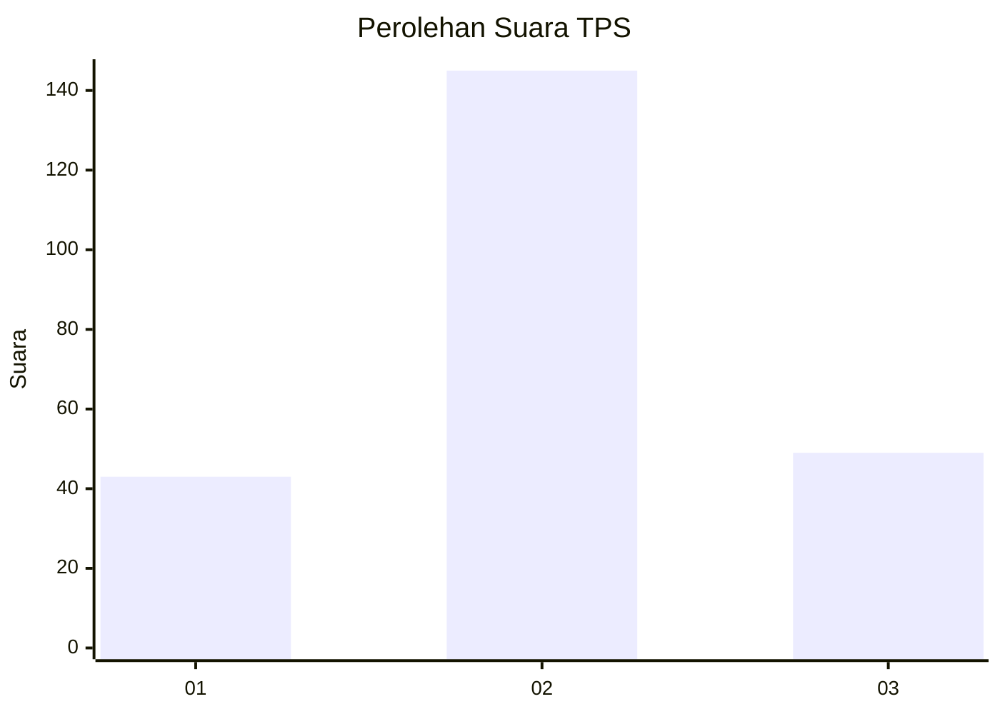
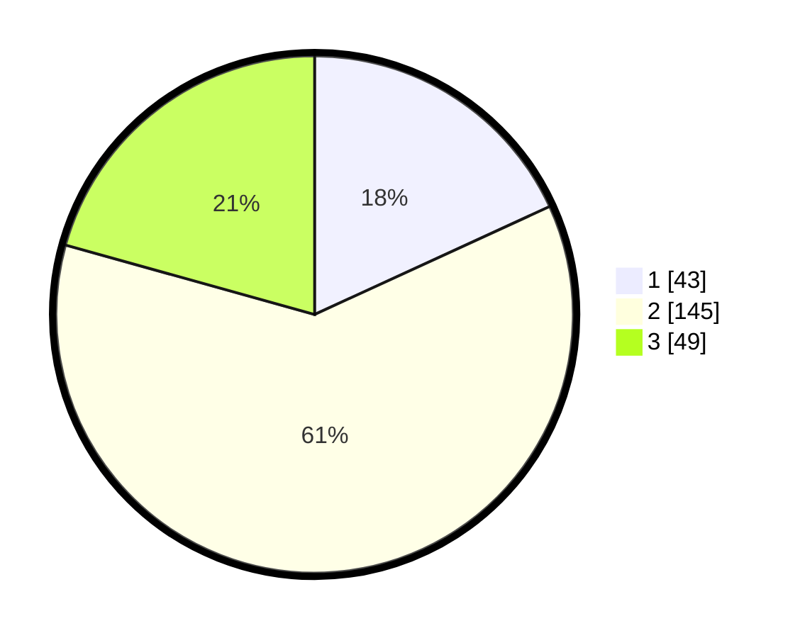

# Hasil

## Grafik

## Tabel

| No. | Nama Paslon    | Suara | Suara (raw) | Persentase |
|:--- |:-------------- | -----:| -----------:| ----------:|
| 1   | ANIES MUHAIMIN | 43    | [43][p-1]   | 18,14      |
| 2   | PRABOWO GIBRAN | 145   | [145][p-2]  | 61,18      |
| 3   | GANJAR MAHFUD  | 49    | [49][p-3]   | 20,68      |

[p-1]: https://github.com/gigit-pemilu/pemilu-2024-34-di-yogyakarta/blob/main/pilpres/hitung-suara/sub/34-di-yogyakarta/sub/01-kulon-progo/sub/05-lendah/sub/2005-gulurejo/sub/001-tps/sub/paslon-1.txt
[p-2]: https://github.com/gigit-pemilu/pemilu-2024-34-di-yogyakarta/blob/main/pilpres/hitung-suara/sub/34-di-yogyakarta/sub/01-kulon-progo/sub/05-lendah/sub/2005-gulurejo/sub/001-tps/sub/paslon-2.txt
[p-3]: https://github.com/gigit-pemilu/pemilu-2024-34-di-yogyakarta/blob/main/pilpres/hitung-suara/sub/34-di-yogyakarta/sub/01-kulon-progo/sub/05-lendah/sub/2005-gulurejo/sub/001-tps/sub/paslon-3.txt

## Foto C Plano

https://sirekap-obj-formc.kpu.go.id/b3b6/pemilu/ppwp/34/01/05/20/05/3401052005001-20240215-091257--76023fc1-00c4-4803-bef5-3f4042863eee.jpg

https://sirekap-obj-formc.kpu.go.id/b3b6/pemilu/ppwp/34/01/05/20/05/3401052005001-20240215-091910--04d043b0-efe3-4fb7-82ff-0c70b1d71a5b.jpg

https://sirekap-obj-formc.kpu.go.id/b3b6/pemilu/ppwp/34/01/05/20/05/3401052005001-20240215-091923--4ef81c4c-02a7-4fb4-81c3-2f9f35a1c750.jpg

## Metadata

| Key        | Value               |
| ---------- | ------------------- |
| Time Stamp | 2024-02-15 16:00:26 |

