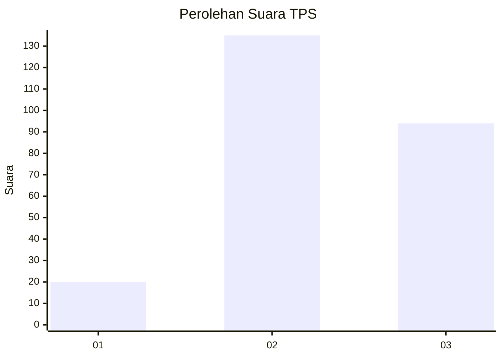
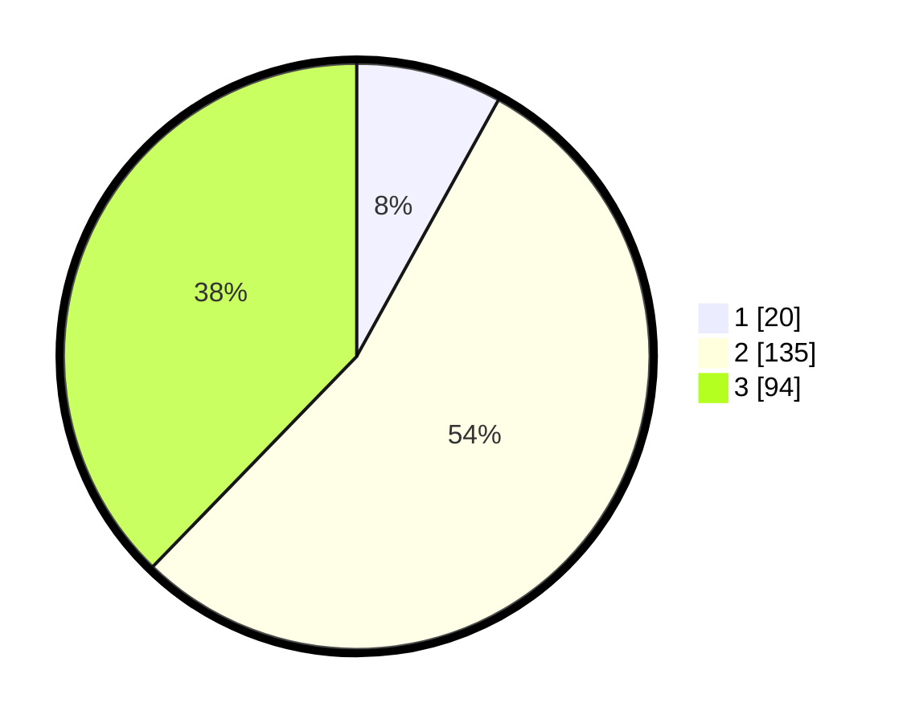

# Hasil

## Grafik

## Tabel

| No. | Nama Paslon    | Suara | Suara (raw) | Persentase |
|:--- |:-------------- | -----:| -----------:| ----------:|
| 1   | ANIES MUHAIMIN | 20    | [20][p-1]   | 8,03       |
| 2   | PRABOWO GIBRAN | 135   | [135][p-2]  | 54,22      |
| 3   | GANJAR MAHFUD  | 94    | [94][p-3]   | 37,75      |

[p-1]: https://github.com/gigit-pemilu/pemilu-2024-34-di-yogyakarta/blob/main/pilpres/hitung-suara/sub/34-di-yogyakarta/sub/01-kulon-progo/sub/05-lendah/sub/2005-gulurejo/sub/015-tps/sub/paslon-1.txt
[p-2]: https://github.com/gigit-pemilu/pemilu-2024-34-di-yogyakarta/blob/main/pilpres/hitung-suara/sub/34-di-yogyakarta/sub/01-kulon-progo/sub/05-lendah/sub/2005-gulurejo/sub/015-tps/sub/paslon-2.txt
[p-3]: https://github.com/gigit-pemilu/pemilu-2024-34-di-yogyakarta/blob/main/pilpres/hitung-suara/sub/34-di-yogyakarta/sub/01-kulon-progo/sub/05-lendah/sub/2005-gulurejo/sub/015-tps/sub/paslon-3.txt

## Foto C Plano

https://sirekap-obj-formc.kpu.go.id/3f76/pemilu/ppwp/34/01/05/20/05/3401052005015-20240214-201457--98e6c3a1-17fb-4113-a279-2761d677e3aa.jpg

https://sirekap-obj-formc.kpu.go.id/3f76/pemilu/ppwp/34/01/05/20/05/3401052005015-20240214-201742--977fa7ea-870a-41b6-bdd6-70e8907451d1.jpg

https://sirekap-obj-formc.kpu.go.id/3f76/pemilu/ppwp/34/01/05/20/05/3401052005015-20240214-204124--21a5b37d-45ed-4416-aa8a-cc034b81d0d0.jpg

## Metadata

| Key        | Value               |
| ---------- | ------------------- |
| Time Stamp | 2024-02-24 22:31:28 |

