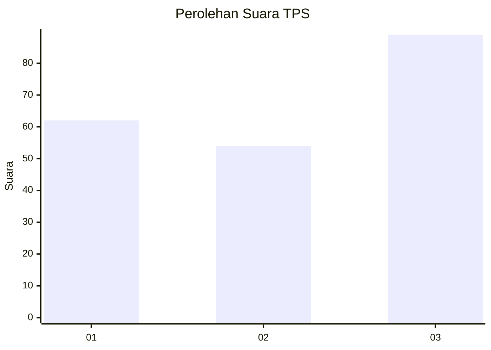
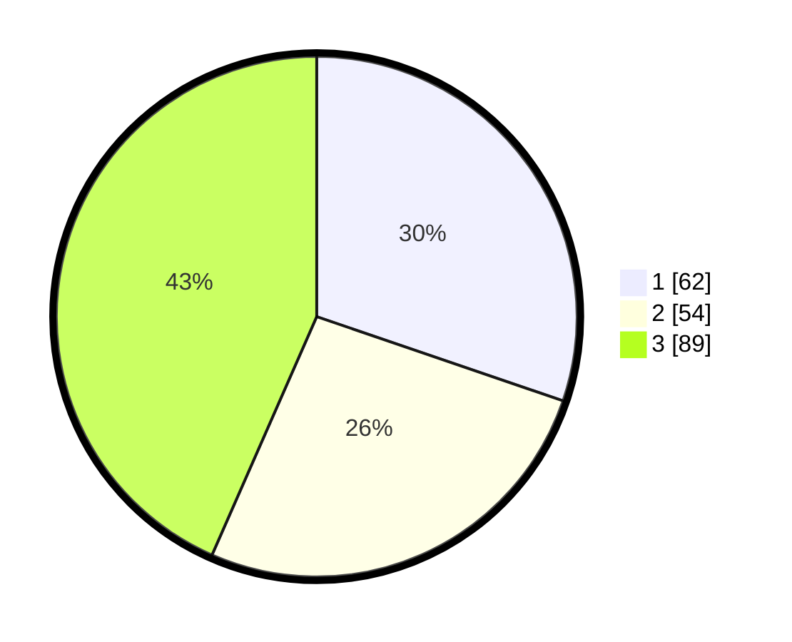

# Hasil

## Grafik

## Tabel

| No. | Nama Paslon    | Suara | Suara (raw) | Persentase |
|:--- |:-------------- | -----:| -----------:| ----------:|
| 1   | ANIES MUHAIMIN | 62    | [62][p-1]   | 30,24      |
| 2   | PRABOWO GIBRAN | 54    | [54][p-2]   | 26,34      |
| 3   | GANJAR MAHFUD  | 89    | [89][p-3]   | 43,41      |

[p-1]: https://github.com/gigit-pemilu/pemilu-2024-34-di-yogyakarta/blob/main/pilpres/hitung-suara/sub/34-di-yogyakarta/sub/01-kulon-progo/sub/05-lendah/sub/2006-ngentakrejo/sub/001-tps/sub/paslon-1.txt
[p-2]: https://github.com/gigit-pemilu/pemilu-2024-34-di-yogyakarta/blob/main/pilpres/hitung-suara/sub/34-di-yogyakarta/sub/01-kulon-progo/sub/05-lendah/sub/2006-ngentakrejo/sub/001-tps/sub/paslon-2.txt
[p-3]: https://github.com/gigit-pemilu/pemilu-2024-34-di-yogyakarta/blob/main/pilpres/hitung-suara/sub/34-di-yogyakarta/sub/01-kulon-progo/sub/05-lendah/sub/2006-ngentakrejo/sub/001-tps/sub/paslon-3.txt

## Foto C Plano

https://sirekap-obj-formc.kpu.go.id/faeb/pemilu/ppwp/34/01/05/20/06/3401052006001-20240215-002928--846cd707-0bc7-425b-943c-c5b90b785054.jpg

https://sirekap-obj-formc.kpu.go.id/faeb/pemilu/ppwp/34/01/05/20/06/3401052006001-20240215-003206--358bbeda-558b-40be-a36d-010f99f9d089.jpg

https://sirekap-obj-formc.kpu.go.id/faeb/pemilu/ppwp/34/01/05/20/06/3401052006001-20240215-003413--dc7b0b08-7c05-4450-9936-e0b6da5d7245.jpg

## Metadata

| Key        | Value               |
| ---------- | ------------------- |
| Time Stamp | 2024-02-15 15:00:29 |

