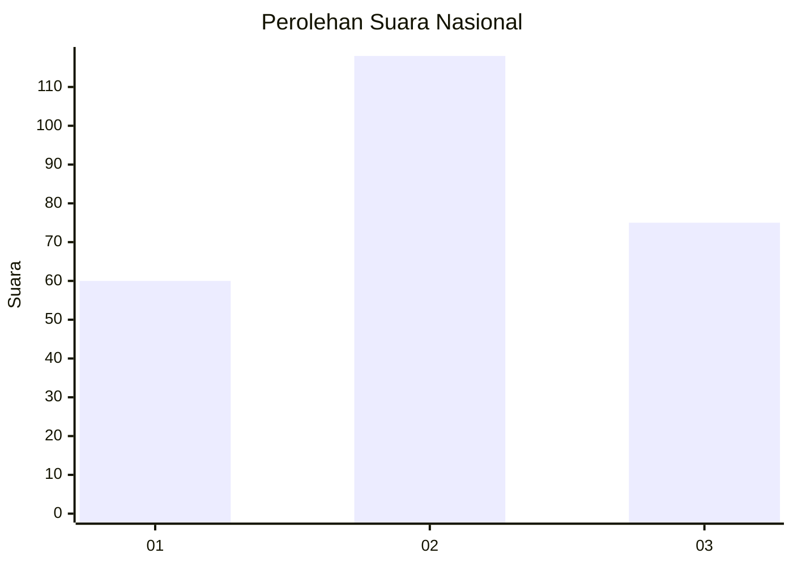
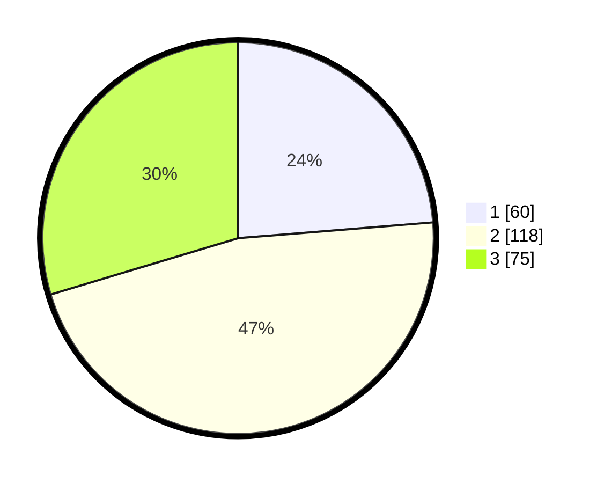

# Hasil

## Grafik

## Tabel

| No. | Nama Paslon    | Suara | Suara (raw) | Persentase |
|:--- |:-------------- | -----:| -----------:| ----------:|
| 1   | ANIES MUHAIMIN | 60    | [60][p-1]   | 23,72      |
| 2   | PRABOWO GIBRAN | 118   | [118][p-2]  | 46,64      |
| 3   | GANJAR MAHFUD  | 75    | [75][p-3]   | 29,64      |

[p-1]: https://github.com/gigit-pemilu/pemilu-2024/blob/main/pilpres/hitung-suara/sub/34-di-yogyakarta/sub/01-kulon-progo/sub/05-lendah/sub/2006-ngentakrejo/sub/012-tps/sub/paslon-1.txt
[p-2]: https://github.com/gigit-pemilu/pemilu-2024/blob/main/pilpres/hitung-suara/sub/34-di-yogyakarta/sub/01-kulon-progo/sub/05-lendah/sub/2006-ngentakrejo/sub/012-tps/sub/paslon-2.txt
[p-3]: https://github.com/gigit-pemilu/pemilu-2024/blob/main/pilpres/hitung-suara/sub/34-di-yogyakarta/sub/01-kulon-progo/sub/05-lendah/sub/2006-ngentakrejo/sub/012-tps/sub/paslon-3.txt

## Foto C Plano

https://sirekap-obj-formc.kpu.go.id/4092/pemilu/ppwp/34/01/05/20/06/3401052006012-20240214-192209--61eaefd0-8dd2-4a0e-9275-fea20ada72d4.jpg

https://sirekap-obj-formc.kpu.go.id/4092/pemilu/ppwp/34/01/05/20/06/3401052006012-20240214-201630--9af01e26-b149-4672-8887-2543e5c40427.jpg

https://sirekap-obj-formc.kpu.go.id/4092/pemilu/ppwp/34/01/05/20/06/3401052006012-20240216-131304--ba225045-01ab-43b5-89c9-f1c66ea23724.jpg

## Metadata

| Key        | Value               |
| ---------- | ------------------- |
| Time Stamp | 2024-02-16 13:30:32 |

## DATA PEMILIH TETAP

Jumlah pemilih dalam DPT: **279**.
 * L: **147**.
 * P: **132**.

## DATA PENGGUNA HAK PILIH

Jumlah pengguna hak pilih dalam DPT: **254**.
 * L: **133**.
 * P: **121**.

Jumlah pengguna hak pilih dalam DPTb: **5**.
 * L: **5**.
 * P: **0**.

Jumlah pengguna hak pilih dalam DPK: **0**.
 * L: **0**.
 * P: **0**.

Jumlah pengguna hak pilih: **259**.
 * L: **138**.
 * P: **121**.

## JUMLAH SUARA SAH DAN TIDAK SAH

JUMLAH SELURUH SUARA SAH: **253**.

JUMLAH SUARA TIDAK SAH: **6**.

JUMLAH SELURUH SUARA SAH DAN SUARA TIDAK SAH: **259**.

