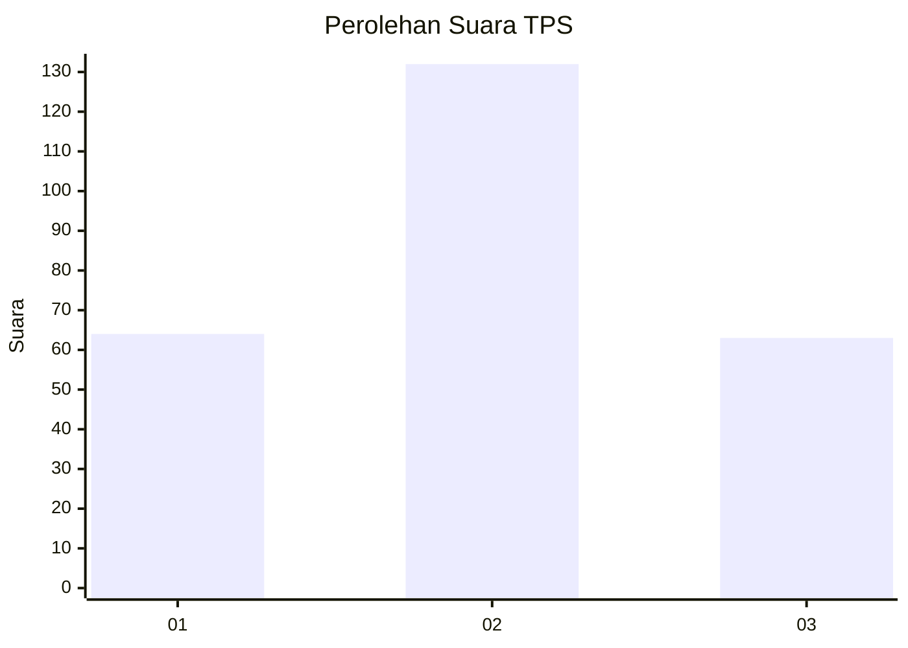
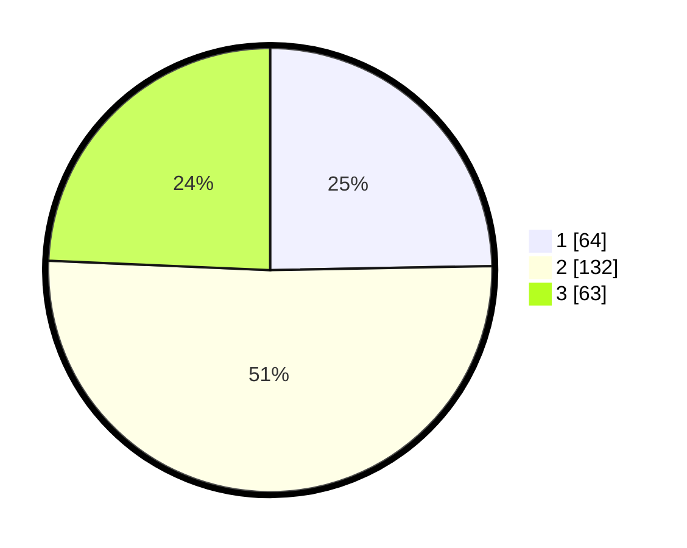

# Hasil

## Grafik

## Tabel

| No. | Nama Paslon    | Suara | Suara (raw) | Persentase |
|:--- |:-------------- | -----:| -----------:| ----------:|
| 1   | ANIES MUHAIMIN | 64    | [64][p-1]   | 24,71      |
| 2   | PRABOWO GIBRAN | 132   | [132][p-2]  | 50,97      |
| 3   | GANJAR MAHFUD  | 63    | [63][p-3]   | 24,32      |

[p-1]: https://github.com/gigit-pemilu/pemilu-2024-34-di-yogyakarta/blob/main/pilpres/hitung-suara/sub/34-di-yogyakarta/sub/01-kulon-progo/sub/06-sentolo/sub/2001-demangrejo/sub/001-tps/sub/paslon-1.txt
[p-2]: https://github.com/gigit-pemilu/pemilu-2024-34-di-yogyakarta/blob/main/pilpres/hitung-suara/sub/34-di-yogyakarta/sub/01-kulon-progo/sub/06-sentolo/sub/2001-demangrejo/sub/001-tps/sub/paslon-2.txt
[p-3]: https://github.com/gigit-pemilu/pemilu-2024-34-di-yogyakarta/blob/main/pilpres/hitung-suara/sub/34-di-yogyakarta/sub/01-kulon-progo/sub/06-sentolo/sub/2001-demangrejo/sub/001-tps/sub/paslon-3.txt

## Foto C Plano

https://sirekap-obj-formc.kpu.go.id/0e71/pemilu/ppwp/34/01/06/20/01/3401062001001-20240216-125723--870bfef0-7ec0-4b9e-a900-3a9c235fddd4.jpg

https://sirekap-obj-formc.kpu.go.id/0e71/pemilu/ppwp/34/01/06/20/01/3401062001001-20240216-125725--6b5dca06-d487-4e27-8e8c-a9ae9c3e220a.jpg

https://sirekap-obj-formc.kpu.go.id/0e71/pemilu/ppwp/34/01/06/20/01/3401062001001-20240216-125724--383ff5cb-1dae-4f92-aaf5-b6798504b63a.jpg

## Metadata

| Key        | Value               |
| ---------- | ------------------- |
| Time Stamp | 2024-02-19 06:16:00 |

## DATA PEMILIH TETAP

Jumlah pemilih dalam DPT: **292**.
 * L: **139**.
 * P: **153**.

## DATA PENGGUNA HAK PILIH

Jumlah pengguna hak pilih dalam DPT: **259**.
 * L: **122**.
 * P: **137**.

Jumlah pengguna hak pilih dalam DPTb: **1**.
 * L: **1**.
 * P: **0**.

Jumlah pengguna hak pilih dalam DPK: **1**.
 * L: **0**.
 * P: **1**.

Jumlah pengguna hak pilih: **261**.
 * L: **123**.
 * P: **138**.

## JUMLAH SUARA SAH DAN TIDAK SAH

JUMLAH SELURUH SUARA SAH: **259**.

JUMLAH SUARA TIDAK SAH: **2**.

JUMLAH SELURUH SUARA SAH DAN SUARA TIDAK SAH: **261**.

