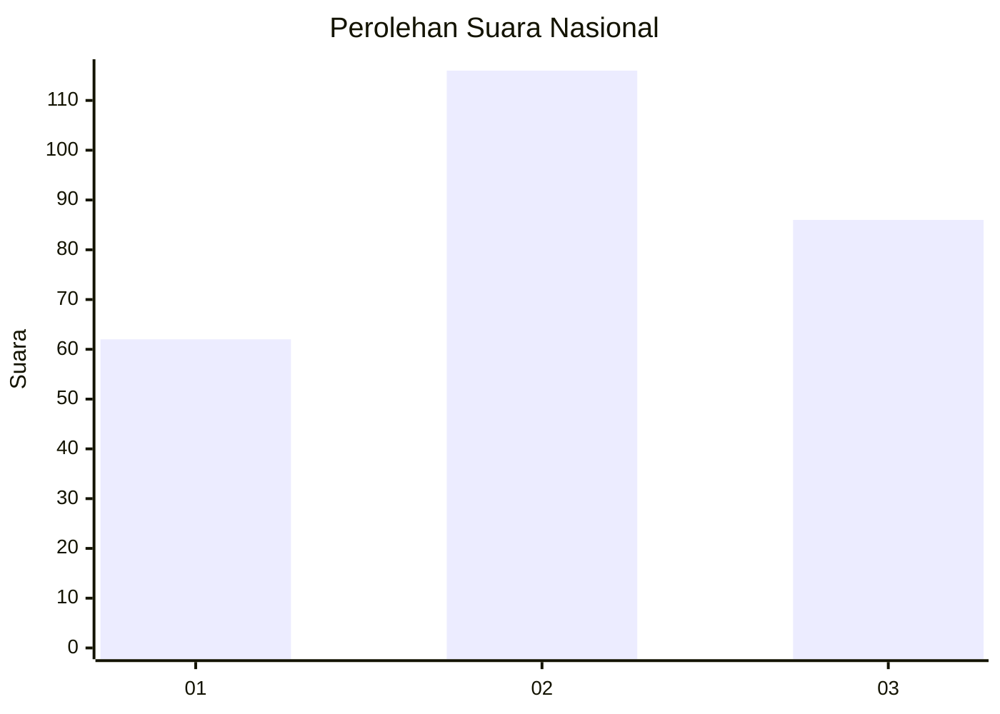
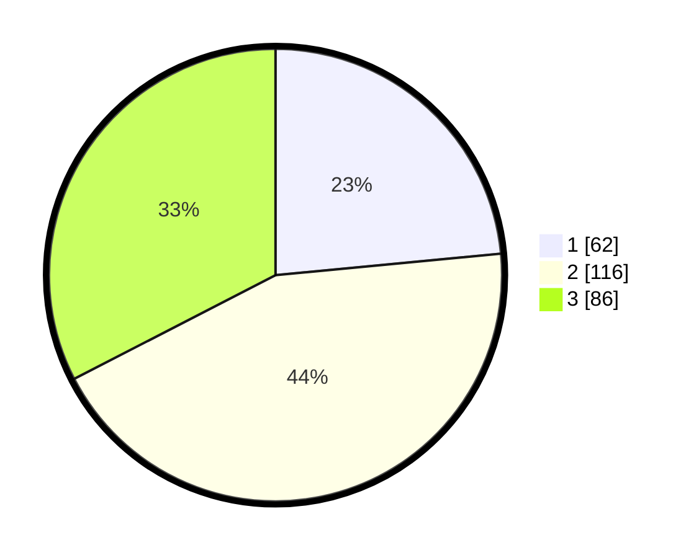

# Hasil

## Grafik

## Tabel

| No. | Nama Paslon    | Suara | Suara (raw) | Persentase |
|:--- |:-------------- | -----:| -----------:| ----------:|
| 1   | ANIES MUHAIMIN | 62    | [62][p-1]   | 23,48      |
| 2   | PRABOWO GIBRAN | 116   | [116][p-2]  | 43,94      |
| 3   | GANJAR MAHFUD  | 86    | [86][p-3]   | 32,58      |

[p-1]: https://github.com/gigit-pemilu/pemilu-2024/blob/main/pilpres/hitung-suara/sub/34-di-yogyakarta/sub/01-kulon-progo/sub/06-sentolo/sub/2001-demangrejo/sub/002-tps/sub/paslon-1.txt
[p-2]: https://github.com/gigit-pemilu/pemilu-2024/blob/main/pilpres/hitung-suara/sub/34-di-yogyakarta/sub/01-kulon-progo/sub/06-sentolo/sub/2001-demangrejo/sub/002-tps/sub/paslon-2.txt
[p-3]: https://github.com/gigit-pemilu/pemilu-2024/blob/main/pilpres/hitung-suara/sub/34-di-yogyakarta/sub/01-kulon-progo/sub/06-sentolo/sub/2001-demangrejo/sub/002-tps/sub/paslon-3.txt

## Foto C Plano

https://sirekap-obj-formc.kpu.go.id/6cfd/pemilu/ppwp/34/01/06/20/01/3401062001002-20240216-074035--e32950cf-1cf5-4fdf-a24c-c3e76971cb27.jpg

https://sirekap-obj-formc.kpu.go.id/6cfd/pemilu/ppwp/34/01/06/20/01/3401062001002-20240216-074036--68d29764-a184-49a5-a715-741c8c354d26.jpg

https://sirekap-obj-formc.kpu.go.id/6cfd/pemilu/ppwp/34/01/06/20/01/3401062001002-20240216-074036--845c8c7c-d52f-4d4c-b017-b59d2eb5e6ca.jpg

## Metadata

| Key        | Value               |
| ---------- | ------------------- |
| Time Stamp | 2024-02-19 06:16:00 |

## DATA PEMILIH TETAP

Jumlah pemilih dalam DPT: **293**.
 * L: **145**.
 * P: **148**.

## DATA PENGGUNA HAK PILIH

Jumlah pengguna hak pilih dalam DPT: **269**.
 * L: **130**.
 * P: **139**.

Jumlah pengguna hak pilih dalam DPTb: **1**.
 * L: **0**.
 * P: **1**.

Jumlah pengguna hak pilih dalam DPK: **2**.
 * L: **1**.
 * P: **1**.

Jumlah pengguna hak pilih: **272**.
 * L: **131**.
 * P: **141**.

## JUMLAH SUARA SAH DAN TIDAK SAH

JUMLAH SELURUH SUARA SAH: **264**.

JUMLAH SUARA TIDAK SAH: **8**.

JUMLAH SELURUH SUARA SAH DAN SUARA TIDAK SAH: **272**.

