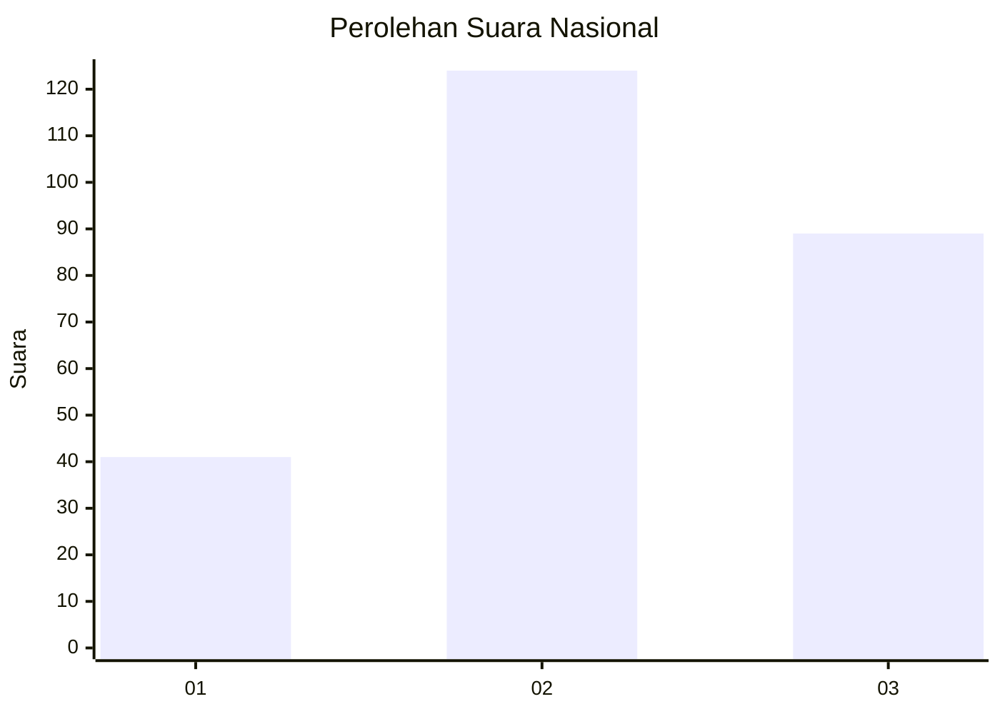
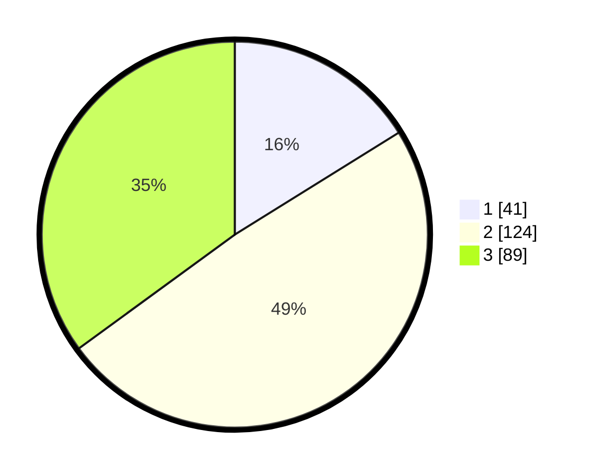

# Hasil

## Grafik

## Tabel

| No. | Nama Paslon    | Suara | Suara (raw) | Persentase |
|:--- |:-------------- | -----:| -----------:| ----------:|
| 1   | ANIES MUHAIMIN | 41    | [41][p-1]   | 16,14      |
| 2   | PRABOWO GIBRAN | 124   | [124][p-2]  | 48,82      |
| 3   | GANJAR MAHFUD  | 89    | [89][p-3]   | 35,04      |

[p-1]: https://github.com/gigit-pemilu/pemilu-2024/blob/main/pilpres/hitung-suara/sub/34-di-yogyakarta/sub/01-kulon-progo/sub/06-sentolo/sub/2001-demangrejo/sub/003-tps/sub/paslon-1.txt
[p-2]: https://github.com/gigit-pemilu/pemilu-2024/blob/main/pilpres/hitung-suara/sub/34-di-yogyakarta/sub/01-kulon-progo/sub/06-sentolo/sub/2001-demangrejo/sub/003-tps/sub/paslon-2.txt
[p-3]: https://github.com/gigit-pemilu/pemilu-2024/blob/main/pilpres/hitung-suara/sub/34-di-yogyakarta/sub/01-kulon-progo/sub/06-sentolo/sub/2001-demangrejo/sub/003-tps/sub/paslon-3.txt

## Foto C Plano

https://sirekap-obj-formc.kpu.go.id/c48b/pemilu/ppwp/34/01/06/20/01/3401062001003-20240214-225050--938600a5-b38d-4055-83e5-b55414771438.jpg

https://sirekap-obj-formc.kpu.go.id/c48b/pemilu/ppwp/34/01/06/20/01/3401062001003-20240214-225142--06bc7e66-aecd-416a-8318-66afc61adf76.jpg

https://sirekap-obj-formc.kpu.go.id/c48b/pemilu/ppwp/34/01/06/20/01/3401062001003-20240214-225636--5d61d6b1-c96c-46c9-b9fc-577b300b5e9f.jpg

## Metadata

| Key        | Value               |
| ---------- | ------------------- |
| Time Stamp | 2024-02-15 15:00:29 |

## DATA PEMILIH TETAP

Jumlah pemilih dalam DPT: **295**.
 * L: **143**.
 * P: **152**.

## DATA PENGGUNA HAK PILIH

Jumlah pengguna hak pilih dalam DPT: **262**.
 * L: **130**.
 * P: **132**.

Jumlah pengguna hak pilih dalam DPTb: **0**.
 * L: **0**.
 * P: **0**.

Jumlah pengguna hak pilih dalam DPK: **1**.
 * L: **0**.
 * P: **1**.

Jumlah pengguna hak pilih: **263**.
 * L: **130**.
 * P: **133**.

## JUMLAH SUARA SAH DAN TIDAK SAH

JUMLAH SELURUH SUARA SAH: **254**.

JUMLAH SUARA TIDAK SAH: **9**.

JUMLAH SELURUH SUARA SAH DAN SUARA TIDAK SAH: **263**.

