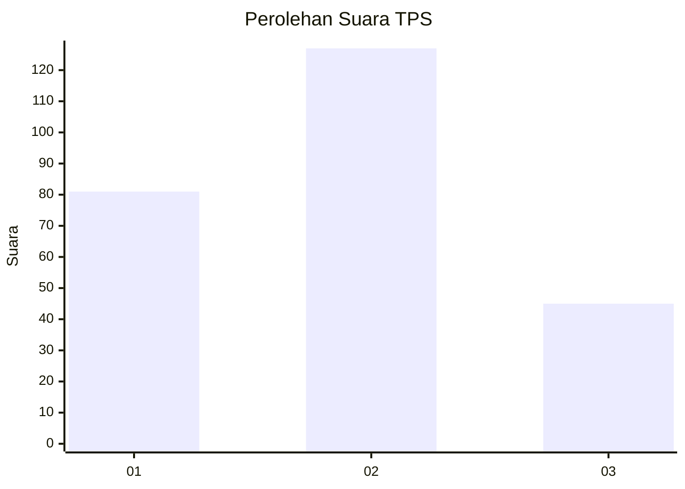
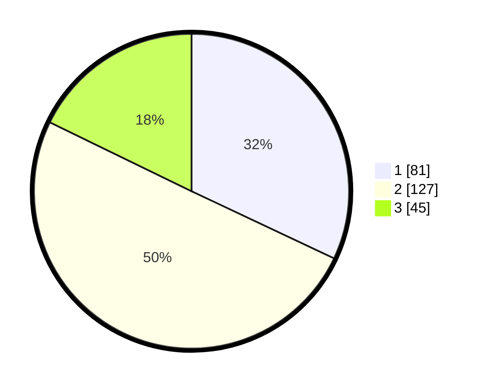

# Hasil

## Grafik

## Tabel

| No. | Nama Paslon    | Suara | Suara (raw) | Persentase |
|:--- |:-------------- | -----:| -----------:| ----------:|
| 1   | ANIES MUHAIMIN | 81    | [81][p-1]   | 32,02      |
| 2   | PRABOWO GIBRAN | 127   | [127][p-2]  | 50,20      |
| 3   | GANJAR MAHFUD  | 45    | [45][p-3]   | 17,79      |

[p-1]: https://github.com/gigit-pemilu/pemilu-2024-34-di-yogyakarta/blob/main/pilpres/hitung-suara/sub/34-di-yogyakarta/sub/01-kulon-progo/sub/06-sentolo/sub/2001-demangrejo/sub/005-tps/sub/paslon-1.txt
[p-2]: https://github.com/gigit-pemilu/pemilu-2024-34-di-yogyakarta/blob/main/pilpres/hitung-suara/sub/34-di-yogyakarta/sub/01-kulon-progo/sub/06-sentolo/sub/2001-demangrejo/sub/005-tps/sub/paslon-2.txt
[p-3]: https://github.com/gigit-pemilu/pemilu-2024-34-di-yogyakarta/blob/main/pilpres/hitung-suara/sub/34-di-yogyakarta/sub/01-kulon-progo/sub/06-sentolo/sub/2001-demangrejo/sub/005-tps/sub/paslon-3.txt

## Foto C Plano

https://sirekap-obj-formc.kpu.go.id/dc9d/pemilu/ppwp/34/01/06/20/01/3401062001005-20240214-212013--087d9237-6d35-4a72-ad70-940e4e2bcd89.jpg

https://sirekap-obj-formc.kpu.go.id/dc9d/pemilu/ppwp/34/01/06/20/01/3401062001005-20240214-212108--deb0fb89-46dc-4084-81ca-0825b4de55de.jpg

https://sirekap-obj-formc.kpu.go.id/dc9d/pemilu/ppwp/34/01/06/20/01/3401062001005-20240215-000942--1c048d4a-a19b-4440-8340-bf133d0e4a61.jpg

## Metadata

| Key        | Value               |
| ---------- | ------------------- |
| Time Stamp | 2024-02-15 12:00:28 |

## DATA PEMILIH TETAP

Jumlah pemilih dalam DPT: **290**.
 * L: **139**.
 * P: **151**.

## DATA PENGGUNA HAK PILIH

Jumlah pengguna hak pilih dalam DPT: **257**.
 * L: **123**.
 * P: **134**.

Jumlah pengguna hak pilih dalam DPTb: **1**.
 * L: **0**.
 * P: **1**.

Jumlah pengguna hak pilih dalam DPK: **0**.
 * L: **0**.
 * P: **0**.

Jumlah pengguna hak pilih: **258**.
 * L: **123**.
 * P: **135**.

## JUMLAH SUARA SAH DAN TIDAK SAH

JUMLAH SELURUH SUARA SAH: **253**.

JUMLAH SUARA TIDAK SAH: **5**.

JUMLAH SELURUH SUARA SAH DAN SUARA TIDAK SAH: **258**.

