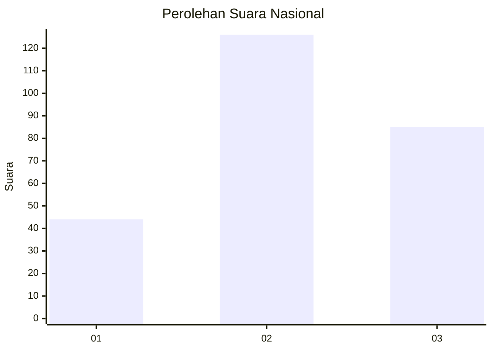
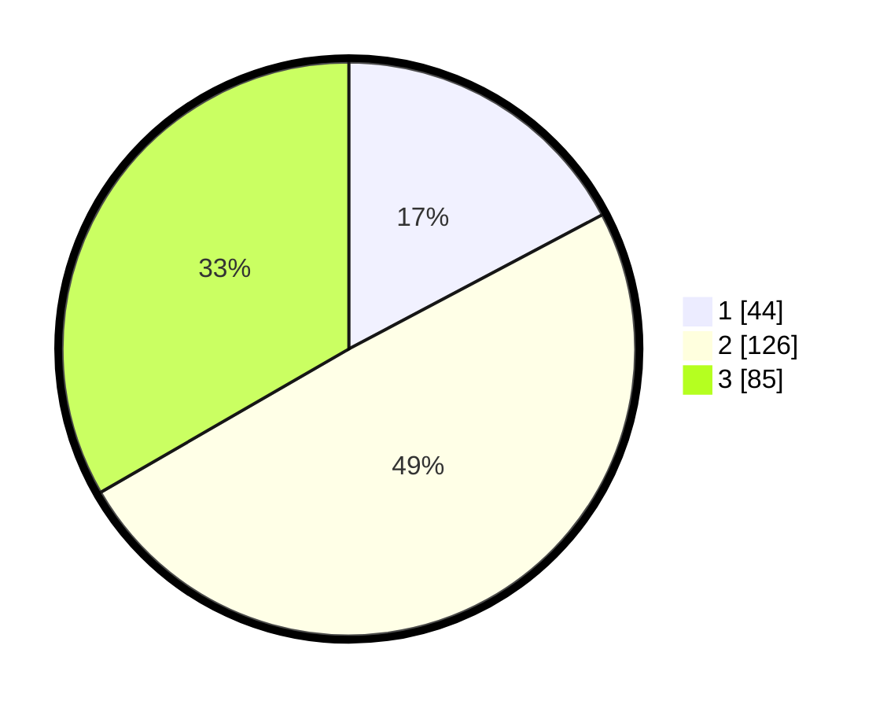

# Hasil

## Grafik

## Tabel

| No. | Nama Paslon    | Suara | Suara (raw) | Persentase |
|:--- |:-------------- | -----:| -----------:| ----------:|
| 1   | ANIES MUHAIMIN | 44    | [44][p-1]   | 17,25      |
| 2   | PRABOWO GIBRAN | 126   | [126][p-2]  | 49,41      |
| 3   | GANJAR MAHFUD  | 85    | [85][p-3]   | 33,33      |

[p-1]: https://github.com/gigit-pemilu/pemilu-2024/blob/main/pilpres/hitung-suara/sub/34-di-yogyakarta/sub/01-kulon-progo/sub/06-sentolo/sub/2001-demangrejo/sub/006-tps/sub/paslon-1.txt
[p-2]: https://github.com/gigit-pemilu/pemilu-2024/blob/main/pilpres/hitung-suara/sub/34-di-yogyakarta/sub/01-kulon-progo/sub/06-sentolo/sub/2001-demangrejo/sub/006-tps/sub/paslon-2.txt
[p-3]: https://github.com/gigit-pemilu/pemilu-2024/blob/main/pilpres/hitung-suara/sub/34-di-yogyakarta/sub/01-kulon-progo/sub/06-sentolo/sub/2001-demangrejo/sub/006-tps/sub/paslon-3.txt

## Foto C Plano

https://sirekap-obj-formc.kpu.go.id/1b03/pemilu/ppwp/34/01/06/20/01/3401062001006-20240216-145008--58328bc9-4a89-4eb0-94ba-5f4763c88dc8.jpg

https://sirekap-obj-formc.kpu.go.id/1b03/pemilu/ppwp/34/01/06/20/01/3401062001006-20240216-145010--4f893ee9-cbaf-4880-a0f0-afc938ed7d76.jpg

https://sirekap-obj-formc.kpu.go.id/1b03/pemilu/ppwp/34/01/06/20/01/3401062001006-20240216-145009--ac15fa4c-0914-4d73-a535-89bfc7b9da2f.jpg

## Metadata

| Key        | Value               |
| ---------- | ------------------- |
| Time Stamp | 2024-02-19 06:16:00 |

## DATA PEMILIH TETAP

Jumlah pemilih dalam DPT: **289**.
 * L: **137**.
 * P: **152**.

## DATA PENGGUNA HAK PILIH

Jumlah pengguna hak pilih dalam DPT: **262**.
 * L: **124**.
 * P: **138**.

Jumlah pengguna hak pilih dalam DPTb: **5**.
 * L: **2**.
 * P: **3**.

Jumlah pengguna hak pilih dalam DPK: **0**.
 * L: **0**.
 * P: **0**.

Jumlah pengguna hak pilih: **267**.
 * L: **126**.
 * P: **141**.

## JUMLAH SUARA SAH DAN TIDAK SAH

JUMLAH SELURUH SUARA SAH: **255**.

JUMLAH SUARA TIDAK SAH: **12**.

JUMLAH SELURUH SUARA SAH DAN SUARA TIDAK SAH: **267**.

