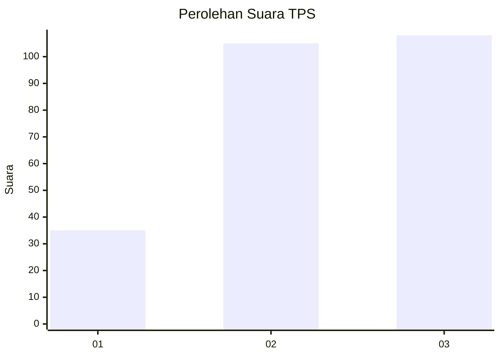
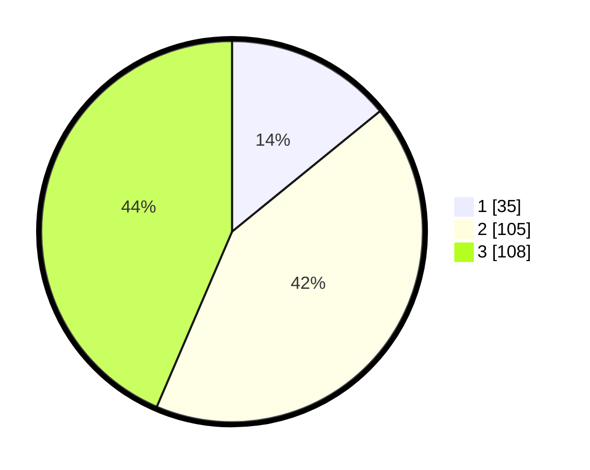

# Hasil

## Grafik

## Tabel

| No. | Nama Paslon    | Suara | Suara (raw) | Persentase |
|:--- |:-------------- | -----:| -----------:| ----------:|
| 1   | ANIES MUHAIMIN | 35    | [35][p-1]   | 14,11      |
| 2   | PRABOWO GIBRAN | 105   | [105][p-2]  | 42,34      |
| 3   | GANJAR MAHFUD  | 108   | [108][p-3]  | 43,55      |

[p-1]: https://github.com/gigit-pemilu/pemilu-2024-34-di-yogyakarta/blob/main/pilpres/hitung-suara/sub/34-di-yogyakarta/sub/01-kulon-progo/sub/06-sentolo/sub/2002-srikayangan/sub/002-tps/sub/paslon-1.txt
[p-2]: https://github.com/gigit-pemilu/pemilu-2024-34-di-yogyakarta/blob/main/pilpres/hitung-suara/sub/34-di-yogyakarta/sub/01-kulon-progo/sub/06-sentolo/sub/2002-srikayangan/sub/002-tps/sub/paslon-2.txt
[p-3]: https://github.com/gigit-pemilu/pemilu-2024-34-di-yogyakarta/blob/main/pilpres/hitung-suara/sub/34-di-yogyakarta/sub/01-kulon-progo/sub/06-sentolo/sub/2002-srikayangan/sub/002-tps/sub/paslon-3.txt

## Foto C Plano

https://sirekap-obj-formc.kpu.go.id/15b1/pemilu/ppwp/34/01/06/20/02/3401062002002-20240216-084534--bd76fcad-778e-47c4-bc19-ff6c0a55938d.jpg

https://sirekap-obj-formc.kpu.go.id/15b1/pemilu/ppwp/34/01/06/20/02/3401062002002-20240216-084535--c5208245-757c-4631-8ce6-03d99ded81ec.jpg

https://sirekap-obj-formc.kpu.go.id/15b1/pemilu/ppwp/34/01/06/20/02/3401062002002-20240216-084534--55ee53e1-adaf-4291-ae9b-a4af008ecee3.jpg

## Metadata

| Key        | Value               |
| ---------- | ------------------- |
| Time Stamp | 2024-02-19 06:16:00 |

## DATA PEMILIH TETAP

Jumlah pemilih dalam DPT: **282**.
 * L: **142**.
 * P: **140**.

## DATA PENGGUNA HAK PILIH

Jumlah pengguna hak pilih dalam DPT: **250**.
 * L: **124**.
 * P: **126**.

Jumlah pengguna hak pilih dalam DPTb: **9**.
 * L: **1**.
 * P: **8**.

Jumlah pengguna hak pilih dalam DPK: **0**.
 * L: **0**.
 * P: **0**.

Jumlah pengguna hak pilih: **259**.
 * L: **125**.
 * P: **134**.

## JUMLAH SUARA SAH DAN TIDAK SAH

JUMLAH SELURUH SUARA SAH: **248**.

JUMLAH SUARA TIDAK SAH: **11**.

JUMLAH SELURUH SUARA SAH DAN SUARA TIDAK SAH: **259**.

