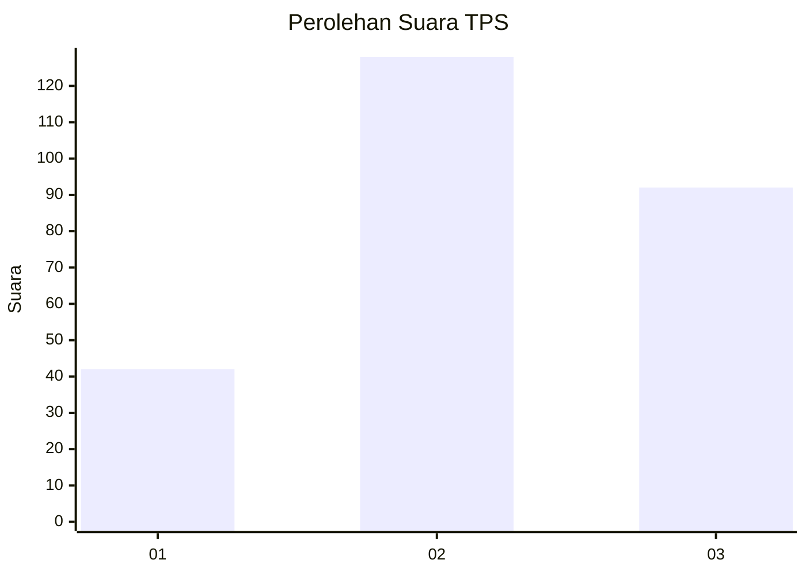
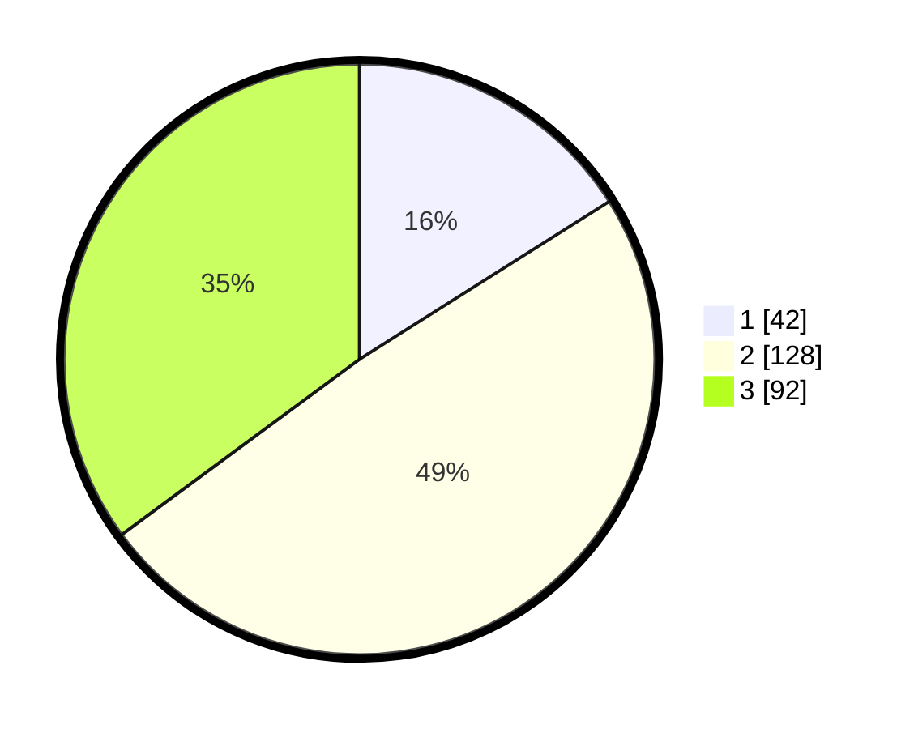

# Hasil

## Grafik

## Tabel

| No. | Nama Paslon    | Suara | Suara (raw) | Persentase |
|:--- |:-------------- | -----:| -----------:| ----------:|
| 1   | ANIES MUHAIMIN | 42    | [42][p-1]   | 16,03      |
| 2   | PRABOWO GIBRAN | 128   | [128][p-2]  | 48,85      |
| 3   | GANJAR MAHFUD  | 92    | [92][p-3]   | 35,11      |

[p-1]: https://github.com/gigit-pemilu/pemilu-2024-34-di-yogyakarta/blob/main/pilpres/hitung-suara/sub/34-di-yogyakarta/sub/01-kulon-progo/sub/06-sentolo/sub/2002-srikayangan/sub/010-tps/sub/paslon-1.txt
[p-2]: https://github.com/gigit-pemilu/pemilu-2024-34-di-yogyakarta/blob/main/pilpres/hitung-suara/sub/34-di-yogyakarta/sub/01-kulon-progo/sub/06-sentolo/sub/2002-srikayangan/sub/010-tps/sub/paslon-2.txt
[p-3]: https://github.com/gigit-pemilu/pemilu-2024-34-di-yogyakarta/blob/main/pilpres/hitung-suara/sub/34-di-yogyakarta/sub/01-kulon-progo/sub/06-sentolo/sub/2002-srikayangan/sub/010-tps/sub/paslon-3.txt

## Foto C Plano

https://sirekap-obj-formc.kpu.go.id/8656/pemilu/ppwp/34/01/06/20/02/3401062002010-20240214-184513--cc2be55b-17cb-483b-8bf0-90bbf45d3cde.jpg

https://sirekap-obj-formc.kpu.go.id/8656/pemilu/ppwp/34/01/06/20/02/3401062002010-20240214-192059--f54d8569-c569-4a77-bc41-ea10b44df990.jpg

https://sirekap-obj-formc.kpu.go.id/8656/pemilu/ppwp/34/01/06/20/02/3401062002010-20240214-193651--c0f2afbb-efe1-4c55-a833-842a499b00f0.jpg

## Metadata

| Key        | Value               |
| ---------- | ------------------- |
| Time Stamp | 2024-02-15 00:41:44 |

## DATA PEMILIH TETAP

Jumlah pemilih dalam DPT: **284**.
 * L: **134**.
 * P: **150**.

## DATA PENGGUNA HAK PILIH

Jumlah pengguna hak pilih dalam DPT: **267**.
 * L: **127**.
 * P: **140**.

Jumlah pengguna hak pilih dalam DPTb: **7**.
 * L: **6**.
 * P: **1**.

Jumlah pengguna hak pilih dalam DPK: **1**.
 * L: **1**.
 * P: **0**.

Jumlah pengguna hak pilih: **275**.
 * L: **134**.
 * P: **141**.

## JUMLAH SUARA SAH DAN TIDAK SAH

JUMLAH SELURUH SUARA SAH: **262**.

JUMLAH SUARA TIDAK SAH: **13**.

JUMLAH SELURUH SUARA SAH DAN SUARA TIDAK SAH: **275**.

