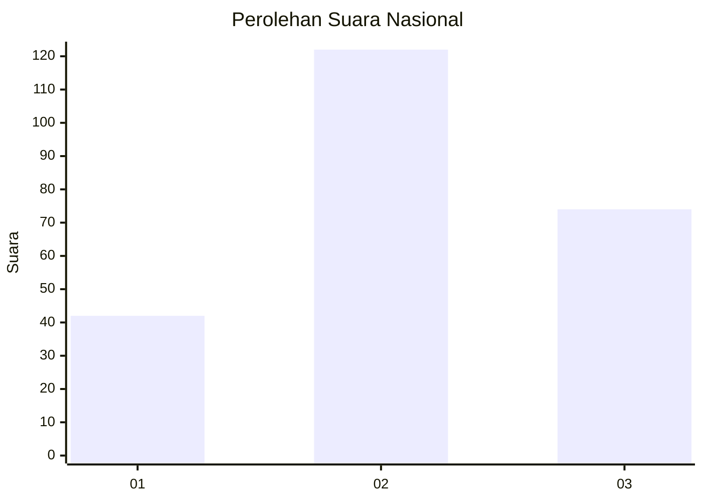
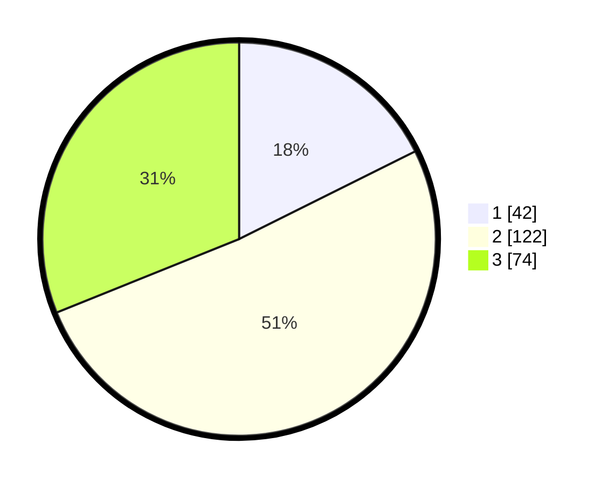

# Hasil

## Grafik

## Tabel

| No. | Nama Paslon    | Suara | Suara (raw) | Persentase |
|:--- |:-------------- | -----:| -----------:| ----------:|
| 1   | ANIES MUHAIMIN | 42    | [42][p-1]   | 17,65      |
| 2   | PRABOWO GIBRAN | 122   | [122][p-2]  | 51,26      |
| 3   | GANJAR MAHFUD  | 74    | [74][p-3]   | 31,09      |

[p-1]: https://github.com/gigit-pemilu/pemilu-2024/blob/main/pilpres/hitung-suara/sub/34-di-yogyakarta/sub/01-kulon-progo/sub/06-sentolo/sub/2006-kaliagung/sub/014-tps/sub/paslon-1.txt
[p-2]: https://github.com/gigit-pemilu/pemilu-2024/blob/main/pilpres/hitung-suara/sub/34-di-yogyakarta/sub/01-kulon-progo/sub/06-sentolo/sub/2006-kaliagung/sub/014-tps/sub/paslon-2.txt
[p-3]: https://github.com/gigit-pemilu/pemilu-2024/blob/main/pilpres/hitung-suara/sub/34-di-yogyakarta/sub/01-kulon-progo/sub/06-sentolo/sub/2006-kaliagung/sub/014-tps/sub/paslon-3.txt

## Foto C Plano

https://sirekap-obj-formc.kpu.go.id/bbe5/pemilu/ppwp/34/01/06/20/06/3401062006014-20240218-083242--f713af69-25e1-4271-849e-0dd8f4e4e43d.jpg

https://sirekap-obj-formc.kpu.go.id/bbe5/pemilu/ppwp/34/01/06/20/06/3401062006014-20240218-083243--80c16492-54f8-4e2f-8360-e3b25d8af20c.jpg

https://sirekap-obj-formc.kpu.go.id/bbe5/pemilu/ppwp/34/01/06/20/06/3401062006014-20240218-083243--46d7fd9c-fee6-48fa-b487-1c296a6b269e.jpg

## Metadata

| Key        | Value               |
| ---------- | ------------------- |
| Time Stamp | 2024-02-21 13:00:00 |

## DATA PEMILIH TETAP

Jumlah pemilih dalam DPT: **262**.
 * L: **125**.
 * P: **137**.

## DATA PENGGUNA HAK PILIH

Jumlah pengguna hak pilih dalam DPT: **231**.
 * L: **109**.
 * P: **122**.

Jumlah pengguna hak pilih dalam DPTb: **14**.
 * L: **5**.
 * P: **9**.

Jumlah pengguna hak pilih dalam DPK: **0**.
 * L: **0**.
 * P: **0**.

Jumlah pengguna hak pilih: **245**.
 * L: **116**.
 * P: **129**.

## JUMLAH SUARA SAH DAN TIDAK SAH

JUMLAH SELURUH SUARA SAH: **238**.

JUMLAH SUARA TIDAK SAH: **7**.

JUMLAH SELURUH SUARA SAH DAN SUARA TIDAK SAH: **245**.

