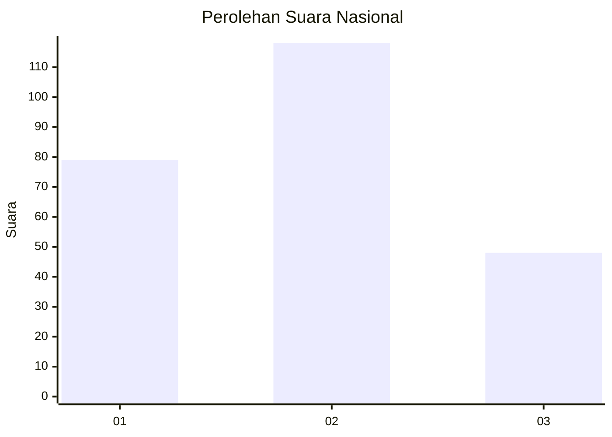
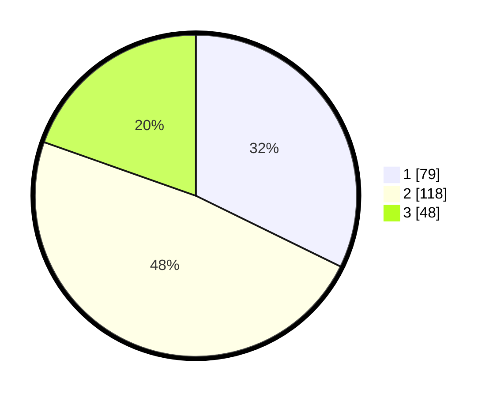

# Hasil

## Grafik

## Tabel

| No. | Nama Paslon    | Suara | Suara (raw) | Persentase |
|:--- |:-------------- | -----:| -----------:| ----------:|
| 1   | ANIES MUHAIMIN | 79    | [79][p-1]   | 32,24      |
| 2   | PRABOWO GIBRAN | 118   | [118][p-2]  | 48,16      |
| 3   | GANJAR MAHFUD  | 48    | [48][p-3]   | 19,59      |

[p-1]: https://github.com/gigit-pemilu/pemilu-2024/blob/main/pilpres/hitung-suara/sub/34-di-yogyakarta/sub/01-kulon-progo/sub/06-sentolo/sub/2007-sentolo/sub/001-tps/sub/paslon-1.txt
[p-2]: https://github.com/gigit-pemilu/pemilu-2024/blob/main/pilpres/hitung-suara/sub/34-di-yogyakarta/sub/01-kulon-progo/sub/06-sentolo/sub/2007-sentolo/sub/001-tps/sub/paslon-2.txt
[p-3]: https://github.com/gigit-pemilu/pemilu-2024/blob/main/pilpres/hitung-suara/sub/34-di-yogyakarta/sub/01-kulon-progo/sub/06-sentolo/sub/2007-sentolo/sub/001-tps/sub/paslon-3.txt

## Foto C Plano

https://sirekap-obj-formc.kpu.go.id/7ca3/pemilu/ppwp/34/01/06/20/07/3401062007001-20240214-193539--770fa7df-5920-4da9-9130-19be1c56220d.jpg

https://sirekap-obj-formc.kpu.go.id/7ca3/pemilu/ppwp/34/01/06/20/07/3401062007001-20240214-191057--2f0e06d9-0945-401c-bf48-e69188bb21b6.jpg

https://sirekap-obj-formc.kpu.go.id/7ca3/pemilu/ppwp/34/01/06/20/07/3401062007001-20240214-232229--31a71d08-eef6-47c5-8731-bf61b7a8d3a0.jpg

## Metadata

| Key        | Value               |
| ---------- | ------------------- |
| Time Stamp | 2024-02-15 05:00:24 |

## DATA PEMILIH TETAP

Jumlah pemilih dalam DPT: **279**.
 * L: **130**.
 * P: **149**.

## DATA PENGGUNA HAK PILIH

Jumlah pengguna hak pilih dalam DPT: **233**.
 * L: **107**.
 * P: **126**.

Jumlah pengguna hak pilih dalam DPTb: **13**.
 * L: **12**.
 * P: **1**.

Jumlah pengguna hak pilih dalam DPK: **2**.
 * L: **2**.
 * P: **0**.

Jumlah pengguna hak pilih: **248**.
 * L: **121**.
 * P: **127**.

## JUMLAH SUARA SAH DAN TIDAK SAH

JUMLAH SELURUH SUARA SAH: **245**.

JUMLAH SUARA TIDAK SAH: **3**.

JUMLAH SELURUH SUARA SAH DAN SUARA TIDAK SAH: **248**.

