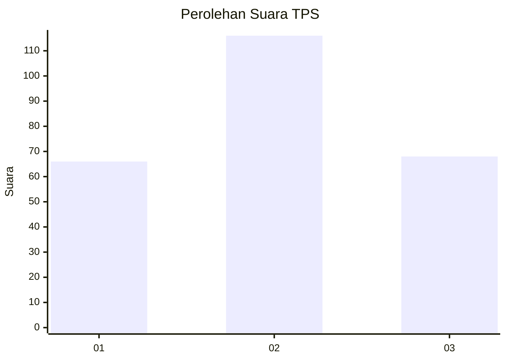
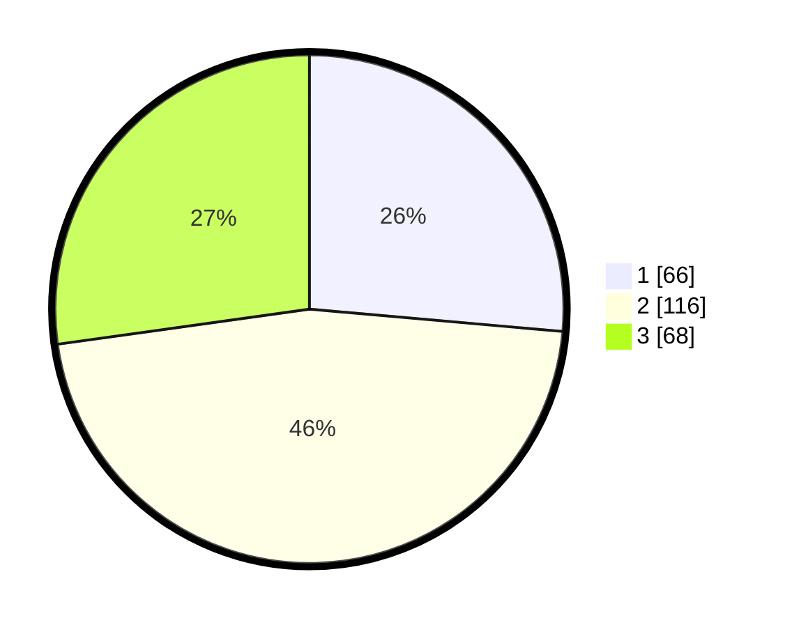

# Hasil

## Grafik

## Tabel

| No. | Nama Paslon    | Suara | Suara (raw) | Persentase |
|:--- |:-------------- | -----:| -----------:| ----------:|
| 1   | ANIES MUHAIMIN | 66    | [66][p-1]   | 26,40      |
| 2   | PRABOWO GIBRAN | 116   | [116][p-2]  | 46,40      |
| 3   | GANJAR MAHFUD  | 68    | [68][p-3]   | 27,20      |

[p-1]: https://github.com/gigit-pemilu/pemilu-2024-34-di-yogyakarta/blob/main/pilpres/hitung-suara/sub/34-di-yogyakarta/sub/01-kulon-progo/sub/06-sentolo/sub/2007-sentolo/sub/002-tps/sub/paslon-1.txt
[p-2]: https://github.com/gigit-pemilu/pemilu-2024-34-di-yogyakarta/blob/main/pilpres/hitung-suara/sub/34-di-yogyakarta/sub/01-kulon-progo/sub/06-sentolo/sub/2007-sentolo/sub/002-tps/sub/paslon-2.txt
[p-3]: https://github.com/gigit-pemilu/pemilu-2024-34-di-yogyakarta/blob/main/pilpres/hitung-suara/sub/34-di-yogyakarta/sub/01-kulon-progo/sub/06-sentolo/sub/2007-sentolo/sub/002-tps/sub/paslon-3.txt

## Foto C Plano

https://sirekap-obj-formc.kpu.go.id/934a/pemilu/ppwp/34/01/06/20/07/3401062007002-20240214-191515--9755f1d7-8431-4bec-8b49-501ad0c93239.jpg

https://sirekap-obj-formc.kpu.go.id/934a/pemilu/ppwp/34/01/06/20/07/3401062007002-20240214-191021--76c01518-dd65-4619-927e-10433f845f4a.jpg

https://sirekap-obj-formc.kpu.go.id/934a/pemilu/ppwp/34/01/06/20/07/3401062007002-20240214-191107--51a72913-33a4-4e93-acdb-0ff1c219b82c.jpg

## Metadata

| Key        | Value               |
| ---------- | ------------------- |
| Time Stamp | 2024-02-14 21:46:01 |

## DATA PEMILIH TETAP

Jumlah pemilih dalam DPT: **277**.
 * L: **128**.
 * P: **149**.

## DATA PENGGUNA HAK PILIH

Jumlah pengguna hak pilih dalam DPT: **244**.
 * L: **110**.
 * P: **134**.

Jumlah pengguna hak pilih dalam DPTb: **18**.
 * L: **14**.
 * P: **4**.

Jumlah pengguna hak pilih dalam DPK: **0**.
 * L: **0**.
 * P: **0**.

Jumlah pengguna hak pilih: **262**.
 * L: **124**.
 * P: **138**.

## JUMLAH SUARA SAH DAN TIDAK SAH

JUMLAH SELURUH SUARA SAH: **250**.

JUMLAH SUARA TIDAK SAH: **12**.

JUMLAH SELURUH SUARA SAH DAN SUARA TIDAK SAH: **262**.

