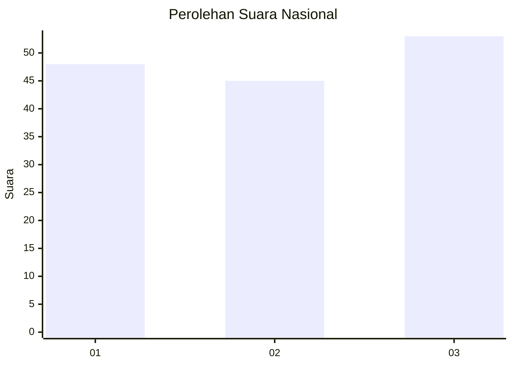
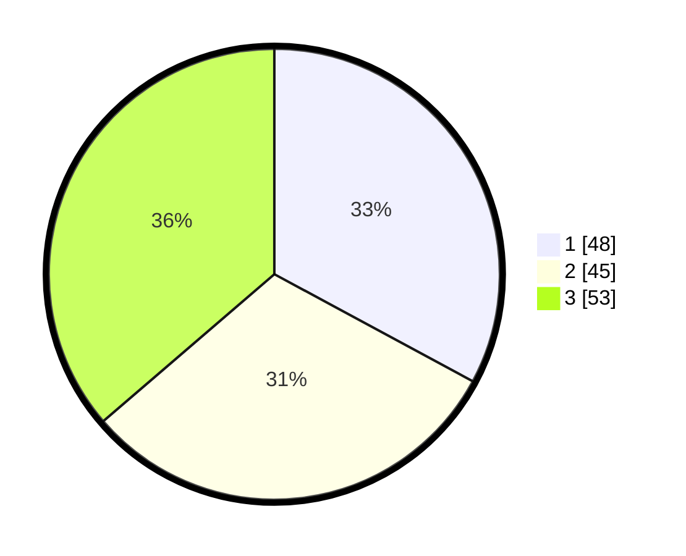

# Hasil

## Grafik

## Tabel

| No. | Nama Paslon    | Suara | Suara (raw) | Persentase |
|:--- |:-------------- | -----:| -----------:| ----------:|
| 1   | ANIES MUHAIMIN | 48    | [48][p-1]   | 32,88      |
| 2   | PRABOWO GIBRAN | 45    | [45][p-2]   | 30,82      |
| 3   | GANJAR MAHFUD  | 53    | [53][p-3]   | 36,30      |

[p-1]: https://github.com/gigit-pemilu/pemilu-2024/blob/main/pilpres/hitung-suara/sub/34-di-yogyakarta/sub/01-kulon-progo/sub/06-sentolo/sub/2007-sentolo/sub/006-tps/sub/paslon-1.txt
[p-2]: https://github.com/gigit-pemilu/pemilu-2024/blob/main/pilpres/hitung-suara/sub/34-di-yogyakarta/sub/01-kulon-progo/sub/06-sentolo/sub/2007-sentolo/sub/006-tps/sub/paslon-2.txt
[p-3]: https://github.com/gigit-pemilu/pemilu-2024/blob/main/pilpres/hitung-suara/sub/34-di-yogyakarta/sub/01-kulon-progo/sub/06-sentolo/sub/2007-sentolo/sub/006-tps/sub/paslon-3.txt

## Foto C Plano

https://sirekap-obj-formc.kpu.go.id/035a/pemilu/ppwp/34/01/06/20/07/3401062007006-20240216-205017--297f9cea-5d84-4c25-961b-d78bffad5a57.jpg

https://sirekap-obj-formc.kpu.go.id/035a/pemilu/ppwp/34/01/06/20/07/3401062007006-20240216-205044--09754fed-392f-4640-8e9f-66af884c8041.jpg

https://sirekap-obj-formc.kpu.go.id/035a/pemilu/ppwp/34/01/06/20/07/3401062007006-20240216-205655--8001450a-a18f-4f1e-90c3-6934ba24d1e3.jpg

## Metadata

| Key        | Value               |
| ---------- | ------------------- |
| Time Stamp | 2024-02-16 21:01:00 |

## DATA PEMILIH TETAP

Jumlah pemilih dalam DPT: **279**.
 * L: **122**.
 * P: **157**.

## DATA PENGGUNA HAK PILIH

Jumlah pengguna hak pilih dalam DPT: **233**.
 * L: **99**.
 * P: **134**.

Jumlah pengguna hak pilih dalam DPTb: **6**.
 * L: **3**.
 * P: **83**.

Jumlah pengguna hak pilih dalam DPK: **4**.
 * L: **1**.
 * P: **3**.

Jumlah pengguna hak pilih: **243**.
 * L: **103**.
 * P: **140**.

## JUMLAH SUARA SAH DAN TIDAK SAH

JUMLAH SELURUH SUARA SAH: **237**.

JUMLAH SUARA TIDAK SAH: **6**.

JUMLAH SELURUH SUARA SAH DAN SUARA TIDAK SAH: **243**.

