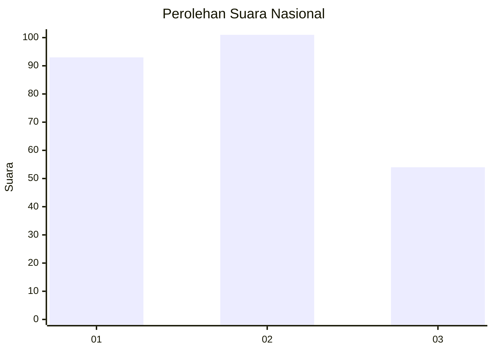
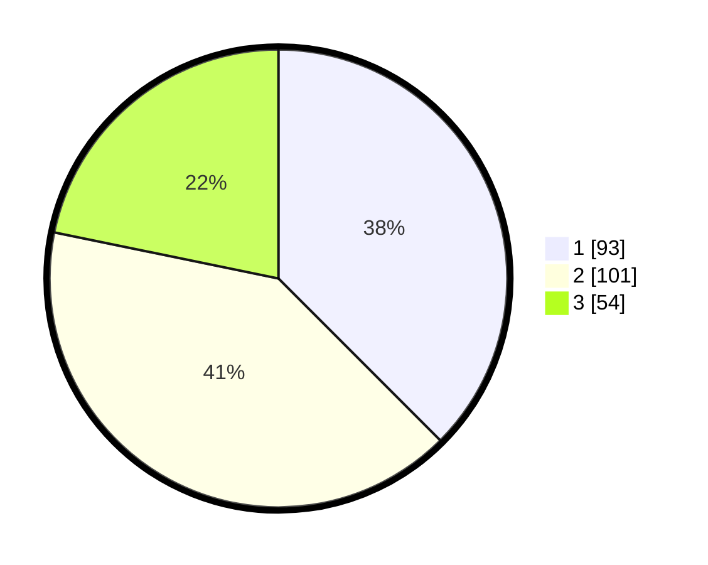

# Hasil

## Grafik

## Tabel

| No. | Nama Paslon    | Suara | Suara (raw) | Persentase |
|:--- |:-------------- | -----:| -----------:| ----------:|
| 1   | ANIES MUHAIMIN | 93    | [93][p-1]   | 37,50      |
| 2   | PRABOWO GIBRAN | 101   | [101][p-2]  | 40,73      |
| 3   | GANJAR MAHFUD  | 54    | [54][p-3]   | 21,77      |

[p-1]: https://github.com/gigit-pemilu/pemilu-2024/blob/main/pilpres/hitung-suara/sub/34-di-yogyakarta/sub/01-kulon-progo/sub/06-sentolo/sub/2008-banguncipto/sub/001-tps/sub/paslon-1.txt
[p-2]: https://github.com/gigit-pemilu/pemilu-2024/blob/main/pilpres/hitung-suara/sub/34-di-yogyakarta/sub/01-kulon-progo/sub/06-sentolo/sub/2008-banguncipto/sub/001-tps/sub/paslon-2.txt
[p-3]: https://github.com/gigit-pemilu/pemilu-2024/blob/main/pilpres/hitung-suara/sub/34-di-yogyakarta/sub/01-kulon-progo/sub/06-sentolo/sub/2008-banguncipto/sub/001-tps/sub/paslon-3.txt

## Foto C Plano

https://sirekap-obj-formc.kpu.go.id/2582/pemilu/ppwp/34/01/06/20/08/3401062008001-20240215-005133--5973a976-fadd-4f99-ae2f-8a2be948b0c8.jpg

https://sirekap-obj-formc.kpu.go.id/2582/pemilu/ppwp/34/01/06/20/08/3401062008001-20240215-004741--3feb1a04-94de-4d09-9961-f0dfb76ba950.jpg

https://sirekap-obj-formc.kpu.go.id/2582/pemilu/ppwp/34/01/06/20/08/3401062008001-20240215-005035--9a1755b3-6d54-4fc3-84a1-46dd9fbf4860.jpg

## Metadata

| Key        | Value               |
| ---------- | ------------------- |
| Time Stamp | 2024-02-19 06:16:00 |

## DATA PEMILIH TETAP

Jumlah pemilih dalam DPT: **289**.
 * L: **142**.
 * P: **147**.

## DATA PENGGUNA HAK PILIH

Jumlah pengguna hak pilih dalam DPT: **250**.
 * L: **117**.
 * P: **133**.

Jumlah pengguna hak pilih dalam DPTb: **3**.
 * L: **2**.
 * P: **1**.

Jumlah pengguna hak pilih dalam DPK: **0**.
 * L: **0**.
 * P: **0**.

Jumlah pengguna hak pilih: **253**.
 * L: **119**.
 * P: **134**.

## JUMLAH SUARA SAH DAN TIDAK SAH

JUMLAH SELURUH SUARA SAH: **248**.

JUMLAH SUARA TIDAK SAH: **5**.

JUMLAH SELURUH SUARA SAH DAN SUARA TIDAK SAH: **253**.

