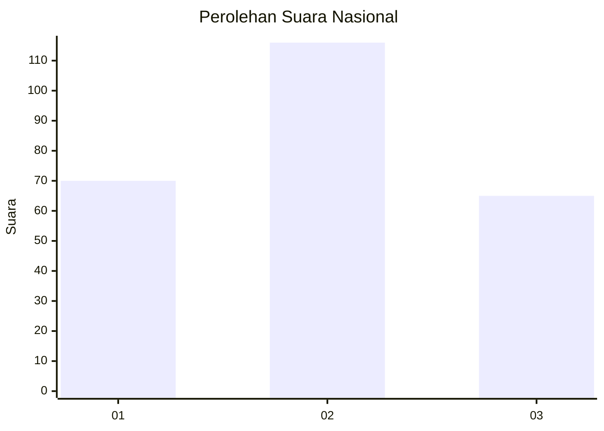
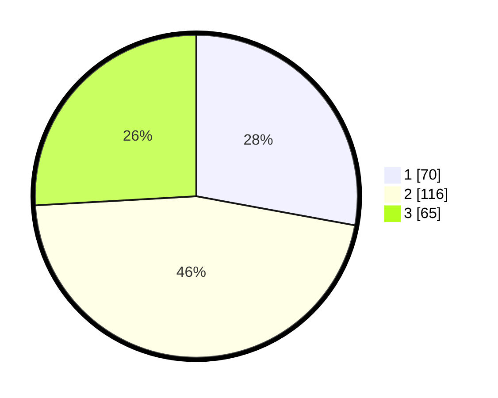

# Hasil

## Grafik

## Tabel

| No. | Nama Paslon    | Suara | Suara (raw) | Persentase |
|:--- |:-------------- | -----:| -----------:| ----------:|
| 1   | ANIES MUHAIMIN | 70    | [70][p-1]   | 27,89      |
| 2   | PRABOWO GIBRAN | 116   | [116][p-2]  | 46,22      |
| 3   | GANJAR MAHFUD  | 65    | [65][p-3]   | 25,90      |

[p-1]: https://github.com/gigit-pemilu/pemilu-2024/blob/main/pilpres/hitung-suara/sub/34-di-yogyakarta/sub/01-kulon-progo/sub/06-sentolo/sub/2008-banguncipto/sub/005-tps/sub/paslon-1.txt
[p-2]: https://github.com/gigit-pemilu/pemilu-2024/blob/main/pilpres/hitung-suara/sub/34-di-yogyakarta/sub/01-kulon-progo/sub/06-sentolo/sub/2008-banguncipto/sub/005-tps/sub/paslon-2.txt
[p-3]: https://github.com/gigit-pemilu/pemilu-2024/blob/main/pilpres/hitung-suara/sub/34-di-yogyakarta/sub/01-kulon-progo/sub/06-sentolo/sub/2008-banguncipto/sub/005-tps/sub/paslon-3.txt

## Foto C Plano

https://sirekap-obj-formc.kpu.go.id/5f2e/pemilu/ppwp/34/01/06/20/08/3401062008005-20240214-220735--334a682a-1782-4cfe-89ad-9fb462398f5e.jpg

https://sirekap-obj-formc.kpu.go.id/5f2e/pemilu/ppwp/34/01/06/20/08/3401062008005-20240214-221114--f72b404b-c85e-493b-88ea-b869fb90d339.jpg

https://sirekap-obj-formc.kpu.go.id/5f2e/pemilu/ppwp/34/01/06/20/08/3401062008005-20240214-221417--fb3952e1-3b98-41c1-9da4-8d498c500486.jpg

## Metadata

| Key        | Value               |
| ---------- | ------------------- |
| Time Stamp | 2024-02-19 06:16:00 |

## DATA PEMILIH TETAP

Jumlah pemilih dalam DPT: **270**.
 * L: **118**.
 * P: **152**.

## DATA PENGGUNA HAK PILIH

Jumlah pengguna hak pilih dalam DPT: **243**.
 * L: **106**.
 * P: **137**.

Jumlah pengguna hak pilih dalam DPTb: **12**.
 * L: **7**.
 * P: **5**.

Jumlah pengguna hak pilih dalam DPK: **0**.
 * L: **0**.
 * P: **0**.

Jumlah pengguna hak pilih: **255**.
 * L: **113**.
 * P: **142**.

## JUMLAH SUARA SAH DAN TIDAK SAH

JUMLAH SELURUH SUARA SAH: **251**.

JUMLAH SUARA TIDAK SAH: **4**.

JUMLAH SELURUH SUARA SAH DAN SUARA TIDAK SAH: **255**.

