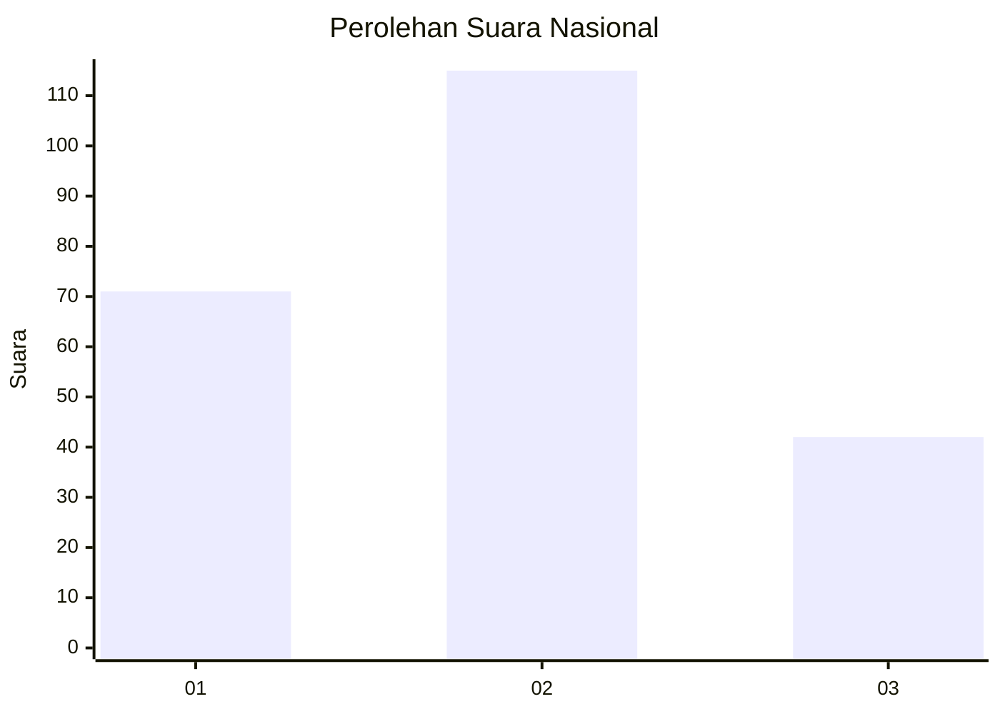
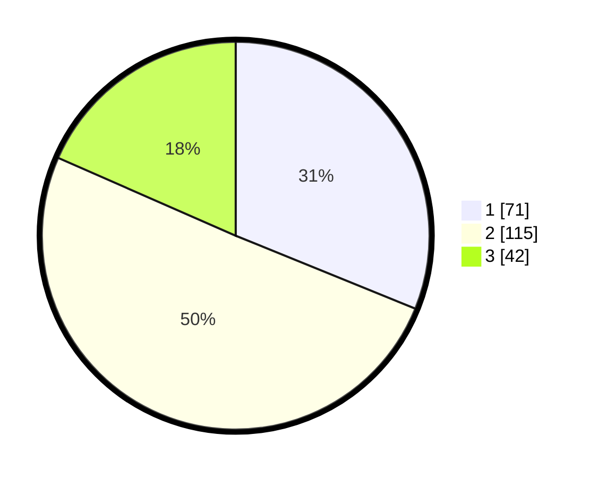

# Hasil

## Grafik

## Tabel

| No. | Nama Paslon    | Suara | Suara (raw) | Persentase |
|:--- |:-------------- | -----:| -----------:| ----------:|
| 1   | ANIES MUHAIMIN | 71    | [71][p-1]   | 31,14      |
| 2   | PRABOWO GIBRAN | 115   | [115][p-2]  | 50,44      |
| 3   | GANJAR MAHFUD  | 42    | [42][p-3]   | 18,42      |

[p-1]: https://github.com/gigit-pemilu/pemilu-2024/blob/main/pilpres/hitung-suara/sub/34-di-yogyakarta/sub/01-kulon-progo/sub/06-sentolo/sub/2008-banguncipto/sub/006-tps/sub/paslon-1.txt
[p-2]: https://github.com/gigit-pemilu/pemilu-2024/blob/main/pilpres/hitung-suara/sub/34-di-yogyakarta/sub/01-kulon-progo/sub/06-sentolo/sub/2008-banguncipto/sub/006-tps/sub/paslon-2.txt
[p-3]: https://github.com/gigit-pemilu/pemilu-2024/blob/main/pilpres/hitung-suara/sub/34-di-yogyakarta/sub/01-kulon-progo/sub/06-sentolo/sub/2008-banguncipto/sub/006-tps/sub/paslon-3.txt

## Foto C Plano

https://sirekap-obj-formc.kpu.go.id/f7a4/pemilu/ppwp/34/01/06/20/08/3401062008006-20240214-155025--777fb1d2-b240-4b1c-9b64-4dd73bd21585.jpg

https://sirekap-obj-formc.kpu.go.id/f7a4/pemilu/ppwp/34/01/06/20/08/3401062008006-20240214-155034--ec88ae38-4665-4e4d-be3b-e839f99afd79.jpg

https://sirekap-obj-formc.kpu.go.id/f7a4/pemilu/ppwp/34/01/06/20/08/3401062008006-20240214-155038--3156c700-e0e0-4c70-a202-8eb045041ced.jpg

## Metadata

| Key        | Value               |
| ---------- | ------------------- |
| Time Stamp | 2024-02-14 21:46:01 |

## DATA PEMILIH TETAP

Jumlah pemilih dalam DPT: **258**.
 * L: **124**.
 * P: **134**.

## DATA PENGGUNA HAK PILIH

Jumlah pengguna hak pilih dalam DPT: **217**.
 * L: **100**.
 * P: **117**.

Jumlah pengguna hak pilih dalam DPTb: **18**.
 * L: **9**.
 * P: **9**.

Jumlah pengguna hak pilih dalam DPK: **0**.
 * L: **0**.
 * P: **0**.

Jumlah pengguna hak pilih: **235**.
 * L: **109**.
 * P: **126**.

## JUMLAH SUARA SAH DAN TIDAK SAH

JUMLAH SELURUH SUARA SAH: **228**.

JUMLAH SUARA TIDAK SAH: **7**.

JUMLAH SELURUH SUARA SAH DAN SUARA TIDAK SAH: **235**.

