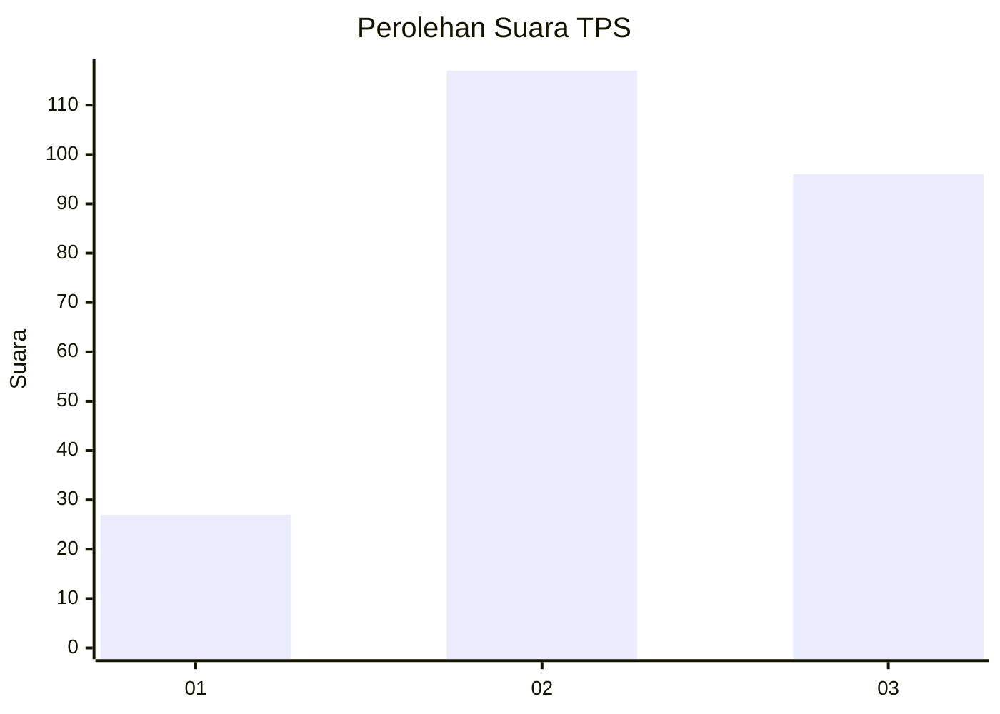
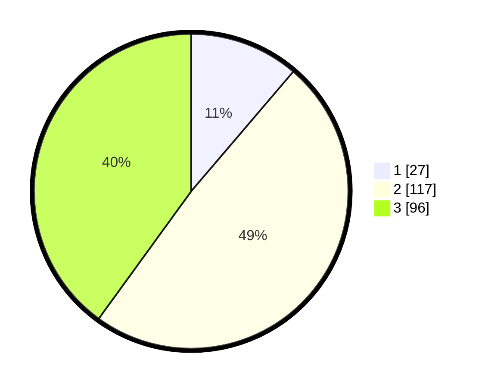

# Hasil

## Grafik

## Tabel

| No. | Nama Paslon    | Suara | Suara (raw) | Persentase |
|:--- |:-------------- | -----:| -----------:| ----------:|
| 1   | ANIES MUHAIMIN | 27    | [27][p-1]   | 11,25      |
| 2   | PRABOWO GIBRAN | 117   | [117][p-2]  | 48,75      |
| 3   | GANJAR MAHFUD  | 96    | [96][p-3]   | 40,00      |

[p-1]: https://github.com/gigit-pemilu/pemilu-2024-34-di-yogyakarta/blob/main/pilpres/hitung-suara/sub/34-di-yogyakarta/sub/01-kulon-progo/sub/06-sentolo/sub/2008-banguncipto/sub/007-tps/sub/paslon-1.txt
[p-2]: https://github.com/gigit-pemilu/pemilu-2024-34-di-yogyakarta/blob/main/pilpres/hitung-suara/sub/34-di-yogyakarta/sub/01-kulon-progo/sub/06-sentolo/sub/2008-banguncipto/sub/007-tps/sub/paslon-2.txt
[p-3]: https://github.com/gigit-pemilu/pemilu-2024-34-di-yogyakarta/blob/main/pilpres/hitung-suara/sub/34-di-yogyakarta/sub/01-kulon-progo/sub/06-sentolo/sub/2008-banguncipto/sub/007-tps/sub/paslon-3.txt

## Foto C Plano

https://sirekap-obj-formc.kpu.go.id/bae3/pemilu/ppwp/34/01/06/20/08/3401062008007-20240216-121422--394a9d3a-a34e-4252-80cb-132350e5608f.jpg

https://sirekap-obj-formc.kpu.go.id/bae3/pemilu/ppwp/34/01/06/20/08/3401062008007-20240216-121424--294a7032-9fe1-485b-8a82-b60bd69f76a3.jpg

https://sirekap-obj-formc.kpu.go.id/bae3/pemilu/ppwp/34/01/06/20/08/3401062008007-20240216-121423--92b687bd-2377-4ec0-a0fa-e0b25870e51c.jpg

## Metadata

| Key        | Value               |
| ---------- | ------------------- |
| Time Stamp | 2024-02-19 06:16:00 |

## DATA PEMILIH TETAP

Jumlah pemilih dalam DPT: **272**.
 * L: **131**.
 * P: **141**.

## DATA PENGGUNA HAK PILIH

Jumlah pengguna hak pilih dalam DPT: **238**.
 * L: **112**.
 * P: **126**.

Jumlah pengguna hak pilih dalam DPTb: **9**.
 * L: **3**.
 * P: **6**.

Jumlah pengguna hak pilih dalam DPK: **0**.
 * L: **0**.
 * P: **0**.

Jumlah pengguna hak pilih: **247**.
 * L: **115**.
 * P: **132**.

## JUMLAH SUARA SAH DAN TIDAK SAH

JUMLAH SELURUH SUARA SAH: **240**.

JUMLAH SUARA TIDAK SAH: **7**.

JUMLAH SELURUH SUARA SAH DAN SUARA TIDAK SAH: **247**.

