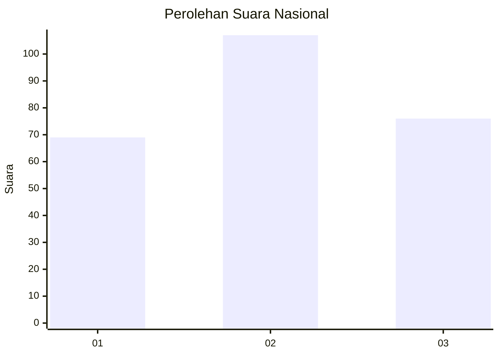
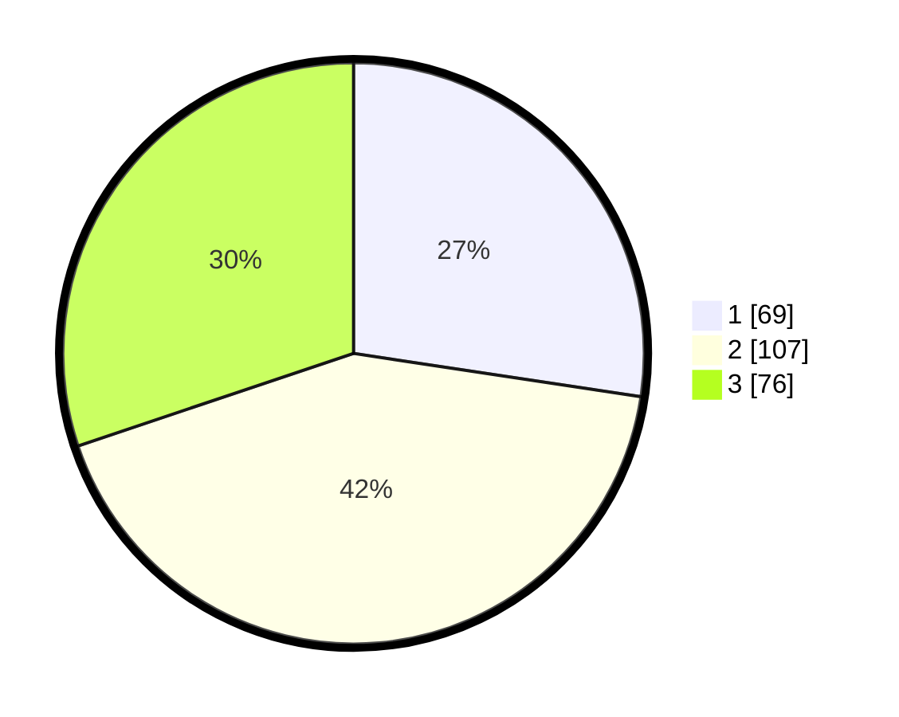

# Hasil

## Grafik

## Tabel

| No. | Nama Paslon    | Suara | Suara (raw) | Persentase |
|:--- |:-------------- | -----:| -----------:| ----------:|
| 1   | ANIES MUHAIMIN | 69    | [69][p-1]   | 27,38      |
| 2   | PRABOWO GIBRAN | 107   | [107][p-2]  | 42,46      |
| 3   | GANJAR MAHFUD  | 76    | [76][p-3]   | 30,16      |

[p-1]: https://github.com/gigit-pemilu/pemilu-2024/blob/main/pilpres/hitung-suara/sub/34-di-yogyakarta/sub/01-kulon-progo/sub/07-pengasih/sub/2001-tawangsari/sub/002-tps/sub/paslon-1.txt
[p-2]: https://github.com/gigit-pemilu/pemilu-2024/blob/main/pilpres/hitung-suara/sub/34-di-yogyakarta/sub/01-kulon-progo/sub/07-pengasih/sub/2001-tawangsari/sub/002-tps/sub/paslon-2.txt
[p-3]: https://github.com/gigit-pemilu/pemilu-2024/blob/main/pilpres/hitung-suara/sub/34-di-yogyakarta/sub/01-kulon-progo/sub/07-pengasih/sub/2001-tawangsari/sub/002-tps/sub/paslon-3.txt

## Foto C Plano

https://sirekap-obj-formc.kpu.go.id/2f00/pemilu/ppwp/34/01/07/20/01/3401072001002-20240216-125113--c9888aff-ad06-4571-b37a-e60b19981b54.jpg

https://sirekap-obj-formc.kpu.go.id/2f00/pemilu/ppwp/34/01/07/20/01/3401072001002-20240216-125117--850410f0-9e08-4d1a-840e-74b75e849ca2.jpg

https://sirekap-obj-formc.kpu.go.id/2f00/pemilu/ppwp/34/01/07/20/01/3401072001002-20240216-125115--035b002a-f88a-437d-bbd0-3e14d4a8ed60.jpg

## Metadata

| Key        | Value               |
| ---------- | ------------------- |
| Time Stamp | 2024-02-21 13:00:00 |

## DATA PEMILIH TETAP

Jumlah pemilih dalam DPT: **282**.
 * L: **128**.
 * P: **154**.

## DATA PENGGUNA HAK PILIH

Jumlah pengguna hak pilih dalam DPT: **247**.
 * L: **117**.
 * P: **130**.

Jumlah pengguna hak pilih dalam DPTb: **12**.
 * L: **8**.
 * P: **4**.

Jumlah pengguna hak pilih dalam DPK: **1**.
 * L: **0**.
 * P: **1**.

Jumlah pengguna hak pilih: **260**.
 * L: **125**.
 * P: **135**.

## JUMLAH SUARA SAH DAN TIDAK SAH

JUMLAH SELURUH SUARA SAH: **252**.

JUMLAH SUARA TIDAK SAH: **8**.

JUMLAH SELURUH SUARA SAH DAN SUARA TIDAK SAH: **260**.

