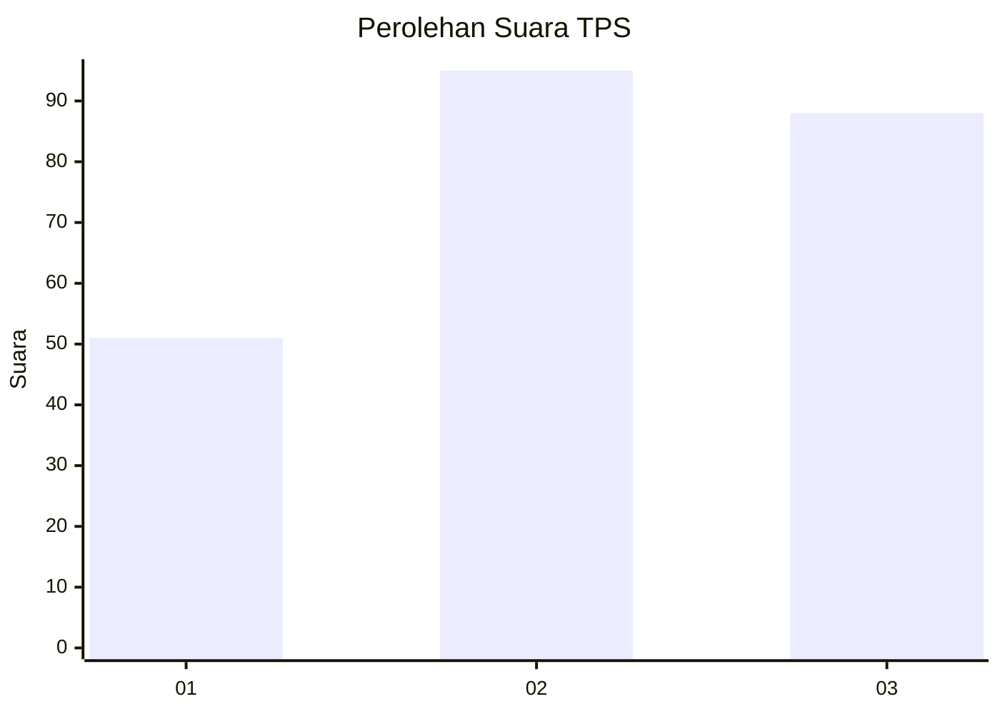
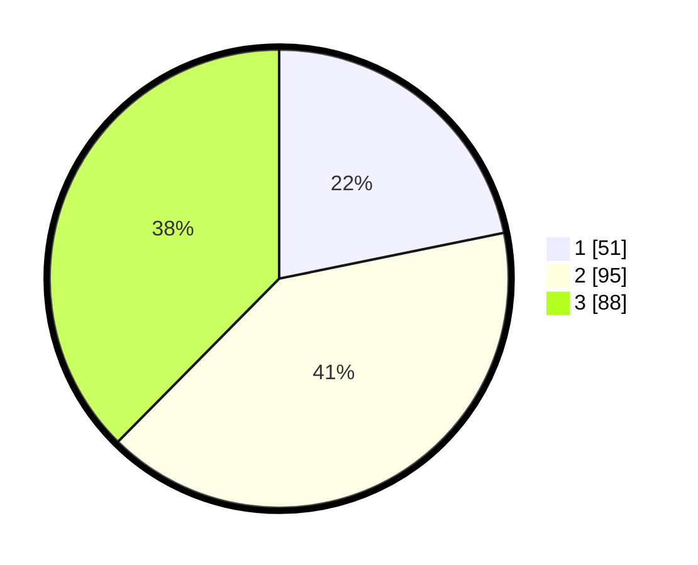

# Hasil

## Grafik

## Tabel

| No. | Nama Paslon    | Suara | Suara (raw) | Persentase |
|:--- |:-------------- | -----:| -----------:| ----------:|
| 1   | ANIES MUHAIMIN | 51    | [51][p-1]   | 21,79      |
| 2   | PRABOWO GIBRAN | 95    | [95][p-2]   | 40,60      |
| 3   | GANJAR MAHFUD  | 88    | [88][p-3]   | 37,61      |

[p-1]: https://github.com/gigit-pemilu/pemilu-2024-34-di-yogyakarta/blob/main/pilpres/hitung-suara/sub/34-di-yogyakarta/sub/01-kulon-progo/sub/07-pengasih/sub/2001-tawangsari/sub/003-tps/sub/paslon-1.txt
[p-2]: https://github.com/gigit-pemilu/pemilu-2024-34-di-yogyakarta/blob/main/pilpres/hitung-suara/sub/34-di-yogyakarta/sub/01-kulon-progo/sub/07-pengasih/sub/2001-tawangsari/sub/003-tps/sub/paslon-2.txt
[p-3]: https://github.com/gigit-pemilu/pemilu-2024-34-di-yogyakarta/blob/main/pilpres/hitung-suara/sub/34-di-yogyakarta/sub/01-kulon-progo/sub/07-pengasih/sub/2001-tawangsari/sub/003-tps/sub/paslon-3.txt

## Foto C Plano

https://sirekap-obj-formc.kpu.go.id/2f68/pemilu/ppwp/34/01/07/20/01/3401072001003-20240214-224718--a2377515-d5e7-49a0-a1c6-7f0534527695.jpg

https://sirekap-obj-formc.kpu.go.id/2f68/pemilu/ppwp/34/01/07/20/01/3401072001003-20240214-224954--eede4589-18d6-42c3-b4e2-fda1d7e90e8f.jpg

## Metadata

| Key        | Value               |
| ---------- | ------------------- |
| Time Stamp | 2024-02-24 22:31:28 |

