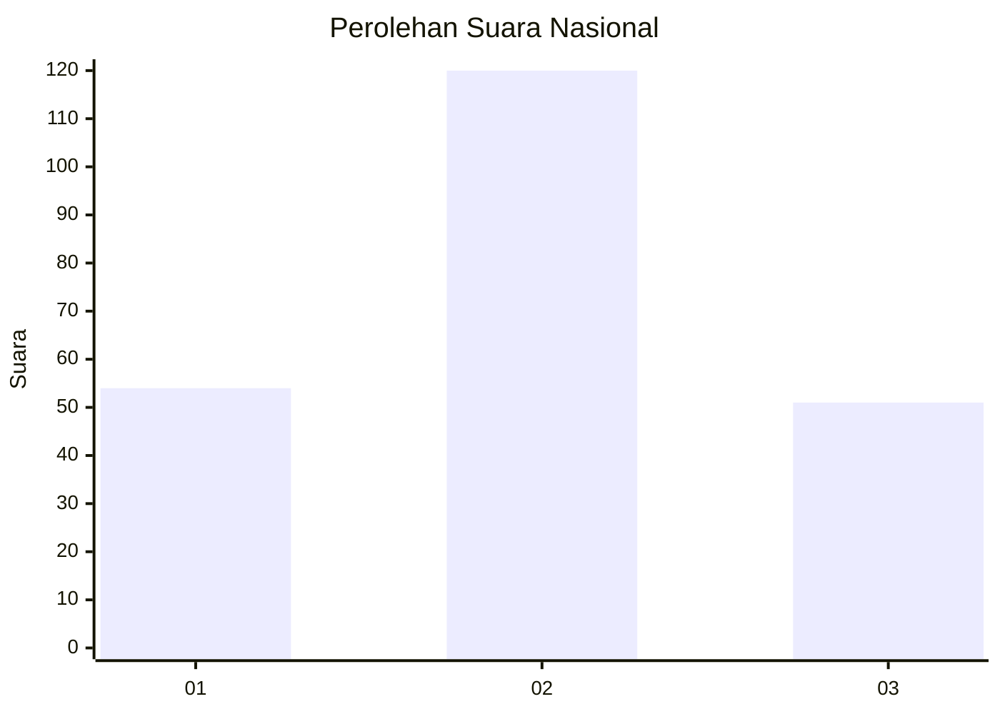
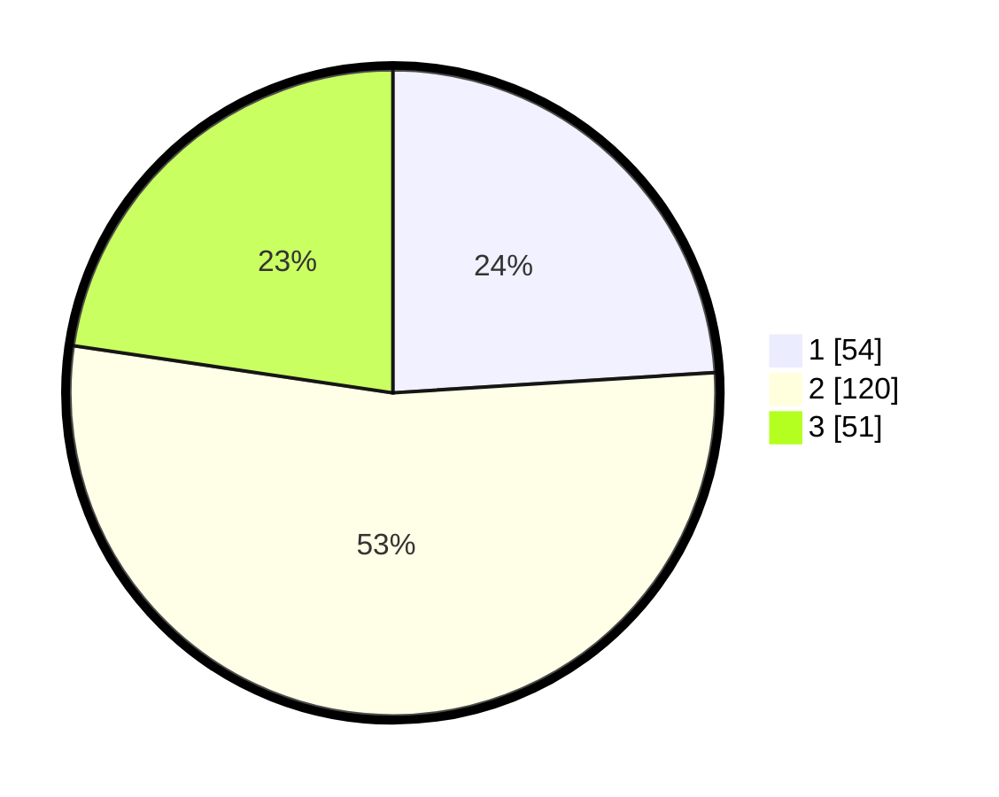

# Hasil

## Grafik

## Tabel

| No. | Nama Paslon    | Suara | Suara (raw) | Persentase |
|:--- |:-------------- | -----:| -----------:| ----------:|
| 1   | ANIES MUHAIMIN | 54    | [54][p-1]   | 24,00      |
| 2   | PRABOWO GIBRAN | 120   | [120][p-2]  | 53,33      |
| 3   | GANJAR MAHFUD  | 51    | [51][p-3]   | 22,67      |

[p-1]: https://github.com/gigit-pemilu/pemilu-2024/blob/main/pilpres/hitung-suara/sub/34-di-yogyakarta/sub/01-kulon-progo/sub/07-pengasih/sub/2001-tawangsari/sub/004-tps/sub/paslon-1.txt
[p-2]: https://github.com/gigit-pemilu/pemilu-2024/blob/main/pilpres/hitung-suara/sub/34-di-yogyakarta/sub/01-kulon-progo/sub/07-pengasih/sub/2001-tawangsari/sub/004-tps/sub/paslon-2.txt
[p-3]: https://github.com/gigit-pemilu/pemilu-2024/blob/main/pilpres/hitung-suara/sub/34-di-yogyakarta/sub/01-kulon-progo/sub/07-pengasih/sub/2001-tawangsari/sub/004-tps/sub/paslon-3.txt

## Foto C Plano

https://sirekap-obj-formc.kpu.go.id/4ad9/pemilu/ppwp/34/01/07/20/01/3401072001004-20240214-155453--b013701d-fd08-41f8-a4a5-fe3a8e01ae3d.jpg

https://sirekap-obj-formc.kpu.go.id/4ad9/pemilu/ppwp/34/01/07/20/01/3401072001004-20240214-205721--a1f17f01-1900-4f5b-b592-729a4714bf43.jpg

https://sirekap-obj-formc.kpu.go.id/4ad9/pemilu/ppwp/34/01/07/20/01/3401072001004-20240214-205731--64adbdad-332b-48aa-b1c3-10681a3424bd.jpg

## Metadata

| Key        | Value               |
| ---------- | ------------------- |
| Time Stamp | 2024-02-15 00:41:44 |

## DATA PEMILIH TETAP

Jumlah pemilih dalam DPT: **256**.
 * L: **122**.
 * P: **134**.

## DATA PENGGUNA HAK PILIH

Jumlah pengguna hak pilih dalam DPT: **229**.
 * L: **113**.
 * P: **116**.

Jumlah pengguna hak pilih dalam DPTb: **1**.
 * L: **0**.
 * P: **1**.

Jumlah pengguna hak pilih dalam DPK: **1**.
 * L: **1**.
 * P: **0**.

Jumlah pengguna hak pilih: **231**.
 * L: **114**.
 * P: **117**.

## JUMLAH SUARA SAH DAN TIDAK SAH

JUMLAH SELURUH SUARA SAH: **225**.

JUMLAH SUARA TIDAK SAH: **6**.

JUMLAH SELURUH SUARA SAH DAN SUARA TIDAK SAH: **231**.

