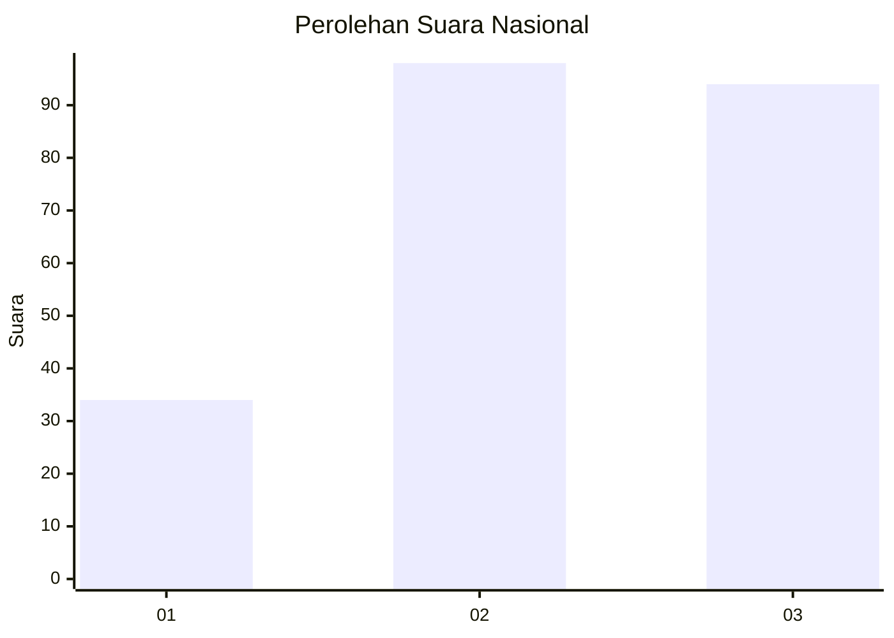
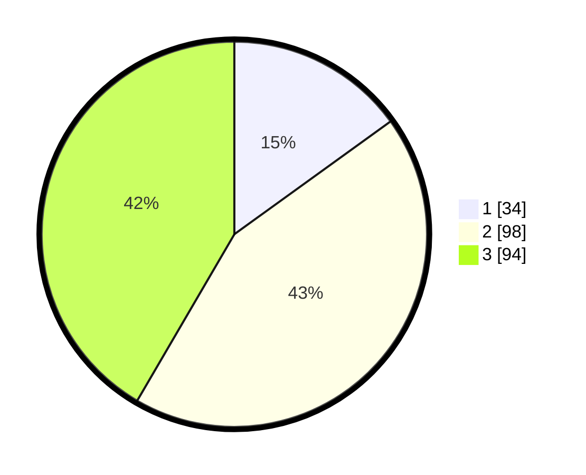

# Hasil

## Grafik

## Tabel

| No. | Nama Paslon    | Suara | Suara (raw) | Persentase |
|:--- |:-------------- | -----:| -----------:| ----------:|
| 1   | ANIES MUHAIMIN | 34    | [34][p-1]   | 15,04      |
| 2   | PRABOWO GIBRAN | 98    | [98][p-2]   | 43,36      |
| 3   | GANJAR MAHFUD  | 94    | [94][p-3]   | 41,59      |

[p-1]: https://github.com/gigit-pemilu/pemilu-2024/blob/main/pilpres/hitung-suara/sub/34-di-yogyakarta/sub/01-kulon-progo/sub/07-pengasih/sub/2001-tawangsari/sub/006-tps/sub/paslon-1.txt
[p-2]: https://github.com/gigit-pemilu/pemilu-2024/blob/main/pilpres/hitung-suara/sub/34-di-yogyakarta/sub/01-kulon-progo/sub/07-pengasih/sub/2001-tawangsari/sub/006-tps/sub/paslon-2.txt
[p-3]: https://github.com/gigit-pemilu/pemilu-2024/blob/main/pilpres/hitung-suara/sub/34-di-yogyakarta/sub/01-kulon-progo/sub/07-pengasih/sub/2001-tawangsari/sub/006-tps/sub/paslon-3.txt

## Foto C Plano

https://sirekap-obj-formc.kpu.go.id/82f8/pemilu/ppwp/34/01/07/20/01/3401072001006-20240215-115101--3b114f64-4caa-473a-9ab0-9caa57896dc5.jpg

https://sirekap-obj-formc.kpu.go.id/82f8/pemilu/ppwp/34/01/07/20/01/3401072001006-20240215-012345--d77e2a5a-4cce-47ac-a9c9-f707924c123f.jpg

https://sirekap-obj-formc.kpu.go.id/82f8/pemilu/ppwp/34/01/07/20/01/3401072001006-20240215-012510--df41fc2a-5ca0-453f-9b21-3a33d64da8d1.jpg

## Metadata

| Key        | Value               |
| ---------- | ------------------- |
| Time Stamp | 2024-02-15 18:00:26 |

## DATA PEMILIH TETAP

Jumlah pemilih dalam DPT: **266**.
 * L: **133**.
 * P: **133**.

## DATA PENGGUNA HAK PILIH

Jumlah pengguna hak pilih dalam DPT: **230**.
 * L: **114**.
 * P: **116**.

Jumlah pengguna hak pilih dalam DPTb: **1**.
 * L: **0**.
 * P: **1**.

Jumlah pengguna hak pilih dalam DPK: **1**.
 * L: **1**.
 * P: **0**.

Jumlah pengguna hak pilih: **232**.
 * L: **115**.
 * P: **117**.

## JUMLAH SUARA SAH DAN TIDAK SAH

JUMLAH SELURUH SUARA SAH: **226**.

JUMLAH SUARA TIDAK SAH: **6**.

JUMLAH SELURUH SUARA SAH DAN SUARA TIDAK SAH: **232**.

