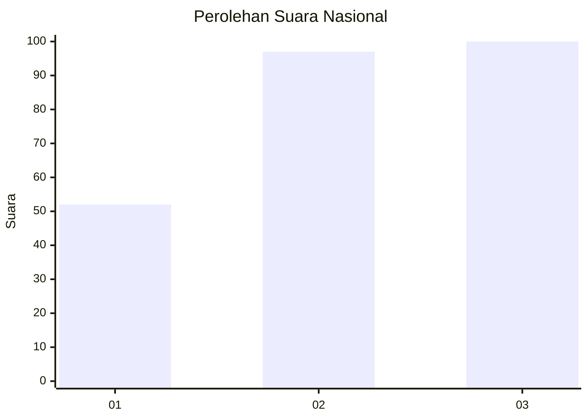
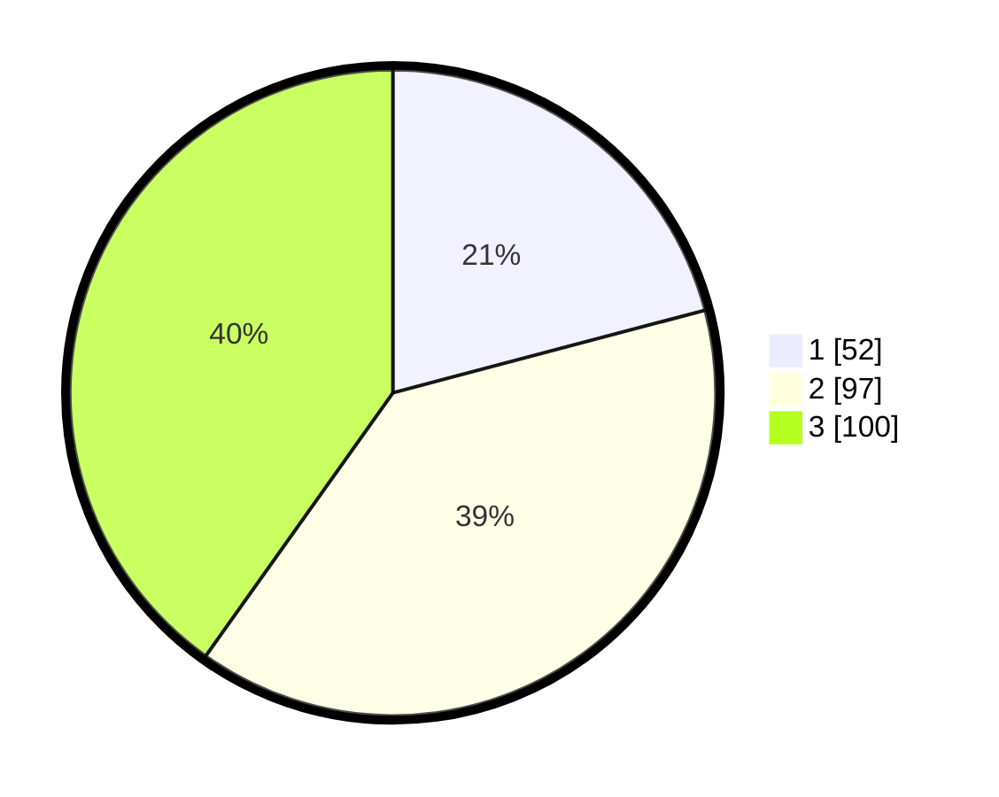

# Hasil

## Grafik

## Tabel

| No. | Nama Paslon    | Suara | Suara (raw) | Persentase |
|:--- |:-------------- | -----:| -----------:| ----------:|
| 1   | ANIES MUHAIMIN | 52    | [52][p-1]   | 20,88      |
| 2   | PRABOWO GIBRAN | 97    | [97][p-2]   | 38,96      |
| 3   | GANJAR MAHFUD  | 100   | [100][p-3]  | 40,16      |

[p-1]: https://github.com/gigit-pemilu/pemilu-2024/blob/main/pilpres/hitung-suara/sub/34-di-yogyakarta/sub/01-kulon-progo/sub/07-pengasih/sub/2002-karangsari/sub/005-tps/sub/paslon-1.txt
[p-2]: https://github.com/gigit-pemilu/pemilu-2024/blob/main/pilpres/hitung-suara/sub/34-di-yogyakarta/sub/01-kulon-progo/sub/07-pengasih/sub/2002-karangsari/sub/005-tps/sub/paslon-2.txt
[p-3]: https://github.com/gigit-pemilu/pemilu-2024/blob/main/pilpres/hitung-suara/sub/34-di-yogyakarta/sub/01-kulon-progo/sub/07-pengasih/sub/2002-karangsari/sub/005-tps/sub/paslon-3.txt

## Foto C Plano

https://sirekap-obj-formc.kpu.go.id/b765/pemilu/ppwp/34/01/07/20/02/3401072002005-20240214-200940--00eb20d5-ac88-4946-953a-e7c5925cc961.jpg

https://sirekap-obj-formc.kpu.go.id/b765/pemilu/ppwp/34/01/07/20/02/3401072002005-20240214-201126--f2e29d29-612f-4df8-8e3f-06f70f06c75c.jpg

https://sirekap-obj-formc.kpu.go.id/b765/pemilu/ppwp/34/01/07/20/02/3401072002005-20240214-201405--a683d309-f467-465e-8c2b-92963cd8abb5.jpg

## Metadata

| Key        | Value               |
| ---------- | ------------------- |
| Time Stamp | 2024-02-16 02:30:27 |

## DATA PEMILIH TETAP

Jumlah pemilih dalam DPT: **280**.
 * L: **134**.
 * P: **146**.

## DATA PENGGUNA HAK PILIH

Jumlah pengguna hak pilih dalam DPT: **244**.
 * L: **117**.
 * P: **127**.

Jumlah pengguna hak pilih dalam DPTb: **7**.
 * L: **5**.
 * P: **2**.

Jumlah pengguna hak pilih dalam DPK: **4**.
 * L: **1**.
 * P: **3**.

Jumlah pengguna hak pilih: **255**.
 * L: **123**.
 * P: **132**.

## JUMLAH SUARA SAH DAN TIDAK SAH

JUMLAH SELURUH SUARA SAH: **255**.

JUMLAH SUARA TIDAK SAH: **6**.

JUMLAH SELURUH SUARA SAH DAN SUARA TIDAK SAH: **261**.

